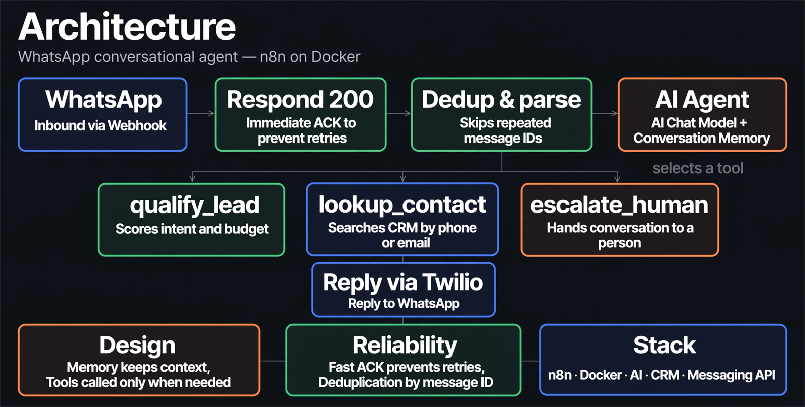
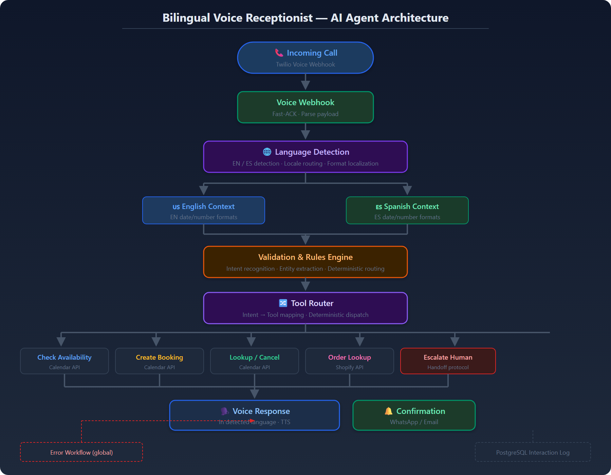
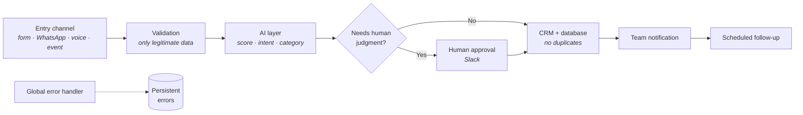

# Bhrayan Márquez — AI Automation Engineer

**I automate business processes: lead capture and qualification, CRM, WhatsApp and AI agents connected to each other.**

---

## What I do

Every lead that would otherwise go unanswered is captured, qualified by priority and
saved to your CRM — without manual work and without duplicates. Customers who reach out
outside business hours still get a response, 24/7, in English or Spanish, with a handoff
to a person when it matters. You stop chasing paperwork and focus on the jobs that pay.

Everything in this repository is **backed by evidence**: end-to-end verified flows, 113
automated tests passing and CI on GitHub Actions.

## Services

| Service | What it solves | Where to look |
|---|---|---|
| **Lead automation** | Automatic lead capture, qualification and prioritization | [Lead Qualification Engine](./projects/lead-qualification/README.md) |
| **CRM automation** | CRM sync without duplicates | [Appointment Automation](./projects/appointment-automation/README.md) |
| **AI workflows** | AI-powered flows: scoring, agents with memory, automated support | [WhatsApp Agent](./projects/whatsapp-agent/README.md) |
| **API integrations** | API and webhook integrations (Stripe, Twilio, WhatsApp, forms) | [Platform API](./docs/platform.md) |
| **Data processing** | Logging, traceability and activity analysis | [docs/platform.md](./docs/platform.md) |
| **n8n automation** | Reliable n8n workflows: retries, deduplication, persistent errors | [Reusable pattern](./docs/patterns/webhook-ai-crm-notify.md) |

## Use cases

### 1. Automatic lead qualification

| | |
|---|---|
| **Problem** | Leads arrive through multiple channels without prioritization: the team works first-come, first-served instead of by value. |
| **Solution** | Every lead is validated, scored with AI (Hot / Warm / Cold) and routed automatically. Hot leads require human approval in Slack before they reach the CRM. |
| **Technologies** | n8n · AI (structured LLM output) · HubSpot · Slack · PostgreSQL |
| **Result** | End-to-end verified flow: real executions with Hot leads (with approval), Warm and Cold, each one recorded in the database and in the CRM without duplicates. |

📄 [Full documentation →](./projects/lead-qualification/README.md)

### 2. WhatsApp agent that replies for you

| | |
|---|---|
| **Problem** | WhatsApp inquiries outside business hours: slow replies are lost leads. |
| **Solution** | Webhook with immediate acknowledgment (prevents duplicate replies), AI agent with conversation memory and a scoped toolset: qualify, check the CRM and escalate to a person. |
| **Technologies** | n8n · WhatsApp Business API · AI with memory and tools · CRM |
| **Result** | 24/7 automated support with deduplication by message ID: the customer never receives the same answer twice. |

📄 [Full documentation →](./projects/whatsapp-agent/README.md)

### 3. Bilingual voice receptionist (EN/ES)

| | |
|---|---|
| **Problem** | Missed calls outside business hours and customers who speak another language. |
| **Solution** | The call detects the language, understands the intent and manages the calendar (availability, book, cancel, reschedule), with escalation to a person when needed. |
| **Technologies** | Voice AI · language detection · calendar API · tool router |
| **Result** | Every step of the call is designed within the latency budget: the conversation does not break while the system processes. |

📄 [Full documentation →](./projects/voice-receptionist/README.md)

### 4. Post-appointment automation (CRM)

| | |
|---|---|
| **Problem** | What happened after an appointment lived in someone's head: no record, no follow-up. |
| **Solution** | When the appointment closes, the outcome is normalized, the CRM is updated (contacts are never duplicated) and the team is notified, with everything persisted. |
| **Technologies** | n8n · CRM (idempotent upsert) · PostgreSQL · Notifications |
| **Result** | The same event can arrive twice and the CRM stays identical: the record is reliable by design. |

📄 [Full documentation →](./projects/appointment-automation/README.md)

## How it works under the hood

All systems share the same proven structure:

📄 [The full pattern, explained layer by layer →](./docs/patterns/webhook-ai-crm-notify.md)

## Evidence

- **113 automated tests passing** (lint + tests + typecheck + build in CI).
- **Flows verified end to end** with real recorded executions.
- **Documented API** with Swagger/OpenAPI at `/api-docs` (9 route groups).
- **Per-client data isolation** enforced by the database (RLS with `FORCE`):
  one tenant cannot read another tenant's data, not even through a code bug.
- **Sanitized n8n workflow examples** in [`examples/`](./examples/README.md).
- **Engineering decisions documented** with their rejected alternatives in the
  [ADRs](./docs/adr/README.md).

## How we work

1. **Discovery call** — I understand the real process, not the one in the manual.
2. **Architecture document** — what gets automated, what stays with human judgment and
   where each piece of data lives.
3. **Phased build** — the main flow first, hardening second.
4. **Delivery with documentation** — diagrams, decisions and rollback procedure.
5. **Operation and tuning** — the system is measured and corrected with real data.

## Are you technical?

This repository also contains the **complete SaaS platform** behind these systems:
multi-tenant REST API, web dashboard, database with 16 migrations, Docker Compose for
dev and prod, and CI. [Technical documentation →](./docs/README.md)

---

## Do you have a process you repeat 100 times a week?

**[bhrayan.automation@gmail.com](mailto:bhrayan.automation@gmail.com)**

© 2026 Bhrayan Márquez · All rights reserved · Technical portfolio, not open-source software

