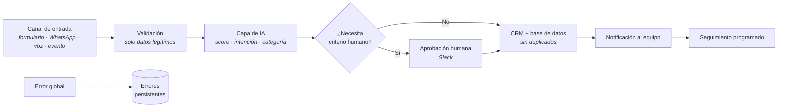

# Bhrayan Márquez — AI Automation Engineer

**Automatizo procesos de negocio: captación y calificación de leads, CRM, WhatsApp y agentes de IA conectados entre sí.**

---

## Qué hago

Conecto tus herramientas para que el trabajo repetitivo lo haga una automatización.

Cuando un lead llega por tu web o por WhatsApp, el sistema lo **califica automáticamente**,
lo registra en tu **CRM** y avisa a tu equipo — sin intervención manual. Cuando un cliente
escribe fuera de horario, un agente de IA responde, y si la conversación lo requiere,
escala a una persona. Cada paso queda registrado para que nada se pierda.

Todo lo que verás aquí está **demostrado con evidencia**: flujos ejecutados de extremo a
extremo, 103 pruebas automatizadas en verde y documentación de arquitectura.

## Servicios

| Servicio | Qué resuelve | Dónde verlo |
|---|---|---|
| **Lead automation** | Captura, calificación y priorización automática de leads | [Lead Qualification Engine](./projects/lead-qualification/README.md) |
| **CRM automation** | Sincronización con tu CRM sin duplicados | [Appointment Automation](./projects/appointment-automation/README.md) |
| **AI workflows** | Flujos con IA: scoring, agentes con memoria, atención automática | [WhatsApp Agent](./projects/whatsapp-agent/README.md) |
| **API integrations** | Integración de APIs y webhooks (Stripe, Twilio, WhatsApp, formularios) | [API de la plataforma](./docs/platform.md) |
| **Data processing** | Registro, trazabilidad y análisis de actividad | [docs/platform.md](./docs/platform.md) |
| **n8n automation** | Workflows n8n fiables: reintentos, deduplicación y errores persistentes | [Patrón reutilizable](./docs/patterns/webhook-ai-crm-notify.md) |

## Casos de uso

### 1. Calificación automática de leads

| | |
|---|---|
| **Problema** | Los leads llegan por varios canales sin priorizar: el equipo atiende por orden de llegada, no por valor. |
| **Solución** | Cada lead se valida, se puntúa con IA (Hot / Warm / Cold) y se enruta automáticamente. Los leads calientes requieren aprobación humana en Slack antes de pasar al CRM. |
| **Tecnologías** | n8n · IA (LLM con salida estructurada) · HubSpot · Slack · PostgreSQL |
| **Resultado** | Flujo verificado de extremo a extremo: ejecuciones reales con leads Hot (con aprobación), Warm y Cold, cada uno registrado en la base de datos y el CRM sin duplicados. |

📄 [Documentación completa →](./projects/lead-qualification/README.md)

### 2. Agente de WhatsApp que responde por ti

| | |
|---|---|
| **Problema** | Consultas por WhatsApp fuera de horario: respuestas tardías son leads perdidos. |
| **Solución** | Webhook con confirmación inmediata (evita respuestas duplicadas), agente de IA con memoria de conversación y herramientas acotadas: calificar, consultar CRM y escalar a una persona. |
| **Tecnologías** | n8n · WhatsApp Business API · IA con memoria y herramientas · CRM |
| **Resultado** | Atención automática 24/7 con deduplicación por message ID: el cliente nunca recibe la misma respuesta dos veces. |

📄 [Documentación completa →](./projects/whatsapp-agent/README.md)

### 3. Recepcionista de voz bilingüe (EN/ES)

| | |
|---|---|
| **Problema** | Llamadas perdidas fuera de horario y clientes que hablan otro idioma. |
| **Solución** | La llamada detecta el idioma, entiende la intención y gestiona el calendario (disponibilidad, agendar, cancelar, reagendar), con escalado a una persona cuando hace falta. |
| **Tecnologías** | Voz IA · detección de idioma · API de calendario · router de herramientas |
| **Resultado** | Cada paso de la llamada se diseña dentro del presupuesto de latencia: la conversación no se corta mientras el sistema procesa. |

📄 [Documentación completa →](./projects/voice-receptionist/README.md)

### 4. Automatización post-cita (CRM)

| | |
|---|---|
| **Problema** | Lo que pasaba después de una cita vivía en la cabeza de alguien: sin registro ni seguimiento. |
| **Solución** | Al cerrarse la cita, el resultado se normaliza, se actualiza el CRM (nunca duplica contactos) y se notifica al equipo, con registro persistente de todo. |
| **Tecnologías** | n8n · CRM (upsert idempotente) · PostgreSQL · Notificaciones |
| **Resultado** | El mismo evento puede llegar dos veces y el CRM queda igual: el registro es fiable por diseño. |

📄 [Documentación completa →](./projects/appointment-automation/README.md)

## Cómo funciona por dentro

Todos los sistemas comparten la misma estructura probada:

📄 [El patrón completo, explicado capa por capa →](./docs/patterns/webhook-ai-crm-notify.md)

## Evidencia

- **103 pruebas automatizadas en verde** (lint + tests + typecheck + build en CI).
- **Flujos verificados de extremo a extremo** con ejecuciones reales registradas.
- **API documentada** con Swagger/OpenAPI en `/api-docs` (9 grupos de rutas).
- **Aislamiento de datos por cliente** impuesto por la base de datos (RLS con `FORCE`):
  un tenant no puede leer los datos de otro ni por error de código.
- **Ejemplos sanitizados de workflows n8n** en [`examples/`](./examples/README.md).
- **Decisiones de ingeniería documentadas** con su alternativa descartada en los
  [ADRs](./docs/adr/README.md).

## Cómo trabajamos

1. **Llamada de descubrimiento** — entiendo el proceso real, no el que está en el manual.
2. **Documento de arquitectura** — qué se automatiza, qué queda con criterio humano y
   dónde vive cada dato.
3. **Construcción por fases** — primero el flujo principal, luego el endurecimiento.
4. **Entrega con documentación** — diagrama, decisiones y procedimiento de reversión.
5. **Operación y ajuste** — el sistema se mide y se corrige con datos reales.

## ¿Eres técnico?

Este repositorio también contiene la **plataforma SaaS completa** que soporta estos
sistemas: API REST multi-tenant, dashboard web, base de datos con 16 migraciones,
Docker Compose para dev y prod, y CI. [Documentación técnica →](./docs/README.md)

---

## ¿Tienes un proceso que repetir 100 veces a la semana?

**[bhrayan.automation@gmail.com](mailto:bhrayan.automation@gmail.com)**

© 2026 Bhrayan Márquez · Todos los derechos reservados · Portafolio técnico, no software de código abierto

