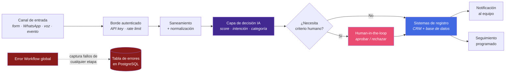

# Bhrayan Márquez — AI Automation Engineer

**Diseño y opero sistemas de automatización con IA en producción.**
Webhook → IA → CRM → Notificación. Con persistencia real, human-in-the-loop y manejo de errores.

---

## Qué encontrarás aquí

Este repositorio documenta **cómo están diseñados** cuatro sistemas de automatización que
construí y opero — no cómo se copian.

> **Nota deliberada sobre el alcance.**
> No vas a encontrar workflows exportados, prompts de producción, umbrales de puntuación ni
> reglas de saneamiento. Eso es el método comercial y no se publica.
> Lo que sí vas a encontrar: **arquitectura, decisiones de ingeniería, trade-offs y
> resultados operativos** — que es exactamente lo que se evalúa al contratar a alguien.

| Si eres… | Ve directo a… |
|---|---|
| **Reclutador / Hiring manager** | [Decisiones de ingeniería](#decisiones-de-ingeniería-que-marcan-la-diferencia) · [Los sistemas](#los-sistemas) |
| **CTO / Lead técnico** | [El patrón reutilizable](./docs/patterns/webhook-ai-crm-notify.md) · [ADRs](./docs/adr/README.md) |
| **Empresa buscando implementación** | [CONTACT.md](./CONTACT.md) |

---

## Los sistemas

### 1. Lead Qualification Engine

Motor de calificación de leads con puntuación por IA, enrutamiento por categoría,
aprobación humana para leads calientes y doble persistencia.

<table>
<tr><td><b>Problema</b></td><td>Leads entrando por múltiples canales sin priorizar; el equipo comercial atendía por orden de llegada, no por valor.</td></tr>
<tr><td><b>Solución</b></td><td>Ingesta autenticada → saneamiento y defensa anti-inyección → puntuación IA (score + Hot/Warm/Cold + categoría) → enrutamiento → gate de aprobación humana en Slack para Hot → persistencia doble → upsert en CRM → seguimiento programado.</td></tr>
<tr><td><b>Lo difícil</b></td><td>Que un lead nunca se pierda ni se duplique, aunque el contenedor se reinicie a mitad de ejecución.</td></tr>
</table>

`n8n` `Docker` `PostgreSQL` `Google Sheets` `HubSpot` `Slack` `LLM`

---

### 2. WhatsApp Conversational Agent

Agente conversacional con memoria, herramientas y escalado a humano sobre WhatsApp.

<table>
<tr><td><b>Problema</b></td><td>Volumen de consultas por WhatsApp fuera de horario; respuestas tardías = leads perdidos.</td></tr>
<tr><td><b>Solución</b></td><td>Webhook entrante con <b>ACK inmediato</b>, deduplicación por message ID, agente IA con memoria conversacional y un conjunto acotado de herramientas (calificar, consultar CRM, escalar a humano).</td></tr>
<tr><td><b>Lo difícil</b></td><td>Los proveedores de mensajería reintentan si tardas en responder. Sin ACK rápido + dedup, el cliente recibe la misma respuesta tres veces.</td></tr>
</table>

`n8n` `Docker` `WhatsApp Business API` `Twilio` `LLM + Memory + Tools` `CRM`

---

### 3. Appointment Automation

Automatización post-cita: sincronización con CRM, registro auditable y notificación.

<table>
<tr><td><b>Problema</b></td><td>Lo que pasaba después de una cita vivía en la cabeza de alguien: sin registro, sin seguimiento, sin trazabilidad.</td></tr>
<tr><td><b>Solución</b></td><td>Flujo disparado al cerrar la cita → normalización del resultado → <b>upsert</b> en CRM (nunca duplica contactos) → registro persistente → notificación al canal del equipo.</td></tr>
<tr><td><b>Lo difícil</b></td><td>Idempotencia: el mismo evento puede llegar dos veces y el CRM debe quedar igual.</td></tr>
</table>

`n8n` `CRM (upsert)` `PostgreSQL` `Notificaciones`

---

### 4. Bilingual Voice Receptionist (EN/ES)

Recepcionista de voz 24/7 que detecta idioma, entiende intención y gestiona el calendario.

<table>
<tr><td><b>Problema</b></td><td>Llamadas perdidas fuera de horario y una base de clientes mixta EN/ES atendida solo en un idioma.</td></tr>
<tr><td><b>Solución</b></td><td>Webhook de voz → detección de idioma → validación y reglas de intención → router de herramientas → motor de calendario (disponibilidad, crear, buscar, cancelar, reagendar) con escalado a humano.</td></tr>
<tr><td><b>Lo difícil</b></td><td>La voz no perdona latencia. Cada herramienta debe responder dentro del presupuesto de tiempo de la llamada o la conversación se rompe.</td></tr>
</table>

`n8n` `Voice AI` `Calendar API` `Shopify` `WhatsApp` `CRM`

---

## El patrón reutilizable

Los cuatro sistemas son la misma columna vertebral con distinta piel:

**Por qué importa:** cuando un cliente nuevo llega con un caso distinto, no empiezo de cero.
Cambia el canal y las herramientas; el esqueleto de fiabilidad ya está probado.

📄 **[Documentación del patrón →](./docs/patterns/webhook-ai-crm-notify.md)**

---

## Decisiones de ingeniería que marcan la diferencia

Esto es lo que separa una automatización de demo de una que aguanta producción:

| Decisión | Qué resuelve |
|---|---|
| 🛡️ **Hardening anti-inyección en la entrada** | El texto que escribe un desconocido llega a un LLM. Se sanea y se acota **antes** de tocar el modelo, para que un lead no pueda reescribir las instrucciones del sistema. |
| 🗄️ **PostgreSQL, no SQLite** | Concurrencia real y durabilidad. SQLite bloquea bajo escrituras simultáneas y no sobrevive bien a un contenedor reiniciado. |
| 🔁 **Deduplicación por identidad de negocio** | Email en leads, message ID en mensajería. El mismo evento puede llegar dos veces; el sistema de registro no puede notarlo. |
| ✋ **Human-in-the-loop en lo que importa** | La IA prioriza; una persona aprueba los leads calientes. Automatizar el juicio comercial es donde se pierde dinero. |
| 🚨 **Error Workflow global con persistencia** | Todo fallo queda escrito en una tabla de errores con contexto. Nada se pierde en un log volátil que se borra al reiniciar. |
| ♻️ **Resiliencia a reinicios** | Contenedores con políticas de reinicio y estado fuera del contenedor. Reiniciar no debe costar datos. |
| 🔗 **Red permanente prod ↔ PostgreSQL** | Red Docker dedicada y estable en vez de IPs efímeras. Elimina toda una clase de fallos intermitentes de conexión. |
| ⚡ **Fast-ACK en canales que reintentan** | Se confirma la recepción primero y se procesa después. Sin esto, la mensajería duplica respuestas al usuario. |
| 📝 **ADRs + rollback documentado** | Cada decisión estructural queda escrita con su alternativa descartada. Volver atrás es un procedimiento, no una improvisación. |

📄 **[Registro de decisiones (ADRs) →](./docs/adr/README.md)**

---

## Stack

**Orquestación** · n8n autoalojado sobre Docker
**Datos** · PostgreSQL (sistema de registro) · Google Sheets (capa operativa para negocio)
**IA** · Orquestación de LLM, agentes con memoria y herramientas, salida estructurada
**CRM** · HubSpot (upsert idempotente)
**Canales** · WhatsApp Business API · Twilio · Voice AI · Webhooks HTTP · Slack
**Comercio** · Shopify (consulta de pedidos)
**Operación** · Docker Compose · redes Docker dedicadas · variables de entorno · workflows de error · versionado con ADRs

---

## Seguridad y alcance de este repositorio

Este repositorio se construyó con una regla de oro: **publicar valor, no receta.**

✅ **Sí contiene:** arquitectura, diagramas conceptuales, decisiones, trade-offs, resultados,
fragmentos ilustrativos genéricos.

❌ **No contiene ni contendrá:** workflows n8n exportados, prompts de producción, umbrales de
puntuación, ventanas de deduplicación, reglas de saneamiento, credenciales, URLs de webhook,
IDs de hojas/canales/instancias, cadenas de conexión ni datos de clientes.

📄 Ver [SECURITY.md](./SECURITY.md) · [LICENSE](./LICENSE)

---

## ¿Necesitas uno de estos sistemas en tu empresa?

**[bhrayan.automation@gmail.com](mailto:bhrayan.automation@gmail.com)**

© 2026 Bhrayan Márquez · Todos los derechos reservados · Portafolio técnico, no software de código abierto

