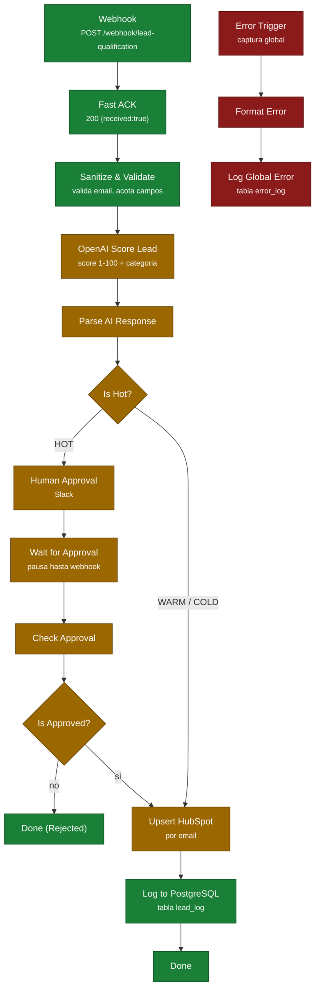

# Arquitectura — Lead Qualification Engine

Documento técnico del sistema tal y como está montado hoy, con el estado real de cada pieza.
Para la presentación del portafolio, ver [`README.md`](../README.md).

> **Estado global:** el esqueleto (ingesta, saneamiento, persistencia, manejo de errores) está
> verificado y funcionando. Las tres integraciones externas (OpenAI, Slack, HubSpot) están
> **pendientes de credenciales reales** y por tanto el flujo no se ha ejecutado nunca de
> extremo a extremo. Detalle en [Estado de las integraciones](#estado-de-las-integraciones).

## Propósito

Recibir leads desde cualquier canal (formulario web, integración, API) y convertirlos en
contactos priorizados dentro del CRM, sin intervención manual salvo donde el criterio humano
aporta valor.

El sistema debe cumplir tres cosas que una automatización de demo no cumple:

1. **No perder leads.** El emisor recibe confirmación inmediata (Fast ACK) antes de que empiece
   el procesamiento pesado, de modo que un timeout aguas abajo no provoca reintentos ni pérdidas.
2. **No duplicar contactos.** El alta en CRM es un *upsert* por email, no un insert.
3. **No perder errores.** Cualquier fallo, en cualquier nodo, queda escrito en PostgreSQL con
   nodo, mensaje, código HTTP y execution ID.

## Stack

| Capa | Tecnología | Notas |
|---|---|---|
| Orquestación | n8n v2.31.6 (Docker) | Modelo borrador / versión publicada — ver [aviso](#aviso-operativo-n8n-2x) |
| Base de datos | PostgreSQL 16 (Docker) | Compartida por n8n y la aplicación; RLS habilitado |
| Backend | Node.js + Express | JWT, pool `pg`, config vía dotenv |
| Frontend | Next.js 14.2.35 (App Router) | Login, dashboard y leads compilando |
| IA | OpenAI `gpt-4o-mini` | Salida forzada a JSON (`response_format: json_object`) |
| CRM | HubSpot | Upsert de contactos por email |
| Notificaciones | Slack | Aprobación humana para leads HOT |
| Infra | Docker Compose | `docker-compose.yml` (dev), `docker-compose.prod.yml` |

## Flujo



**Verde** = verificado en runtime · **Ámbar** = pendiente de credencial, nunca ejecutado ·
**Rojo** = ruta de errores (verificada).

Detalle importante: **las dos ramas convergen en `Upsert HubSpot`**. Sin credencial de HubSpot
no existe ningún camino que llegue a `Log to PostgreSQL` dentro del flujo real.

### Persistencia

| Tabla | Escrita por | Contenido |
|---|---|---|
| `lead_log` | `Log to PostgreSQL` | Lead + score IA + categoría + estado de aprobación |
| `error_log` | `Log Global Error` | Nivel, mensaje, nodo, execution ID, código HTTP, stack |

Ambos nodos usan mapeo **explícito** de columnas (`dataMode: defineBelow`). No se usa
auto-mapeo: dependía de que las claves del JSON coincidieran con los nombres de columna y
fallaba en silencio.

## Arranque con Docker

### Requisitos

- Docker y Docker Compose v2+
- Puertos libres: `5678` (n8n), `5432` (PostgreSQL)

### Puesta en marcha

```bash
# 1. Variables de entorno
cp .env.example .env
#    Editar .env con valores reales. Nunca se commitea (.gitignore + pre-commit hook).

# 2. Levantar servicios
docker compose up -d

# 3. Comprobar que responden
curl http://localhost:5678/healthz        # {"status":"ok"}
docker compose ps                          # postgres debe estar (healthy)

# 4. Migraciones y seeds (si es una instalación limpia)
docker compose exec -T postgres psql -U n8n -d n8n -f /migrations/…

# 5. Interfaz
#    n8n → http://localhost:5678
```

### Variables de entorno relevantes

| Variable | Para qué | Estado |
|---|---|---|
| `POSTGRES_USER` / `POSTGRES_PASSWORD` / `POSTGRES_DB` | Conexión a la base | Configurado |
| `OPENAI_API_KEY` | Scoring del lead | Presente, **cuenta sin saldo** |
| `SLACK_BOT_TOKEN` · `SLACK_CHANNEL_ID` | Aprobación humana | **Vacías** |
| `HUBSPOT_ACCESS_TOKEN` | Upsert de contactos | **Vacía** |
| `JWT_SECRET` | Autenticación del backend | Configurado |

### Probar el webhook

```bash
curl -X POST http://localhost:5678/webhook/lead-qualification \
  -H "Content-Type: application/json" \
  -d '{"email":"ana@example.com","name":"Ana Ruiz","company":"Acme",
       "message":"Necesito automatizar la captación","source":"web-form"}'
# → {"received":true}
```

El 200 confirma la ingesta, **no** el procesamiento completo: el ACK es deliberadamente
anterior al trabajo pesado.

## Estado de las integraciones

| Integración | Estado | Evidencia |
|---|---|---|
| **Webhook + Fast ACK** | ✅ Funcional | HTTP 200 `{"received":true}` en todas las pruebas |
| **Sanitize & Validate** | ✅ Funcional | Valida email y acota campos; error controlado verificado |
| **PostgreSQL — `error_log`** | ✅ Funcional | Filas con nodo, mensaje, execution ID y código HTTP |
| **PostgreSQL — `lead_log`** | ✅ Funcional a nivel de nodo | Escritura real verificada; falta probarlo dentro del flujo |
| **Error Trigger + Format Error** | ✅ Funcional | Captura global escribiendo en `error_log` |
| **OpenAI** | ⚠️ PENDIENTE — REQUIERE CREDENCIAL REAL | Key válida (`/v1/models` → 200) pero cuenta **sin saldo** (`insufficient_quota`, HTTP 429) |
| **Slack** | ⚠️ PENDIENTE — REQUIERE CREDENCIAL REAL | Sin token; `auth.test` → `invalid_auth` |
| **HubSpot** | ⚠️ PENDIENTE — REQUIERE CREDENCIAL REAL | Sin token; API → HTTP 401 |
| **Stripe / billing** | ⛔ Fuera de alcance | No forma parte del flujo de leads |

Nodos que **nunca se han ejecutado**: `Parse AI Response`, `Is Hot?`, `Human Approval (Slack)`,
`Wait for Approval`, `Check Approval`, `Is Approved?`, `Upsert HubSpot`, `Done`.

### Para desbloquear

1. **OpenAI** — añadir crédito a la cuenta. La key no hay que cambiarla.
2. **Slack** — bot token `xoxb-` con `chat:write` (y `chat:write.public` si el canal es público
   y el bot no es miembro), más el `SLACK_CHANNEL_ID`.
3. **HubSpot** — private app token `pat-` con `crm.objects.contacts.read` y `.write`.

## Aviso operativo (n8n 2.x)

n8n v2 distingue **borrador** de **versión publicada**. La ejecución usa la versión publicada
(`activeVersionId`), no lo que hay guardado en el borrador.

- `PATCH /rest/workflows/:id` **solo toca el borrador**: no cambia el comportamiento en runtime.
- `PATCH {"active": false}` es un **no-op silencioso** (responde `active: true`).
- Reiniciar el contenedor **no** recarga el borrador.

Después de cada edición hay que publicar:

```bash
POST /rest/workflows/{id}/deactivate    # body {}
POST /rest/workflows/{id}/activate      # body {"versionId": "<versionId del borrador>"}
```

Sin este paso los cambios son invisibles y se pierde mucho tiempo depurando algo ya corregido.

## Decisiones de diseño

| Decisión | Motivo |
|---|---|
| Fast ACK antes de procesar | Los emisores reintentan si tardas. ACK primero, trabajo después. |
| Upsert por email | El mismo lead puede llegar por dos canales; el CRM no debe duplicar. |
| Human-in-the-loop solo en HOT | Automatizar el juicio comercial en leads calientes es donde se pierde dinero. |
| Error Workflow global con persistencia | Un log en memoria desaparece al reiniciar el contenedor. |
| Salida IA forzada a JSON | Sin `response_format`, el parseo depende de que el modelo se porte bien. |
| Mapeo explícito de columnas | El auto-mapeo fallaba en silencio al renombrar un campo. |
| PostgreSQL en vez de SQLite | Concurrencia real y durabilidad ante reinicios. |

## Documentos relacionados

- [`docs/SPRINT2_SERVICIOS_EXTERNOS.md`](./SPRINT2_SERVICIOS_EXTERNOS.md) — bugs corregidos y evidencias
- [`docs/PRODUCCION_CHECKLIST.md`](./PRODUCCION_CHECKLIST.md) — qué falta para producción
- [`docs/VALIDACION_RUNTIME.md`](./VALIDACION_RUNTIME.md) — validación por fases
- [`SECURITY.md`](../SECURITY.md) — qué no se publica en este repo
