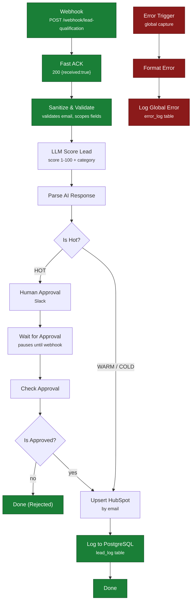

# Architecture — Lead Qualification Engine

Technical document of the lead qualification automation system, with the real state of
each piece. For the full SaaS platform, see [`platform.md`](./platform.md).

> **Global state:** the complete flow — ingestion, sanitization, LLM scoring, human
> approval, persistence and CRM upsert — is verified end to end (HOT, WARM and COLD
> executions with `lead_log` records).

## Purpose

Receive leads from any channel (web form, integration, API) and turn them into
prioritized contacts in the CRM, without manual work except where human judgment
adds value.

The system must do three things a demo automation does not:

1. **Never lose leads.** The sender receives immediate confirmation (fast ACK) before
   heavy processing starts, so a downstream timeout causes no retries or losses.
2. **Never duplicate contacts.** CRM writes are an *upsert by email*, not an insert.
3. **Never lose errors.** Any failure in any node is written to PostgreSQL with node,
   message, HTTP code and execution ID.

## Stack

| Layer | Technology | Notes |
|---|---|---|
| Orchestration | n8n 2.31.6 (Docker) | See [operational note](#operational-note-n8n-2x) |
| Database | PostgreSQL 15 (Docker) | Shared by n8n and the application; RLS enabled |
| LLM | Groq (`llama-3.3-70b-versatile`) | HTTP orchestration, structured output |
| CRM | HubSpot | Contact upsert by email |
| Notifications | Slack | Human approval for HOT leads |
| Backend | Node.js + Express | Platform REST API (see `platform.md`) |
| Infrastructure | Docker Compose | Images pinned to exact patches |

## Flow



Important detail: **both branches converge on `Upsert HubSpot`**. The `lead_log` record
only happens after the CRM write: no path "completes" a lead without passing through
persistence.

### Persistence

| Table | Written by | Content |
|---|---|---|
| `lead_log` | `Log to PostgreSQL` | Lead + LLM score + category + approval state |
| `error_log` | `Log Global Error` | Level, message, node, execution ID, HTTP code, stack |

Both nodes use **explicit** column mapping. Auto-mapping is not used: it depended on JSON
keys matching column names and failed silently.

## Verified state

The flow has been executed end to end against the production environment of this system,
with real credentials loaded via environment variables (never in the repository):

| Path | Execution | Evidence |
|---|---|---|
| **WARM** → upsert → `lead_log` | ✅ Verified | Execution 46 SUCCESS |
| **HOT** → human approval → upsert → `lead_log` | ✅ Verified | Execution 48 SUCCESS · `lead_log` with state `approved` |
| **COLD** → upsert → `lead_log` | ✅ Verified | `lead_log` with state `OPEN` |
| **Sanitize & Validate** | ✅ Verified | Invalid email → controlled error, never reaches the LLM |
| **Global Error Workflow** | ✅ Verified | Failures written to `error_log` with full context |
| **HubSpot upsert** | ✅ Verified | Contact created/updated without duplicates |

## Running with Docker

### Requirements

- Docker and Docker Compose v2+
- Free ports: `5678` (n8n), `5432` (PostgreSQL)

### Getting started

```bash
# 1. Environment variables
cp .env.example .env
#    Edit .env with real values. Never committed (.gitignore + pre-commit hook).

# 2. Start services
docker compose up -d

# 3. Check they respond
curl http://localhost:5678/healthz        # {"status":"ok"}
docker compose ps                          # postgres must be (healthy)
```

### Testing the webhook

```bash
curl -X POST http://localhost:5678/webhook/lead-qualification \
  -H "Content-Type: application/json" \
  -d '{"email":"ana@example.com","name":"Ana Ruiz","company":"Acme",
       "message":"I need to automate lead capture","source":"web-form"}'
# → {"received":true}
```

The 200 confirms ingestion, **not** full processing: the ACK is deliberately issued
before the heavy work.

## Operational note (n8n 2.x)

n8n v2 distinguishes **draft** from **published version**. Executions use the published
version (`activeVersionId`), not what is saved in the draft.

- `PATCH /rest/workflows/:id` **only touches the draft**: it does not change runtime
  behavior.
- `PATCH {"active": false}` is a **silent no-op** (responds `active: true`).
- Restarting the container does **not** reload the draft.

After every edit you must publish:

```bash
POST /rest/workflows/{id}/deactivate    # body {}
POST /rest/workflows/{id}/activate      # body {"versionId": "<draft versionId>"}
```

Without this step changes are invisible and a lot of time is lost debugging something
already fixed.

## Design decisions

| Decision | Reason |
|---|---|
| Fast ACK before processing | Senders retry if you are slow. ACK first, work after. |
| Upsert by email | The same lead can arrive through two channels; the CRM must not duplicate. |
| Human-in-the-loop only for HOT | Automating commercial judgment on hot leads is where money is lost. |
| Global Error Workflow with persistence | An in-memory log disappears when the container restarts. |
| LLM output forced to structured JSON | Without a strict format, parsing depends on the model behaving. |
| Explicit column mapping | Auto-mapping failed silently when a field was renamed. |
| PostgreSQL instead of SQLite | Real concurrency and durability across restarts. |

## Related documents

- [Reusable pattern: Webhook → AI → CRM → Notification](./patterns/webhook-ai-crm-notify.md)
- [Architecture Decision Records (ADRs)](./adr/README.md)
- [Full SaaS platform](./platform.md)
- [SECURITY.md](../SECURITY.md) — what is not published in this repo
