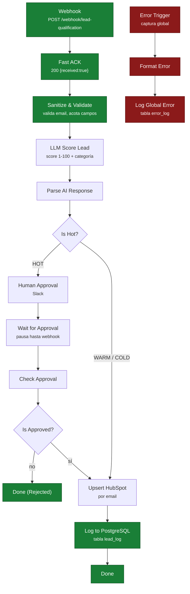

# Arquitectura — Lead Qualification Engine

Documento técnico del sistema de automatización de calificación de leads, con el estado
real de cada pieza. Para la plataforma SaaS completa, ver [`platform.md`](./platform.md).

> **Estado global:** el flujo completo —ingesta, saneamiento, puntuación LLM, aprobación
> humana, persistencia y upsert en CRM— está verificado de extremo a extremo (ejecuciones
> HOT, WARM y COLD con registros en `lead_log`).

## Propósito

Recibir leads desde cualquier canal (formulario web, integración, API) y convertirlos en
contactos priorizados dentro del CRM, sin intervención manual salvo donde el criterio humano
aporta valor.

El sistema debe cumplir tres cosas que una automatización de demo no cumple:

1. **No perder leads.** El emisor recibe confirmación inmediata (Fast ACK) antes de que
   empiece el procesamiento pesado, de modo que un timeout aguas abajo no provoca
   reintentos ni pérdidas.
2. **No duplicar contactos.** El alta en CRM es un *upsert* por email, no un insert.
3. **No perder errores.** Cualquier fallo, en cualquier nodo, queda escrito en PostgreSQL
   con nodo, mensaje, código HTTP y execution ID.

## Stack

| Capa | Tecnología | Notas |
|---|---|---|
| Orquestación | n8n 2.31.6 (Docker) | Ver [aviso operativo](#aviso-operativo-n8n-2x) |
| Base de datos | PostgreSQL 15 (Docker) | Compartida por n8n y la aplicación; RLS habilitado |
| LLM | Groq (`llama-3.3-70b-versatile`) | Orquestación vía HTTP, salida estructurada |
| CRM | HubSpot | Upsert de contactos por email |
| Notificaciones | Slack | Aprobación humana para leads HOT |
| Backend | Node.js + Express | API REST de la plataforma (ver `platform.md`) |
| Infraestructura | Docker Compose | Imágenes pineadas a patch exacto |

## Flujo



Detalle importante: **las dos ramas convergen en `Upsert HubSpot`**. El registro en
`lead_log` solo ocurre después de la escritura en el CRM: no existe camino que
"complete" un lead sin pasar por la persistencia.

### Persistencia

| Tabla | Escrita por | Contenido |
|---|---|---|
| `lead_log` | `Log to PostgreSQL` | Lead + score LLM + categoría + estado de aprobación |
| `error_log` | `Log Global Error` | Nivel, mensaje, nodo, execution ID, código HTTP, stack |

Ambos nodos usan mapeo **explícito** de columnas. No se usa auto-mapeo: dependía de que
las claves del JSON coincidieran con los nombres de columna y fallaba en silencio.

## Estado verificado

El flujo se ha ejecutado de extremo a extremo contra el entorno de producción de este
sistema, con credenciales reales cargadas vía variables de entorno (nunca en el repositorio):

| Ruta | Ejecución | Evidencia |
|---|---|---|
| **WARM** → upsert → `lead_log` | ✅ Verificada | Ejecución 46 SUCCESS |
| **HOT** → aprobación humana → upsert → `lead_log` | ✅ Verificada | Ejecución 48 SUCCESS · `lead_log` con estado `approved` |
| **COLD** → upsert → `lead_log` | ✅ Verificada | `lead_log` con estado `OPEN` |
| **Sanitize & Validate** | ✅ Verificada | Email inválido → error controlado, nunca llega al LLM |
| **Error Workflow global** | ✅ Verificada | Fallos escritos en `error_log` con contexto completo |
| **HubSpot upsert** | ✅ Verificada | Contacto creado/actualizado sin duplicados |

## Arranque con Docker

### Requisitos

- Docker y Docker Compose v2+
- Puertos libres: `5678` (n8n), `5432` (PostgreSQL)

### Puesta en marcha

```bash
# 1. Variables de entorno
cp .env.example .env
#    Editar .env con valores reales. Nunca se commitea (.gitignore + pre-commit hook).

# 2. Levantar servicios
docker compose up -d

# 3. Comprobar que responden
curl http://localhost:5678/healthz        # {"status":"ok"}
docker compose ps                          # postgres debe estar (healthy)
```

### Probar el webhook

```bash
curl -X POST http://localhost:5678/webhook/lead-qualification \
  -H "Content-Type: application/json" \
  -d '{"email":"ana@example.com","name":"Ana Ruiz","company":"Acme",
       "message":"Necesito automatizar la captación","source":"web-form"}'
# → {"received":true}
```

El 200 confirma la ingesta, **no** el procesamiento completo: el ACK es deliberadamente
anterior al trabajo pesado.

## Aviso operativo (n8n 2.x)

n8n v2 distingue **borrador** de **versión publicada**. La ejecución usa la versión
publicada (`activeVersionId`), no lo que hay guardado en el borrador.

- `PATCH /rest/workflows/:id` **solo toca el borrador**: no cambia el comportamiento en
  runtime.
- `PATCH {"active": false}` es un **no-op silencioso** (responde `active: true`).
- Reiniciar el contenedor **no** recarga el borrador.

Después de cada edición hay que publicar:

```bash
POST /rest/workflows/{id}/deactivate    # body {}
POST /rest/workflows/{id}/activate      # body {"versionId": "<versionId del borrador>"}
```

Sin este paso los cambios son invisibles y se pierde mucho tiempo depurando algo ya
corregido.

## Decisiones de diseño

| Decisión | Motivo |
|---|---|
| Fast ACK antes de procesar | Los emisores reintentan si tardas. ACK primero, trabajo después. |
| Upsert por email | El mismo lead puede llegar por dos canales; el CRM no debe duplicar. |
| Human-in-the-loop solo en HOT | Automatizar el juicio comercial en leads calientes es donde se pierde dinero. |
| Error Workflow global con persistencia | Un log en memoria desaparece al reiniciar el contenedor. |
| Salida LLM forzada a JSON estructurado | Sin formato estricto, el parseo depende de que el modelo se porte bien. |
| Mapeo explícito de columnas | El auto-mapeo fallaba en silencio al renombrar un campo. |
| PostgreSQL en vez de SQLite | Concurrencia real y durabilidad ante reinicios. |

## Documentos relacionados

- [Patrón reutilizable: Webhook → IA → CRM → Notificación](./patterns/webhook-ai-crm-notify.md)
- [Registro de decisiones de arquitectura (ADRs)](./adr/README.md)
- [Plataforma SaaS completa](./platform.md)
- [SECURITY.md](../SECURITY.md) — qué no se publica en este repo
