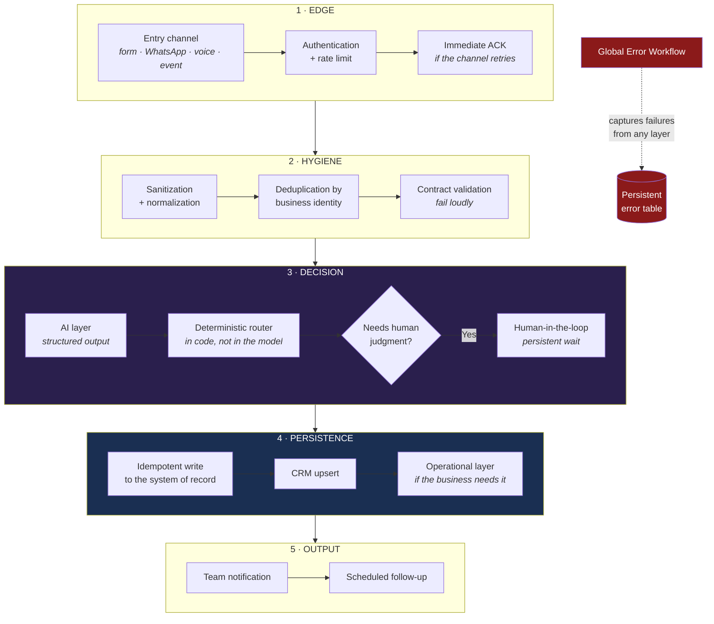
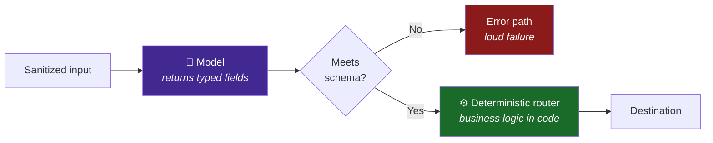
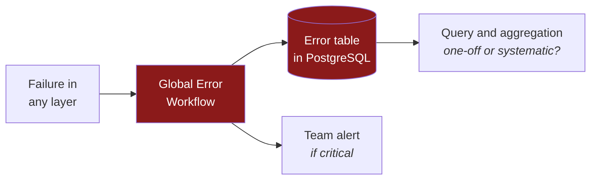

# Pattern: Webhook → AI → CRM → Notification

**The reusable skeleton behind the four systems in this portfolio.**

When a new client arrives with a different use case, we do not start from zero. The
channels and tools change; **the reliability foundations are already proven**.

---

## The five layers



---

## Layer 1 — Edge

**Responsibility:** nothing enters unauthenticated, and the channel does not retry.

| Rule | Why |
|---|---|
| Every webhook carries authentication | A public endpoint without a key is an open LLM bill for anyone |
| ACK before processing on channels that retry | Timeout retries are the root cause of duplicate responses |
| Rejections are also logged | A spike of invalid requests is information, not noise |

**Applied in:** Lead Qualification (API key) · WhatsApp Agent (fast-ACK) · Voice
Receptionist (voice webhook) · Appointment (validated event).

---

## Layer 2 — Input hygiene

**Responsibility:** what enters is safe, unique and in the expected shape.

### Sanitization before the model

The text is written by a stranger and ends up in an LLM. It is normalized and scoped
**before** touching the model, so the content is treated as *data to evaluate*, not
*instructions to obey*.

> Design principle. The concrete rules are not published.

### Deduplication by business identity

The key identifies **the real thing**, not the execution:

| System | Dedup identity |
|---|---|
| Lead Qualification | Lead email |
| WhatsApp Agent | Provider message ID |
| Appointment Automation | Event idempotency key |

**Antipattern:** deduplicating by execution ID. It changes on every retry, so it
deduplicates nothing.

### Contract validation

If the payload does not comply, it goes to the error path. **Never** a partial write: a
partial record looks correct and is not.

---

## Layer 3 — Decision

**Responsibility:** the AI brings judgment without keeping control.

### The AI proposes, code disposes



**Why the router lives in code and not in the model:**

1. **Auditable** — can be read, versioned and tested.
2. **Reproducible** — the same input always gives the same destination.
3. **Cheap** — no extra model call.
4. **Fast** — decisive when there is a latency budget (voice).

### Human-in-the-loop where errors are expensive

Not everything is approved: approval fatigue makes people approve on autopilot and the
gate stops protecting. Only **what has real cost if it goes wrong** is approved.

The wait is **persistent**: if the container restarts while someone decides, the pending
approval stays alive.

---

## Layer 4 — Persistence

**Responsibility:** the data survives and is never duplicated.

| Role | Tool | Why |
|---|---|---|
| System of record | PostgreSQL | Real concurrency, durability, queryable history |
| Business system | CRM with upsert | Current contact state, no duplicates |
| Operational layer | Spreadsheet | The team works where it already knows how to work |

**Golden rule: every write is idempotent.** Running the same event N times leaves the
system identical to running it once. Without this, every retry —and there will be
retries— dirties the CRM.

---

## Layer 5 — Output

**Responsibility:** the right people find out, and pending items are not forgotten.

| Rule | Why |
|---|---|
| Notify **after** persisting | Do not announce something that then failed to be written |
| Follow-up marks state | Without the mark, the cron re-sends the same message every pass |
| Notification carries actionable context | An alert without context forces opening three more tabs |

---

## Cross-cutting — Global Error Workflow



**Persistent, not a log.** Container logs disappear when recreated. A table survives,
can be queried, grouped by failure type and answers the only question that matters in
operations: *did this happen once or every day?*

---

## Illustrative fragment of the pattern

> ⚠️ **Generic and not end-to-end functional.** It shows the *layer order*. It contains
> no prompts, thresholds, business schemas, dedup windows or sanitization rules.

```js
// ILLUSTRATIVE — the layer sequence, without the business logic.

async function pipeline(request, deps) {
  // ── 1 · EDGE ────────────────────────────────────────────────
  if (!deps.auth.isValid(request)) {
    await deps.store.recordRejection('unauthorized');
    return { status: 401 };
  }
  deps.channel.ackImmediately();          // only on channels that retry

  // ── 2 · HYGIENE ──────────────────────────────────────────────
  const clean = deps.sanitizer.normalize(request.body);   // rules not published
  const claimed = await deps.store.claimOnce(deps.identityOf(clean));
  if (!claimed) return { status: 200, note: 'duplicate' };
  if (!deps.contract.isValid(clean)) return deps.errorPath(clean, 'schema');

  // ── 3 · DECISION ─────────────────────────────────────────────
  const decision = await deps.ai.evaluate(clean);          // prompt not published
  if (!deps.contract.isValidDecision(decision)) {
    return deps.errorPath(clean, 'ai_schema');
  }
  const destination = deps.router.resolve(decision);       // deterministic, in code
  if (destination.needsHumanApproval) {
    const approved = await deps.humanGate.await(clean, decision); // persistent wait
    if (!approved) return { status: 200, note: 'rejected_by_human' };
  }

  // ── 4 · PERSISTENCE ──────────────────────────────────────────
  await deps.db.upsertRecord(clean, decision);
  await deps.crm.upsertContact(clean);

  // ── 5 · OUTPUT ───────────────────────────────────────────────
  await deps.notifier.send(deps.summaryOf(clean, decision));
  if (destination.schedulesFollowup) await deps.queue.enqueue(clean);

  return { status: 200 };
}
```

---

## How the pattern is instantiated

| Layer | Lead Qualification | WhatsApp Agent | Appointment | Voice Receptionist |
|---|---|---|---|---|
| **Channel** | Web form | WhatsApp | Calendar event | Phone call |
| **Edge** | API key | Fast-ACK | Event validation | Voice webhook |
| **Dedup** | Email | Message ID | Idempotency key | Call session |
| **AI decision** | Score + category | Agent with memory and tools | Typed outcome | Intent + rules |
| **Human gate** | Hot leads | Escalation tool | — | Escalation after N failures |
| **Persistence** | PostgreSQL + Sheets | Memory + record | PostgreSQL | Interaction record |
| **CRM** | HubSpot upsert | CRM lookup | Upsert by contact | — |
| **Output** | Slack + cron | WhatsApp reply | Team notification | Voice + written confirmation |

**Reading:** change each cell, not the structure. That is the real asset — the time to
start a new use case drops because the hard problems are already solved once.

---

## Antipatterns this pattern avoids

| Antipattern | What it causes |
|---|---|
| Unauthenticated public webhook | Open LLM bill for anyone |
| Process before responding | Timeout retries → duplicate responses |
| Dedup by execution ID | Deduplicates nothing: changes on every retry |
| Model decides the destination | Non-reproducible, non-auditable behavior |
| Parsing free model text | Silent failures that corrupt the CRM |
| Human approval of everything | Approval fatigue: approving without reading |
| SQLite under concurrent writes | Locks and data loss on restart |
| Writing without upsert | Duplicate contacts → the team stops trusting the CRM |
| Notifying before persisting | Announcements of things never written |
| Errors only in container logs | Lost on recreate; never known if systematic |
| Handoff that does not pause the bot | Person and bot reply at the same time |
| Cron without state mark | The same contact gets the same message every pass |

---

<div align="center">

[⬅️ Back to the portfolio](../../README.md) · [ADRs](../adr/README.md) · [SECURITY](../../SECURITY.md)

**Do you want this pattern applied to your process?**
[bhrayan.automation@gmail.com](mailto:bhrayan.automation@gmail.com)

</div>
