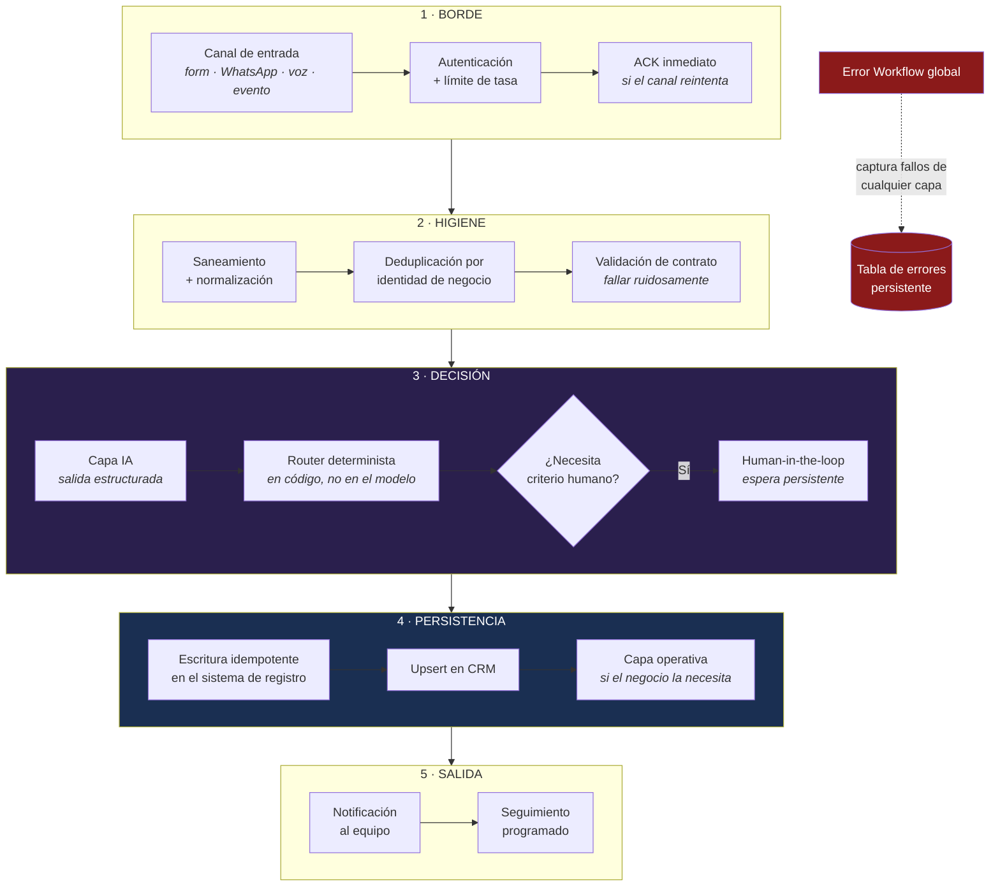
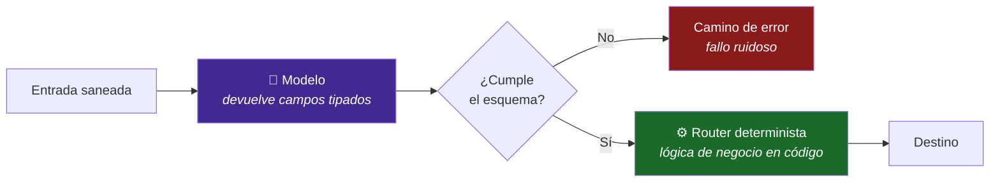
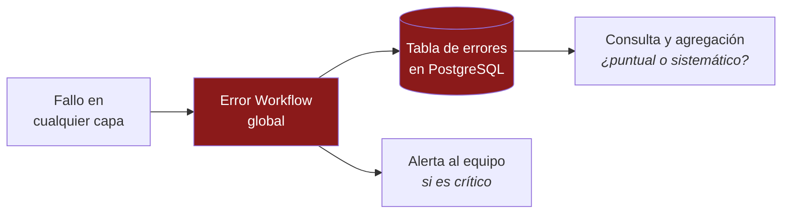

# Patrón: Webhook → IA → CRM → Notificación

**El esqueleto reutilizable detrás de los cuatro sistemas de este portafolio.**

Cuando llega un cliente nuevo con un caso distinto, no se empieza de cero. Cambian el canal
y las herramientas; **los cimientos de fiabilidad ya están probados**.

---

## Las cinco capas



---

## Capa 1 — Borde

**Responsabilidad:** que nada entre sin autenticar y que el canal no reintente.

| Regla | Por qué |
|---|---|
| Todo webhook lleva autenticación | Un endpoint público sin clave es una factura de LLM abierta a cualquiera |
| ACK antes de procesar en canales que reintentan | Los reintentos por timeout son la causa raíz de las respuestas duplicadas |
| El rechazo también se registra | Un pico de peticiones inválidas es información, no ruido |

**Aplicado en:** Lead Qualification (API key) · WhatsApp Agent (fast-ACK) · Voice
Receptionist (webhook de voz) · Appointment (evento validado).

---

## Capa 2 — Higiene de entrada

**Responsabilidad:** que lo que entra sea seguro, único y con la forma esperada.

### Saneamiento antes del modelo

El texto lo escribe un desconocido y termina en un LLM. Se normaliza y se acota **antes**
de tocar el modelo, para que el contenido se trate como *dato a evaluar*, no como
*instrucción a obedecer*.

> Principio de diseño. Las reglas concretas no se publican.

### Deduplicación por identidad de negocio

La clave es la que identifica **la cosa real**, no la ejecución:

| Sistema | Identidad de dedup |
|---|---|
| Lead Qualification | Email del lead |
| WhatsApp Agent | Message ID del proveedor |
| Appointment Automation | Clave de idempotencia del evento |

**Antipatrón:** deduplicar por ID de ejecución. Cambia en cada reintento, así que no
deduplica nada.

### Validación de contrato

Si el payload no cumple, va al camino de error. **Nunca** se escribe a medias: un registro
parcial parece correcto y no lo es.

---

## Capa 3 — Decisión

**Responsabilidad:** que la IA aporte criterio sin quedarse con el control.

### La IA propone, el código dispone



**Por qué el router va en código y no en el modelo:**

1. **Auditable** — se puede leer, versionar y probar.
2. **Reproducible** — la misma entrada da el mismo destino, siempre.
3. **Barato** — no cuesta una llamada adicional al modelo.
4. **Rápido** — decisivo cuando hay un presupuesto de latencia (voz).

### Human-in-the-loop donde el error es caro

No se aprueba todo: la fatiga de aprobación hace que la gente apruebe en automático y el
gate deja de proteger. Se aprueba **solo lo que tiene coste real si sale mal**.

La espera es **persistente**: si el contenedor se reinicia mientras alguien decide, la
aprobación pendiente sigue viva.

---

## Capa 4 — Persistencia

**Responsabilidad:** que el dato sobreviva y que nunca se duplique.

| Rol | Herramienta | Por qué |
|---|---|---|
| Sistema de registro | PostgreSQL | Concurrencia real, durabilidad, historia consultable |
| Sistema de negocio | CRM con upsert | Estado actual del contacto, sin duplicados |
| Capa operativa | Hoja de cálculo | El equipo trabaja donde ya sabe trabajar |

**Regla de oro: toda escritura es idempotente.** Ejecutar el mismo evento N veces deja el
sistema igual que ejecutarlo una vez. Sin esto, cada reintento —y va a haber reintentos—
ensucia el CRM.

---

## Capa 5 — Salida

**Responsabilidad:** que la gente correcta se entere, y que lo pendiente no se olvide.

| Regla | Por qué |
|---|---|
| Notificar **después** de persistir | No avisar de algo que luego falló al escribirse |
| El seguimiento marca estado | Sin la marca, el cron reenvía el mismo mensaje en cada pasada |
| La notificación lleva contexto accionable | Un aviso sin contexto obliga a abrir otras tres pestañas |

---

## Transversal — Error Workflow global



**Persistente, no un log.** Los logs de un contenedor se pierden al recrearlo. Una tabla
sobrevive, se consulta, se agrupa por tipo de fallo y responde la única pregunta que
importa en operación: *¿esto pasó una vez o pasa todos los días?*

---

## Fragmento ilustrativo del patrón

> ⚠️ **Genérico y no funcional de extremo a extremo.** Muestra el *orden de las capas*. No
> contiene prompts, umbrales, esquemas de negocio, ventanas de dedup ni reglas de
> saneamiento.

```js
// ILUSTRATIVO — la secuencia de capas, sin la lógica de negocio.

async function pipeline(request, deps) {
  // ── 1 · BORDE ────────────────────────────────────────────────
  if (!deps.auth.isValid(request)) {
    await deps.store.recordRejection('unauthorized');
    return { status: 401 };
  }
  deps.channel.ackImmediately();          // solo en canales que reintentan

  // ── 2 · HIGIENE ──────────────────────────────────────────────
  const clean = deps.sanitizer.normalize(request.body);   // reglas no publicadas
  const claimed = await deps.store.claimOnce(deps.identityOf(clean));
  if (!claimed) return { status: 200, note: 'duplicate' };
  if (!deps.contract.isValid(clean)) return deps.errorPath(clean, 'schema');

  // ── 3 · DECISIÓN ─────────────────────────────────────────────
  const decision = await deps.ai.evaluate(clean);          // prompt no publicado
  if (!deps.contract.isValidDecision(decision)) {
    return deps.errorPath(clean, 'ai_schema');
  }
  const destination = deps.router.resolve(decision);       // determinista, en código
  if (destination.needsHumanApproval) {
    const approved = await deps.humanGate.await(clean, decision); // espera persistente
    if (!approved) return { status: 200, note: 'rejected_by_human' };
  }

  // ── 4 · PERSISTENCIA ─────────────────────────────────────────
  await deps.db.upsertRecord(clean, decision);
  await deps.crm.upsertContact(clean);

  // ── 5 · SALIDA ───────────────────────────────────────────────
  await deps.notifier.send(deps.summaryOf(clean, decision));
  if (destination.schedulesFollowup) await deps.queue.enqueue(clean);

  return { status: 200 };
}
```

---

## Cómo se instancia el patrón

| Capa | Lead Qualification | WhatsApp Agent | Appointment | Voice Receptionist |
|---|---|---|---|---|
| **Canal** | Formulario web | WhatsApp | Evento de calendario | Llamada de voz |
| **Borde** | API key | Fast-ACK | Validación de evento | Webhook de voz |
| **Dedup** | Email | Message ID | Clave de idempotencia | Sesión de llamada |
| **Decisión IA** | Score + categoría | Agente con memoria y tools | Resultado tipado | Intención + reglas |
| **Gate humano** | Leads Hot | Herramienta de escalado | — | Escalado tras N fallos |
| **Persistencia** | PostgreSQL + Sheets | Memoria + registro | PostgreSQL | Registro de interacción |
| **CRM** | Upsert HubSpot | Consulta CRM | Upsert por contacto | — |
| **Salida** | Slack + cron | Respuesta WhatsApp | Notificación al equipo | Voz + confirmación escrita |

**Lectura:** cambia cada celda, no cambia la estructura. Ese es el activo real — el tiempo
de puesta en marcha de un caso nuevo baja porque los problemas difíciles ya están resueltos
una vez.

---

## Antipatrones que este patrón evita

| Antipatrón | Qué provoca |
|---|---|
| Webhook público sin autenticar | Coste de LLM abierto a cualquiera |
| Procesar antes de responder | Reintentos por timeout → respuestas duplicadas |
| Dedup por ID de ejecución | No deduplica nada: cambia en cada reintento |
| Que el modelo decida el destino | Comportamiento no reproducible ni auditable |
| Parsear texto libre del modelo | Fallos silenciosos que contaminan el CRM |
| Aprobar humanamente todo | Fatiga de aprobación: se aprueba sin leer |
| SQLite bajo escrituras concurrentes | Bloqueos y pérdida de datos al reiniciar |
| Escribir sin upsert | Contactos duplicados → el equipo deja de confiar en el CRM |
| Notificar antes de persistir | Avisos de cosas que nunca se escribieron |
| Errores solo en logs del contenedor | Se pierden al recrear; nunca se sabe si el fallo es sistemático |
| Handoff que no pausa el bot | Persona y bot responden a la vez al mismo cliente |
| Cron sin marca de estado | El mismo contacto recibe el mismo mensaje en cada pasada |

---

<div align="center">

[⬅️ Volver al portafolio](../../README.md) · [ADRs](../adr/README.md) · [SECURITY](../../SECURITY.md)

**¿Quieres este patrón aplicado a tu proceso?**
[bhrayan.automation@gmail.com](mailto:bhrayan.automation@gmail.com)

</div>
