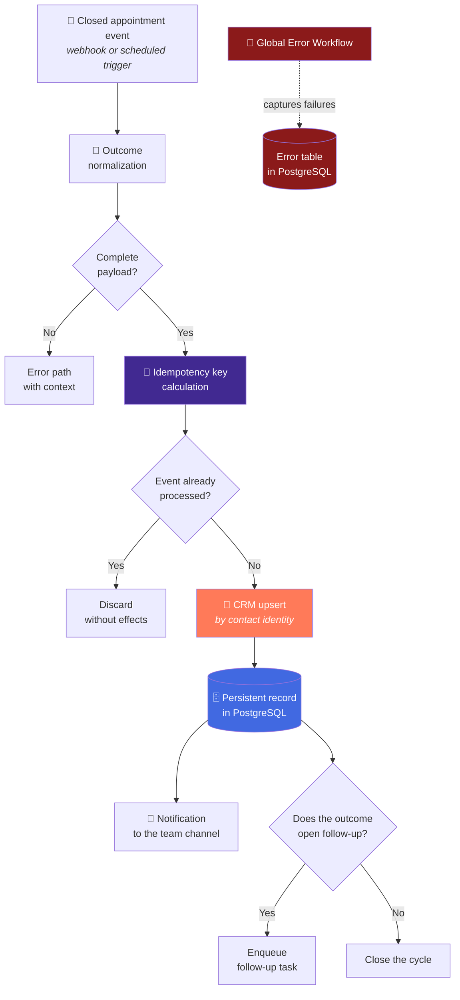
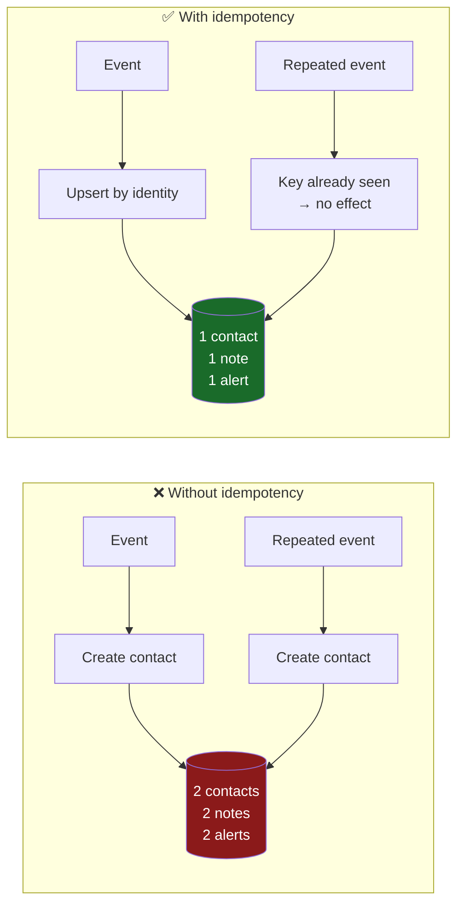

<div align="center">

# Appointment Automation

**What happens after the appointment, automated: synced CRM, auditable record and notified team.**

[](#)
[](#)
[](#)
[](#)

[](#)
[](#)
[](#)

</div>

---

## The problem

The appointment is the easy moment. The hard part is **what comes after**.

In most teams, the post-appointment lives in someone's head: *"I think they said they'd
think about it"*, *"I wrote it on a sticky note"*, *"did anyone update the CRM?"*.
Result:

- The CRM reflects a reality from three weeks ago.
- Nobody can answer how many appointments ended in a sale, because the data does not exist.
- The same contact appears twice because two people entered it manually.
- An event re-delivered by the calendar system duplicates the whole record.

---

## The solution in one sentence

A flow triggered when the appointment closes that **normalizes the outcome**, does an
**idempotent CRM upsert**, **persists an auditable record** and **notifies the team** —
so reprocessing the same event leaves everything exactly the same.

---

## Conceptual architecture



---

## The heart of the system: idempotency

This is the simplest of the four flows and, precisely because of that, the one that best
illustrates a principle most automations ignore.

**The same event is going to arrive twice.** That is not a hypothesis: it is what happens
when a calendar system retries, when someone hits "save" twice, or when a batch is
reprocessed after an incident.

A non-idempotent flow turns every retry into a duplicate contact, a duplicate note and a
duplicate notification. An idempotent flow absorbs it without effect.



**Two** protection layers are applied, because one alone is not enough:

| Layer | What it does | What it protects |
|---|---|---|
| **Event idempotency key** | Discards re-delivery before touching anything | Duplicate notifications and side effects |
| **Upsert by contact identity** | The CRM converges to the same state | Duplicate contacts even if the first layer fails |

> The concrete composition of the idempotency key is not published.

---

## Stage-by-stage walkthrough

### 1. Trigger

The flow starts when the appointment closes. The event source is abstracted behind a
normalization stage, so switching calendar systems **does not require rebuilding the
rest of the flow**.

### 2. Outcome normalization

The appointment outcome becomes a scoped set of typed values. Free text cannot feed
business logic: if the outcome does not fit the defined vocabulary, the record goes to
the error path instead of being half-written.

### 3. CRM upsert

Idempotent write by contact identity: update if it exists, create if it does not. In
addition to the contact, the appointment outcome is synced as queryable data — not as a
note nobody reads.

### 4. Persistent record

Every processed appointment leaves a row in PostgreSQL: what was decided, when, and what
the system did afterwards.

**Why a database and not just the CRM:** the CRM stores the contact's *current* state.
The database stores the *history* of what happened — which is what allows answering
"how many appointments ended in a sale last quarter?" without depending on someone
having edited a field.

### 5. Notification

The team channel receives the summary. **After** writing to the systems of record, not
before: if the write fails, nobody receives an alert about something that did not happen.

### 6. Conditional follow-up

If the outcome opens follow-up, a task is enqueued. If it closes the cycle, nothing is
done — and "doing nothing" is also recorded.

---

## Engineering decisions

| Decision | Rejected alternative | Reason |
|---|---|---|
| Two-layer idempotency | Upsert only | The upsert protects the CRM, not notifications or side effects |
| Notify after persisting | Notify first | Avoids announcing something that later failed to be written |
| Typed outcome | Free salesperson text | Business logic cannot depend on how someone wrote a note |
| Record in PostgreSQL in addition to CRM | CRM only | The CRM stores current state; the DB stores history and enables analytics |
| Normalization decoupled from the source | Coupled to the specific calendar | Switching providers does not require rebuilding the whole flow |
| Explicit error path | Write what you can | A partial write is worse than none: it looks correct and is not |

📄 Additional context in the [ADR registry](../../docs/adr/README.md).

---

## Operational behavior

| Property | Behavior |
|---|---|
| **Idempotency** | Reprocessing N times leaves the system identical to processing once |
| **No CRM duplicates** | Guaranteed by contact identity, not by trusting the source |
| **Auditability** | Every processed appointment is queryable with its outcome and date |
| **All or nothing** | An incomplete payload goes to the error path; never a partial write |
| **Provider independence** | Normalization isolates the rest of the flow from the event source |

---

## Illustrative fragment

> ⚠️ **Generic and not end-to-end functional.** It shows the *shape* of the idempotency
> guard. It contains no real key composition, no business outcome vocabulary and no CRM
> field mapping.

```js
// ILLUSTRATIVE — the idempotency guard goes BEFORE any side effect.

async function handleAppointmentEvent(event, store, crm, notifier) {
  const key = buildIdempotencyKey(event); // composition not published

  const firstTime = await store.claim(key);
  if (!firstTime) {
    return { status: 'skipped', reason: 'already_processed' };
  }

  // Upsert: converges to the same state no matter how many times it runs.
  await crm.upsertContact({
    identity: event.contactIdentity,
    outcome: event.normalizedOutcome,
  });

  await store.recordAppointment(key, event);

  // The notification goes last: only announce what is already written.
  await notifier.send(buildSummary(event));

  return { status: 'processed' };
}
```

---

## What you will NOT find in this repository

- The exported n8n workflow or the real node/connection graph.
- The idempotency key composition.
- The business outcome vocabulary or the CRM field mapping.
- The rules deciding when follow-up opens.
- Credentials, calendar IDs, channel IDs, connection strings.

See [SECURITY.md](../../SECURITY.md).

---

<div align="center">

**Does your CRM reflect what happened at the last appointment — or what someone remembered to write down?**
[bhrayan.automation@gmail.com](mailto:bhrayan.automation@gmail.com)

[⬅️ Back to the portfolio](../../README.md) · [Reusable pattern](../../docs/patterns/webhook-ai-crm-notify.md) · [ADRs](../../docs/adr/README.md)

</div>
