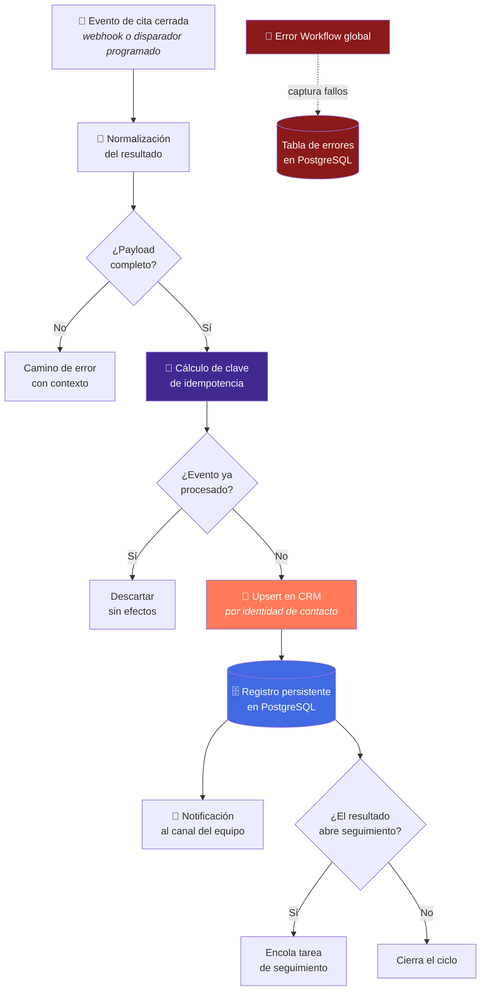
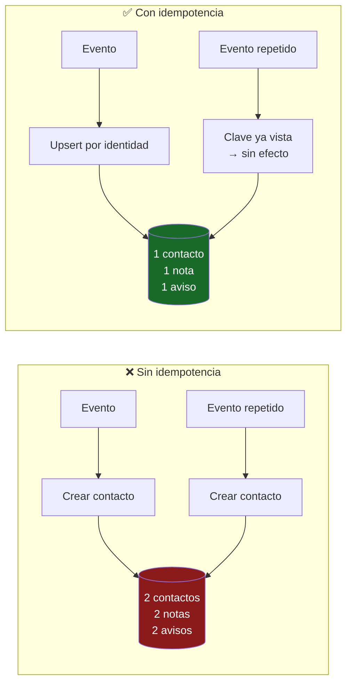

<div align="center">

# Appointment Automation

**Lo que pasa después de la cita, automatizado: CRM sincronizado, registro auditable y equipo notificado.**

[](#)
[](#)
[](#)
[](#)

[](#)
[](#)
[](#)

</div>

---

## El problema

La cita es el momento fácil. Lo difícil es **lo que viene después**.

En la mayoría de los equipos, el post-cita vive en la cabeza de alguien: *"creo que quedó
en pensarlo"*, *"lo apunté en un papel"*, *"¿alguien actualizó el CRM?"*. Resultado:

- El CRM refleja una realidad de hace tres semanas.
- Nadie puede responder cuántas citas terminaron en venta, porque el dato no existe.
- El mismo contacto aparece dos veces porque dos personas lo cargaron a mano.
- Un evento reenviado por el sistema de calendario duplica todo el registro.

---

## La solución en una frase

Un flujo disparado al cerrar la cita que **normaliza el resultado**, hace **upsert
idempotente en el CRM**, **persiste un registro auditable** y **notifica al equipo** — de
forma que reprocesar el mismo evento deja todo exactamente igual.

---

## Arquitectura conceptual



---

## El corazón del sistema: idempotencia

Este flujo es el más simple de los cuatro y, precisamente por eso, el que mejor ilustra un
principio que la mayoría de las automatizaciones ignoran.

**El mismo evento va a llegar dos veces.** No es una hipótesis: es lo que pasa cuando un
sistema de calendario reintenta, cuando alguien pulsa "guardar" dos veces, o cuando se
reprocesa un lote tras un incidente.

Un flujo no idempotente convierte cada reintento en un contacto duplicado, una nota
duplicada y una notificación duplicada. Un flujo idempotente lo absorbe sin efecto.



Se aplican **dos capas** de protección, porque una sola no basta:

| Capa | Qué hace | Qué protege |
|---|---|---|
| **Clave de idempotencia del evento** | Descarta la re-entrega antes de tocar nada | Notificaciones y efectos secundarios duplicados |
| **Upsert por identidad de contacto** | El CRM converge al mismo estado | Contactos duplicados aunque la primera capa falle |

> La composición concreta de la clave de idempotencia no se publica.

---

## Recorrido por etapas

### 1. Disparo

El flujo arranca al cerrarse la cita. La fuente del evento se abstrae detrás de una etapa
de normalización, de forma que cambiar de sistema de calendario **no obliga a rehacer el
resto del flujo**.

### 2. Normalización del resultado

El resultado de la cita se convierte en un conjunto acotado de valores tipados. Un campo de
texto libre no puede alimentar la lógica de negocio: si el resultado no encaja en el
vocabulario definido, el registro va al camino de error en vez de escribirse a medias.

### 3. Upsert en el CRM

Escritura idempotente por identidad de contacto: si existe se actualiza, si no se crea.
Además del contacto, se sincroniza el resultado de la cita como dato consultable — no como
una nota que nadie lee.

### 4. Registro persistente

Cada cita procesada deja fila en PostgreSQL: qué se decidió, cuándo y qué hizo el sistema
después.

**Por qué una base de datos y no solo el CRM:** el CRM guarda el estado *actual* del
contacto. La base de datos guarda la *historia* de lo que pasó, que es lo que permite
responder "¿cuántas citas terminaron en venta el trimestre pasado?" sin depender de que
nadie haya editado un campo.

### 5. Notificación

El canal del equipo recibe el resumen. **Después** de escribir en los sistemas de registro,
no antes: si la escritura falla, nadie recibe un aviso de algo que no ocurrió.

### 6. Seguimiento condicional

Si el resultado abre seguimiento, se encola. Si cierra el ciclo, no se hace nada — y "no
hacer nada" también queda registrado.

---

## Decisiones de ingeniería

| Decisión | Alternativa descartada | Razón |
|---|---|---|
| Doble capa de idempotencia | Solo upsert | El upsert protege el CRM, no las notificaciones ni los efectos secundarios |
| Notificar después de persistir | Notificar primero | Evita avisar de algo que luego falló al escribirse |
| Resultado tipado | Texto libre del comercial | La lógica de negocio no puede depender de cómo alguien redactó una nota |
| Registro en PostgreSQL además del CRM | Solo CRM | El CRM guarda estado actual; la BD guarda historia y permite analítica |
| Normalización desacoplada de la fuente | Acoplar al calendario concreto | Cambiar de proveedor no obliga a rehacer el flujo completo |
| Camino de error explícito | Escribir lo que se pueda | Una escritura parcial es peor que ninguna: parece correcta y no lo es |

📄 Contexto adicional en el [registro de ADRs](../../docs/adr/README.md).

---

## Comportamiento operativo

| Propiedad | Comportamiento |
|---|---|
| **Idempotencia** | Reprocesar N veces deja el sistema igual que procesarlo una vez |
| **Sin duplicados en CRM** | Garantizado por identidad de contacto, no por confiar en la fuente |
| **Auditabilidad** | Toda cita procesada es consultable con su resultado y su fecha |
| **Todo o nada** | Un payload incompleto va al camino de error; nunca se escribe a medias |
| **Independencia del proveedor** | La normalización aísla al resto del flujo de la fuente del evento |

---

## Fragmento ilustrativo

> ⚠️ **Genérico y no funcional de extremo a extremo.** Muestra la *forma* del guardián de
> idempotencia. No contiene la composición real de la clave, el vocabulario de resultados
> de negocio ni el mapeo de campos del CRM.

```js
// ILUSTRATIVO — el guardián de idempotencia va ANTES de cualquier efecto secundario.

async function handleAppointmentEvent(event, store, crm, notifier) {
  const key = buildIdempotencyKey(event); // composición no publicada

  const firstTime = await store.claim(key);
  if (!firstTime) {
    return { status: 'skipped', reason: 'already_processed' };
  }

  // Upsert: converge al mismo estado sin importar cuántas veces se ejecute.
  await crm.upsertContact({
    identity: event.contactIdentity,
    outcome: event.normalizedOutcome,
  });

  await store.recordAppointment(key, event);

  // La notificación va al final: solo se avisa de lo que ya quedó escrito.
  await notifier.send(buildSummary(event));

  return { status: 'processed' };
}
```

---

## Qué NO encontrarás en este repositorio

- El workflow n8n exportado ni el grafo real de nodos y conexiones.
- La composición de la clave de idempotencia.
- El vocabulario de resultados de negocio ni el mapeo de campos del CRM.
- Las reglas que deciden cuándo se abre seguimiento.
- Credenciales, IDs de calendario, IDs de canal, cadenas de conexión.

Ver [SECURITY.md](../../SECURITY.md).

---

<div align="center">

**¿Automatizas lo que pasa después de la cita?**
[CONTACT.md](../../CONTACT.md)

[⬅️ Volver al portafolio](../../README.md) · [Patrón reutilizable](../../docs/patterns/webhook-ai-crm-notify.md) · [ADRs](../../docs/adr/README.md)

</div>
