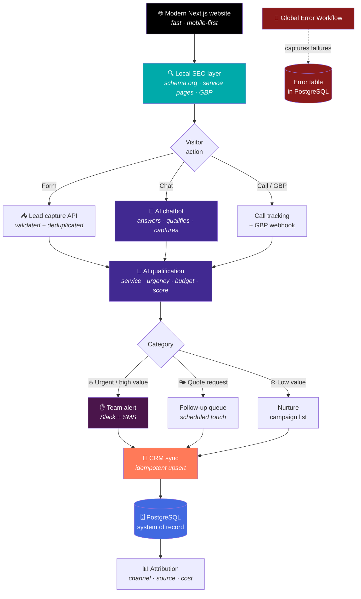

<div align="center">

# AI-Powered Lead Generation System for Roofing Business

**Modern website, local SEO architecture, AI chatbot and a lead pipeline that qualifies, scores and syncs to the CRM — end to end.**

[](#)
[](#)
[](#)
[](#)
[](#)
[](#)
[](#)
[](#)

[](#)
[](#)
[](#)

</div>


---

## The problem

A roofing company generates leads through multiple channels — the website form, phone
calls, Google Business Profile and referrals — and none of them talk to each other:

- A storm blows through on a Thursday night; by Friday morning every roofer in town has
  a "free inspection" ad on the homeowner's phone. The company's website is fast but
  invisible: **no local presence in search**, no structured data, no Google Business
  connection.
- The form sends a plain email. Nobody follows up fast, and by Monday the lead has
  already booked three estimates with competitors.
- The chatbot on the website answers canned questions; it cannot capture a lead, qualify
  it or tell the difference between "new roof" (high value) and "can you fix a leak?"
  (urgent) and "just browsing" (low value).
- The CRM is updated by hand — when it is updated. The same homeowner appears twice and
  the office never knows which channel the job came from.

**The result:** paid ads, a nice website and lost leads. The company cannot answer the
simplest business question: *where do our jobs actually come from?*

---

## The solution in one sentence

A **modern Next.js website** built around **local SEO** (structured data, service pages
and speed), with an **AI chatbot that captures and qualifies every visitor**, feeding a
**lead qualification workflow** that scores, deduplicates, syncs to the **CRM** and
alerts the team — on an **automation-ready backend** that any CRM or messaging channel
can plug into.

---

## Conceptual architecture



---

## Stage-by-stage walkthrough

### 1. Modern Next.js website

The site is built on **Next.js + TypeScript + Tailwind CSS**: server-rendered for speed
and SEO, mobile-first because roofing leads search from their phones, and fast enough to
pass Core Web Vitals.

**Why it matters:** for a local business, the website is not a brochure — it is the
landing surface for every ad, every Google result and every "roofing company near me"
search. A slow or broken site burns the traffic the business already paid for.

### 2. Local SEO architecture

The site is structured around local search intent:

| Element | What it does |
|---|---|
| **schema.org structured data** (LocalBusiness, Service, FAQ, Review) | Rich results: stars, hours and services in Google search |
| **Dedicated service pages** (repair, replacement, flat roof, insurance claims) | Matches the specific search terms homeowners type |
| **Location pages** for the service area | "Roofer near X" searches land on a relevant page |
| **Google Business Profile connection** | Reviews, Q&A and calls become trackable leads |
| **Fast, mobile-first rendering** | Better rankings and fewer bounces on mobile |

The concrete schema graph and the page architecture follow the SEO playbook of the
portfolio; the decision that matters here is that **SEO is part of the system, not an
afterthought**: the website generates the data that the capture layer consumes.

### 3. AI chatbot

The on-site chatbot has three jobs, in this order:

1. **Answer** common questions (services, warranty, financing, service area) without
   making the visitor leave.
2. **Qualify** — during the conversation it gathers the job type, urgency and budget in
   a natural way, the same questions a good office manager would ask.
3. **Capture** — when the visitor is ready, it turns the conversation into a structured
   lead and hands it to the pipeline.

**Key decision:** the chatbot never holds a lead hostage. If the visitor asks to be
called, a form shows, the lead goes to the queue and the team calls back — the bot does
not pretend to be a human.

### 4. Lead capture system

Every channel converges on the same **validated capture API**:

| Channel | Entry point |
|---|---|
| Website form | POST to the capture API |
| Chatbot conversation | Structured output from the conversation |
| Phone call | Call tracking number with post-call data |
| Google Business Profile | GBP webhook / form fallback |

The capture layer **sanitizes, validates and deduplicates** before any business logic
runs — the same principle as the [lead qualification engine](../lead-qualification/README.md):
data written by strangers is treated as data to validate, not as instructions to follow.

### 5. Lead qualification workflow

Each captured lead is scored with AI into a category:

| Category | What it means | Where it goes |
|---|---|---|
| **Urgent / high value** | Active damage, storm response, high ticket | Immediate team alert (Slack + SMS) |
| **Quote request** | Considering, needs a proposal | Scheduled follow-up sequence |
| **Low value / nurture** | Browsing, no timeline | Nurture list, no pressure |

The AI **proposes** the classification; a deterministic router decides the destination.
Out-of-schema output goes to the error path, never to the CRM.

### 6. CRM integration architecture

The CRM sync is **idempotent**: the same contact updating twice never duplicates, and
every lead carries its **source channel** — the attribution data the business needs to
know which channel actually produces jobs.

The integration layer is abstracted behind a contract, so the CRM behind it can be
swapped (HubSpot today, GoHighLevel tomorrow) without rebuilding the pipeline.

### 7. Automation-ready backend

Everything sits on an **event-driven backend** with:

- One authenticated intake contract for all channels.
- PostgreSQL as the system of record, with per-lead history.
- A notification layer that reaches the team where they are (Slack, SMS, email).
- A global error workflow that persists every failure into a queryable table.

The business can later add WhatsApp, more CRM fields or a new ad channel **without
touching the core flow** — that is what "automation-ready" means here.

---

## Engineering decisions

| Decision | Rejected alternative | Reason |
|---|---|---|
| Website and pipeline as one system | Website brochure + separate CRM entry | Attribution requires the site to feed the pipeline directly |
| Structured data + service pages as first-class | "Design-first" site without schema | Local search is a paid distribution channel if done right, free if done with structure |
| Chatbot qualifies before capturing | Chatbot that just answers | A conversation that ends without a captured lead is a lost lead |
| All channels → one validated intake | One form per channel | One contract, one dedup, one attribution model |
| Deterministic router after AI scoring | Model decides the destination | Auditable, reproducible routing; the model proposes |
| Idempotent CRM upsert | Plain insert | A retry or a duplicate form must not create two CRM records |
| Notification for urgent leads only | Notify on every lead | Alert fatigue makes the team ignore the channel that matters |
| Error workflow with persistence | Logs only | Logs vanish on restart; a table can be queried and aggregated |

---

## Operational behavior

| Property | Behavior |
|---|---|
| **Attribution** | Every lead records its channel and source — job origin is answerable |
| **Deduplication** | Repeated captures update the record; they never duplicate it |
| **Idempotency** | Reprocessing an event leaves the CRM and DB in the same state |
| **Response speed** | Urgent leads alert the team in seconds, day or night |
| **CRM portability** | The integration layer is abstracted; the CRM is swappable |
| **Controlled degradation** | Invalid or out-of-schema input goes to the error path, never a partial write |
| **SEO as data** | The site generates the structured data the capture layer consumes |

---

## Illustrative fragment

> ⚠️ **Generic and not end-to-end functional.** It shows the *shape* of the intake
> contract. It contains no real schema, no prompt, no thresholds and no CRM mapping.

```js
// ILLUSTRATIVE — the intake contract every channel converges on.
// Principle: validate and deduplicate BEFORE scoring; never send garbage to the AI.

async function captureLead(input, store, scorer, crm) {
  const clean = sanitize(input);                 // neutralization rules not published
  const valid = validate(clean);                 // required fields + scoped enums
  if (!valid) {
    return { status: 'rejected', reason: 'invalid_payload' };
  }

  const first = await store.claim(clean.contactIdentity); // dedup by business identity
  if (!first) {
    return { status: 'already_exists', updated: true };   // update, do not duplicate
  }

  const decision = await scorer.classify(clean); // AI proposes: category + score
  if (!isValidDecision(decision)) {
    return { status: 'error_path', reason: 'schema_violation' };
  }

  await crm.upsert({ identity: clean.contactIdentity, ...clean, decision });
  await store.recordLead(clean, decision);

  return { status: 'routed', category: decision.category };
}
```

---

## What you will NOT find in this repository

- The exported n8n workflow or the real node/connection graph.
- The chatbot's prompt or the literal conversation design.
- The scoring prompt and the thresholds separating the categories.
- The exact schema.org graph and the concrete page architecture.
- The deduplication window and strategy.
- Credentials, webhook URLs, CRM keys, phone numbers, client data.

That is the replicable part and the commercial method. See [SECURITY.md](../../SECURITY.md).

---

## Screenshots

The gallery of the running system — website, chatbot conversation, qualification flow and
CRM records — is shown in the **live demo** offered to clients. Public screenshots that
comply with the [asset policy](../../assets/README.md) are published in
[`assets/screenshots/`](../../assets/screenshots/).

---

<div align="center">

**Does your roofing website capture the leads it already receives?**
[bhrayan.automation@gmail.com](mailto:bhrayan.automation@gmail.com)

[⬅️ Back to the portfolio](../../README.md) · [Reusable pattern](../../docs/patterns/webhook-ai-crm-notify.md) · [ADRs](../../docs/adr/README.md)

</div>
