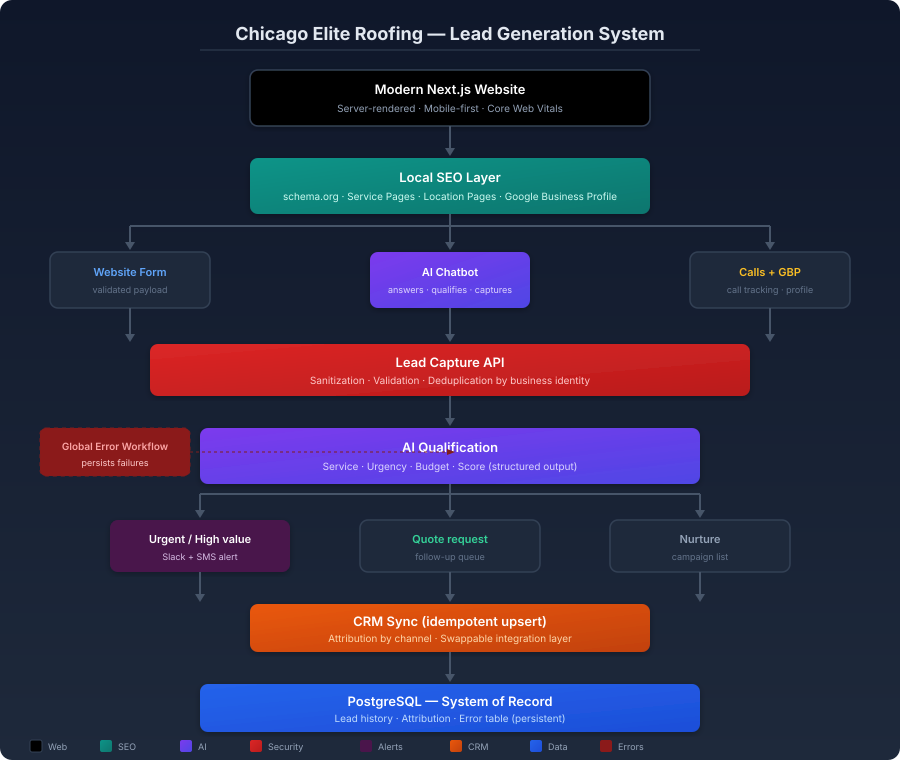

# Case Study — AI-Powered Lead Generation for a Roofing Business

> Target niche: home services & trades in the U.S. (roofing, storm response, exterior contractors).
> Technical details: see the [project README](README.md).
> This case study reformulates what the project already documents.

## The problem

A roofing company had the classic combination: a website, paid ads and a phone that rings — but the pipeline leaked. Forms landed in an inbox nobody checked on weekends. A storm on Thursday meant competitors were bidding on the same homeowner by Friday morning. There was no way to tell which channel a job came from, and the CRM was updated by hand — when it was updated.

## The solution

A modern website built for local search, with an AI chatbot that answers, qualifies and captures every visitor. Every lead — form, chat, phone or Google Business Profile — flows into one pipeline that classifies it automatically (urgent, quote request or nurture), alerts the team within seconds on the urgent ones and syncs everything to the CRM without duplicates. The office can finally answer: *where do our jobs come from?*

## The results

- [to complete with real demo data] % of leads captured automatically across all channels
- [to complete with real demo data] minutes from lead to team alert on urgent jobs
- [to complete with real demo data] % of form leads that received a follow-up within the hour
- [to complete with real demo data] duplicate contacts prevented in the CRM

## Technical stack

Next.js, TypeScript, Tailwind CSS · Local SEO (schema.org, service pages) · OpenAI · HubSpot · Slack · n8n · PostgreSQL.

## Suggested metrics (to measure in demo)

- % of website visitors that convert into a captured lead
- % of leads classified automatically (urgent / quote / nurture)
- Time from lead arrival to team alert (seconds)
- % of leads followed up within 1 hour
- Duplicates prevented on CRM entry
- Job attribution by channel (form, chat, call, Google Business Profile)

## Video script (2–3 min, recordable with Loom)

| Time | On screen | Narration |
|---|---|---|
| 0:00–0:20 | Camera + the roofing website on screen | «A storm hits, and every roofer in town is bidding on the same homeowner. I'll show you how a roofing business captures, qualifies and follows up every lead — before the competition calls back.» |
| 0:20–0:50 | The site loads fast; scroll through service pages and schema-rich results | «This is a website built for local search: fast, mobile-first, with structured data and a page for every service. It's designed to be found, not just to look good.» |
| 0:50–1:25 | The AI chatbot conversation: homeowner asks about storm damage, the bot asks qualifying questions | «A homeowner lands on the site and asks about storm damage. The chatbot answers, asks the same questions a good office manager would ask — and captures the lead without losing the visitor.» |
| 1:25–1:55 | The lead appears in the pipeline as "urgent"; a Slack + SMS alert fires; the record syncs to the CRM | «The lead is classified urgent, the team gets the alert in seconds, and the record lands in the CRM with no duplicates — with the channel it came from attached.» |
| 1:55–2:20 | The dashboard shows attribution: jobs by channel | «Now the owner can answer the question that matters: which channel actually produces jobs? Every lead carries its source.» |
| 2:20–2:45 | Closing: camera + call to action | «If your website receives leads you're losing, book a live demo with your own data. My contact info is on screen.» |

---

# Estudio de caso — Generación de leads con IA para un negocio de techados

> Nicho objetivo: servicios del hogar y oficios en EE.UU. (techados, respuesta a tormentas, contratistas de exteriores).
> Detalles técnicos: ver el [README del proyecto](README.md).

## El problema

Una empresa de techados tenía la combinación clásica: sitio web, anuncios pagados y un teléfono que suena — pero el embudo perdía leads. Los formularios caían en un correo que nadie revisaba los fines de semana. Una tormenta el jueves significaba que los competidores ya estaban cotizando al mismo propietario el viernes por la mañana. No había forma de saber de qué canal venía un trabajo, y el CRM se actualizaba a mano — cuando se actualizaba.

## La solución

Un sitio web moderno construido para búsqueda local, con un chatbot de IA que responde, califica y captura a cada visitante. Cada lead —formulario, chat, llamada o Google Business Profile— entra a un solo embudo que lo clasifica automáticamente (urgente, solicitud de cotización o seguimiento), alerta al equipo en segundos cuando es urgente y sincroniza todo al CRM sin duplicados. La oficina por fin puede responder: *¿de dónde vienen nuestros trabajos?*

## El resultado

- [a completar con datos reales de la demo] % de leads capturados automáticamente en todos los canales
- [a completar con datos reales de la demo] minutos desde el lead hasta la alerta al equipo en trabajos urgentes
- [a completar con datos reales de la demo] % de leads de formulario que recibieron seguimiento en la primera hora
- [a completar con datos reales de la demo] contactos duplicados evitados en el CRM

## Stack técnico

Next.js, TypeScript, Tailwind CSS · SEO local (schema.org, páginas de servicio) · OpenAI · HubSpot · Slack · n8n · PostgreSQL.

## Métricas sugeridas (a medir en demo)

- % de visitantes del sitio que se convierten en lead capturado
- % de leads clasificados automáticamente (urgente / cotización / seguimiento)
- Tiempo desde la llegada del lead hasta la alerta al equipo (segundos)
- % de leads con seguimiento en la primera hora
- Duplicados evitados al entrar al CRM
- Atribución de trabajos por canal (formulario, chat, llamada, Google Business Profile)

## Guion de video (2–3 min, grabable con Loom)

| Tiempo | Qué se ve en pantalla | Qué se dice |
|---|---|---|
| 0:00–0:20 | Cámara + el sitio web de techados en pantalla | «Llega una tormenta y todos los techadores de la zona le están cotizando al mismo propietario. Te muestro cómo un negocio de techados captura, califica y da seguimiento a cada lead — antes de que la competencia devuelva la llamada.» |
| 0:20–0:50 | El sitio carga rápido; se recorre páginas de servicio y resultados con schema | «Este es un sitio web construido para búsqueda local: rápido, mobile-first, con datos estructurados y una página por servicio. Está diseñado para ser encontrado, no solo para verse bien.» |
| 0:50–1:25 | Conversación del chatbot: el propietario pregunta por daños de tormenta, el bot hace preguntas de calificación | «Un propietario llega al sitio y pregunta por daños de tormenta. El chatbot responde, hace las mismas preguntas que haría un buen gerente de oficina — y captura el lead sin perder al visitante.» |
| 1:25–1:55 | El lead aparece en el embudo como "urgente"; se dispara una alerta de Slack + SMS; el registro se sincroniza al CRM | «El lead se clasifica como urgente, el equipo recibe la alerta en segundos y el registro llega al CRM sin duplicados — con el canal de origen adjunto.» |
| 1:55–2:20 | El panel muestra atribución: trabajos por canal | «Ahora el dueño puede responder la pregunta clave: ¿qué canal produce trabajos de verdad? Cada lead lleva su fuente.» |
| 2:20–2:45 | Cierre: cámara + llamado a la acción | «Si tu sitio web recibe leads que se están perdiendo, agenda una demo en vivo con tus propios datos. Mi contacto está en pantalla.» |

---

[Back to project README](README.md) · [All projects](../README.md)
