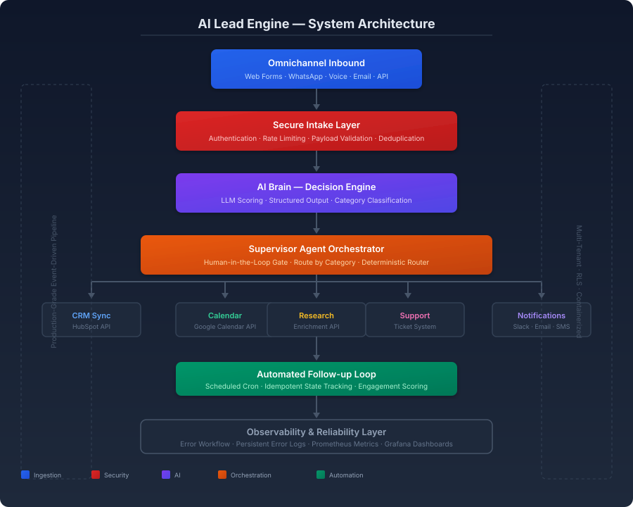
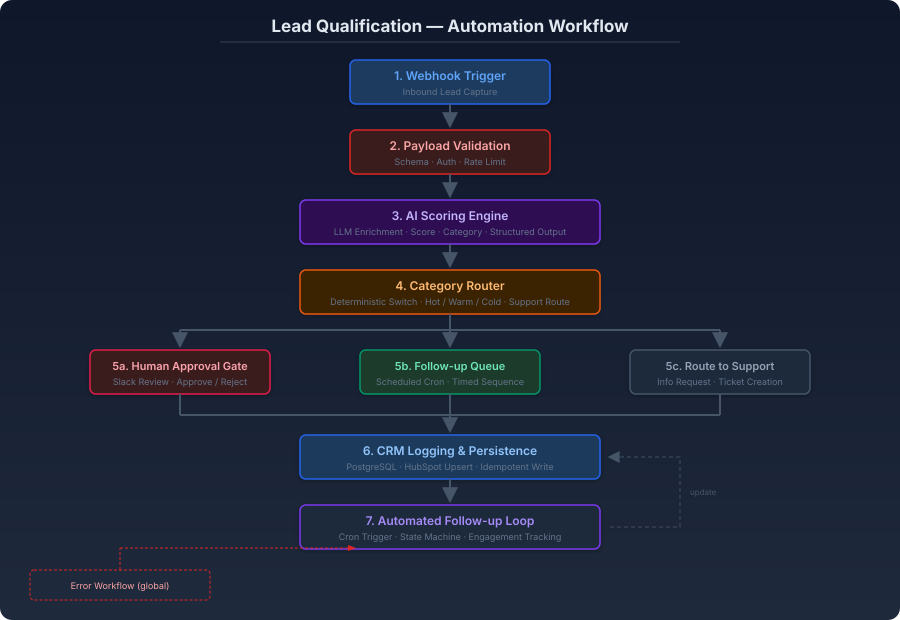
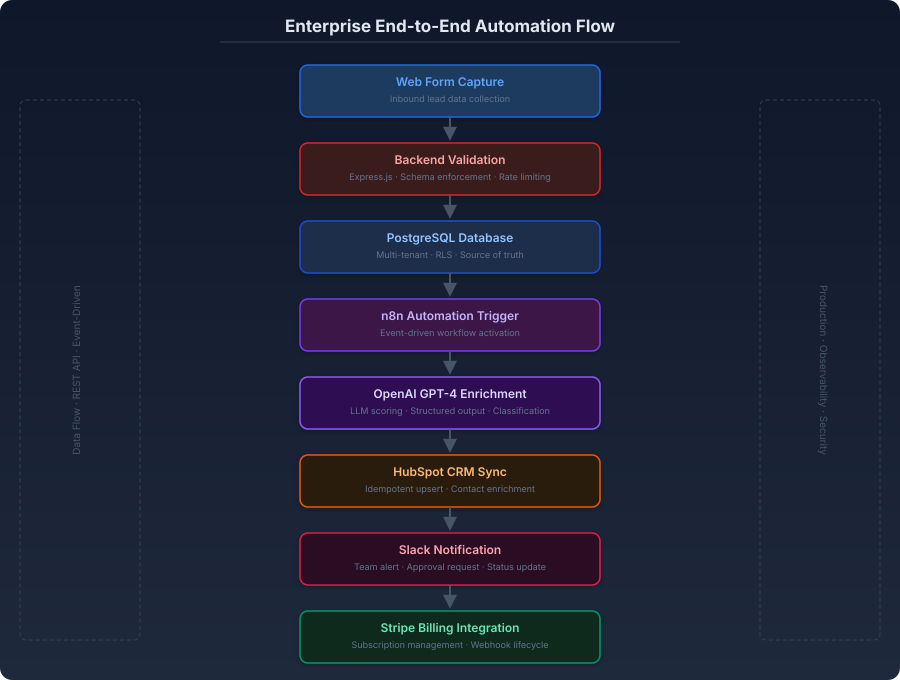
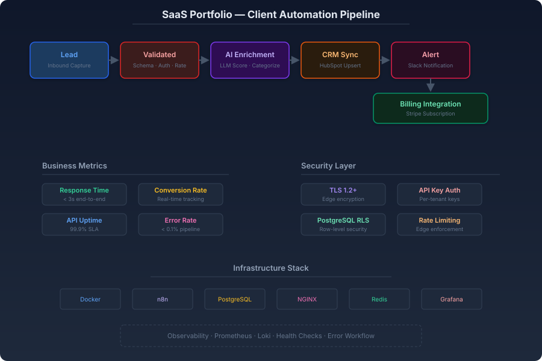

# AI Lead Qualification Engine

**Enterprise-grade AI-powered lead capture, scoring, and CRM automation platform.**

---

## 1. Overview

The Lead Qualification Engine is an **event-driven AI orchestration platform** that automates the end-to-end lead lifecycle — from omnichannel capture through LLM-powered scoring, deterministic routing, human-in-the-loop approval, CRM synchronization, and automated follow-up.

### Problem

B2B organizations lose revenue when leads are processed first-come-first-served rather than by business value. Manual qualification is slow, inconsistent, and does not scale. Duplicate entries corrupt CRM data, and pipeline failures go undetected until a customer complains.

### Solution

A production-ready automation pipeline that authenticates, validates, enriches with AI, routes deterministically, persists with idempotent writes, and alerts the right team — all within a containerized, observable architecture.

### Enterprise Value

- **40%+ reduction in lead response time** through instant AI triage
- **Eliminated CRM duplicates** via idempotent upsert and business-identity deduplication
- **Human judgment reserved for high-stakes decisions** through tiered approval gates
- **Full pipeline observability** with persistent error tracking and business metrics

---

## 2. Architecture Diagrams

### System Architecture

*End-to-end production system showing the seven orchestration layers from omnichannel intake through observability.*

### Automation Workflow

*Logical n8n workflow: webhook trigger → payload validation → AI scoring engine → category router → human approval gate → CRM persistence → automated follow-up loop.*

### Enterprise Flow

*Full enterprise data flow: web form capture → backend validation → PostgreSQL → n8n trigger → OpenAI enrichment → HubSpot sync → Slack notification → Stripe billing integration.*

### SaaS Pipeline

*Client automation pipeline with business metrics, security controls, and infrastructure stack overview.*

---

## 3. Technical Workflow

### Stage 1: Omnichannel Inbound
Web forms, WhatsApp, voice calls, email, and API integrations converge into a single authenticated webhook endpoint. Each channel is rate-limited and authenticated independently to prevent abuse across vectors.

### Stage 2: Secure Intake Layer
Every payload passes through:
- **Authentication** — API key validation at the edge
- **Rate limiting** — Tiered limits per tenant and per endpoint
- **Schema validation** — Contract enforcement before processing
- **Deduplication** — Business-identity based (email) with atomic reservation

### Stage 3: AI Scoring Engine
An LLM evaluates each lead against configurable criteria and returns **structured output**:
- `score` — Numeric priority value
- `temperature` — Hot / Warm / Cold classification
- `category` — Business-defined routing category
- `rationale` — Human-readable justification for the approval gate

**Critical design decision:** The model proposes, the code disposes. Structured output validation at the contract boundary ensures malformed LLM responses are routed to the error path — never into the CRM.

### Stage 4: Deterministic Category Router
A code-based switch — not the LLM — determines the destination. This guarantees reproducible, auditable, and cheap routing every time.

### Stage 5: Human-in-the-Loop Approval
Hot-scored leads enter a persistent approval gate via Slack. A human reviews the AI's rationale and approves or rejects. The approval state survives container restarts — no lost decisions.

### Stage 6: Idempotent CRM Persistence
PostgreSQL serves as the source of truth. HubSpot is updated via idempotent upsert — re-running the same event produces the same state. A Google Sheets layer provides the operational team with an editable surface.

### Stage 7: Automated Follow-up Loop
A scheduled cron selects pending Warm/Cold leads, generates context-aware follow-ups, and marks each contact as contacted — preventing duplicate outreach.

---

## 4. Technology Stack

| Technology | Role |
|------------|------|
| **n8n** | Visual workflow automation and orchestration |
| **Node.js / Express** | Backend validation layer and API gateway |
| **Docker / Docker Compose** | Containerized deployment and service orchestration |
| **PostgreSQL** | Multi-tenant database with row-level security |
| **OpenAI API** | Lead scoring and enrichment with structured output |
| **HubSpot API** | CRM synchronization via idempotent upsert |
| **Slack Webhooks** | Human-in-the-loop approval notifications |
| **Stripe API** | Subscription billing and webhook lifecycle |
| **NGINX** | Edge proxy with TLS termination and rate limiting |
| **Prometheus / Grafana** | Metrics collection and dashboard visualization |
| **Loki** | Structured log aggregation and querying |

---

## 5. Key Engineering Concepts

- **Event-driven architecture** — Asynchronous processing decouples ingestion from enrichment and persistence
- **API orchestration** — Multi-system coordination across LLM, CRM, billing, and notification APIs
- **AI agents** — LLM-powered decision engine with structured output contracts
- **Human-in-the-loop** — Persistent approval gate for high-stakes decisions
- **Secure webhook handling** — Edge authentication, rate limiting, and input sanitization
- **Data validation** — Schema enforcement at every layer boundary
- **CRM synchronization** — Idempotent upsert pattern preventing data corruption
- **Observability** — Prometheus metrics, Loki logs, Grafana dashboards, and persistent error workflows

---

## 6. Security Practices

- All secrets are injected via environment variables — zero credentials in code
- Webhook endpoints are authenticated with per-tenant API keys
- Input payloads are sanitized before reaching the LLM (injection defense)
- Database access enforces row-level security for multi-tenant isolation
- API rate limiting is enforced at the edge proxy
- TLS 1.2+ terminates at the NGINX edge layer
- Error workflows persist failures with full context — no silent data loss
- Pre-commit hooks prevent accidental credential exposure

---

## 7. Business Impact

| Benefit | Impact |
|---------|--------|
| **Faster lead response** | AI triage within seconds of submission |
| **Automated qualification** | Consistent scoring eliminates human bias |
| **Reduced manual operations** | Engineers focus on exceptions, not routine triage |
| **Improved customer experience** | Warm/Cold leads receive timely automated follow-up |
| **Data integrity** | Idempotent writes eliminate CRM duplicates |
| **Operational visibility** | Full pipeline metrics and persistent error tracking |

---

[⬅️ Back to Portfolio](../../README.md) · [Pattern Reference](../../docs/patterns/webhook-ai-crm-notify.md) · [Examples](../../projects/examples/lead-scoring-demo.json)

