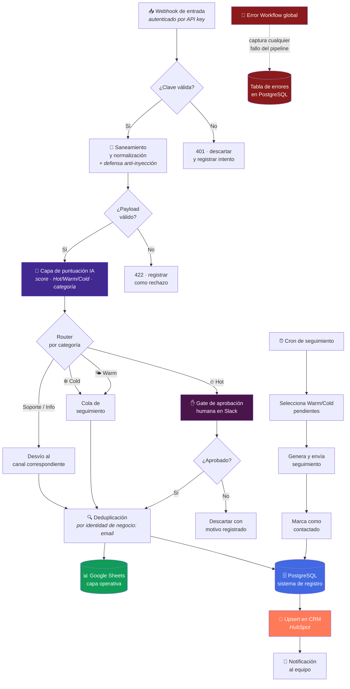

<div align="center">

# Lead Qualification Engine

**Calificación de leads con IA, enrutamiento por categoría, aprobación humana y doble persistencia.**

[](#)
[](#)
[](#)
[](#)
[](#)
[](#)

[](#)
[](#)
[](#)

</div>


---

## El problema

Una empresa recibe leads por formulario, campañas y referidos. El equipo comercial los
atiende **por orden de llegada**, no por valor. Consecuencias medibles:

- El lead con presupuesto y urgencia espera lo mismo que el que pregunta por curiosidad.
- Nadie sabe cuántos leads entraron realmente: la fuente de verdad es la bandeja de entrada.
- El mismo contacto entra tres veces y se convierte en tres registros en el CRM.
- Cuando algo falla, se descubre porque un cliente reclama.

---

## La solución en una frase

Un pipeline autenticado que **sanea**, **puntúa con IA**, **enruta por categoría**, **pide
aprobación humana para lo caliente** y **escribe en dos sistemas de registro** — con
seguimiento programado para lo tibio y un workflow de error que persiste todo fallo.

---

## Arquitectura conceptual



---

## Recorrido por etapas

### 1. Borde autenticado

La entrada es un webhook **protegido por API key**. Una petición sin clave válida no
consume recursos del pipeline: se corta en el borde y se registra el intento.

**Por qué importa:** un webhook público sin autenticación es un endpoint que cualquiera
puede inundar. Y en este caso, inundar significa **gastar llamadas a un LLM**.

### 2. Saneamiento y defensa anti-inyección

El contenido lo escribe un desconocido y termina llegando a un modelo de lenguaje. Antes de
eso, la entrada se **normaliza, se acota y se neutraliza** para que el texto del lead se
trate como *dato a evaluar*, no como *instrucción a obedecer*.

> **Principio de diseño, no receta.** La lógica concreta de neutralización forma parte del
> método comercial y no se publica. Lo relevante aquí es la decisión: *el saneamiento ocurre
> antes del modelo, no después.*

**Qué previene:** que un lead escriba en el campo "mensaje" algo diseñado para que el
modelo lo clasifique como máxima prioridad, escale a un humano o filtre el contexto del
sistema.

### 3. Puntuación con IA

La capa de IA devuelve **salida estructurada**, no prosa:

| Campo | Tipo | Uso posterior |
|---|---|---|
| `score` | numérico | Prioriza dentro de la misma temperatura |
| `temperature` | `Hot` · `Warm` · `Cold` | Decide si hay gate humano o cola de seguimiento |
| `category` | enum de negocio | Decide a qué destino se enruta |
| `rationale` | texto breve | Contexto para la persona que aprueba |

**Decisión clave:** el modelo **propone**, no ejecuta. Su salida es un campo tipado que
alimenta un router determinista. Si el modelo devuelve algo fuera del esquema, el registro
cae al camino de error en vez de contaminar el CRM.

### 4. Enrutamiento por categoría

Un router determinista — no el modelo — decide el destino. Cada categoría tiene su camino:
comercial, soporte, informativo. Las categorías de negocio y sus destinos concretos no se
publican.

### 5. Human-in-the-loop para leads calientes

Los leads **Hot** no entran solos al CRM. Se envía una tarjeta a Slack con el resumen y la
justificación del modelo, y una persona **aprueba o rechaza**.

**Por qué:** un falso positivo caliente hace que un comercial invierta su hora más valiosa
en un lead que no lo era. El coste de una aprobación de 5 segundos es mucho menor que el
coste de esa hora.

El flujo **espera** la decisión de forma persistente: si el contenedor se reinicia mientras
alguien decide, la aprobación pendiente sigue viva.

### 6. Doble persistencia con deduplicación

| Destino | Rol | Por qué |
|---|---|---|
| **PostgreSQL** | Sistema de registro | Concurrencia real, durabilidad, consultas históricas |
| **Google Sheets** | Capa operativa | El equipo comercial trabaja donde ya sabe trabajar |

La deduplicación usa **email como identidad de negocio**. El mismo contacto reenviando el
formulario actualiza su registro; no crea uno nuevo.

> La ventana temporal y la estrategia exacta de dedup no se publican.

### 7. Upsert en HubSpot

Escritura **idempotente**: si el contacto existe se actualiza, si no se crea. Ejecutar el
mismo evento dos veces deja el CRM en el mismo estado.

**Por qué importa:** un CRM con contactos duplicados deja de ser confiable, y cuando el
equipo deja de confiar en el CRM, vuelve a la hoja de cálculo personal. Ahí muere la
automatización.

### 8. Seguimiento programado (Warm / Cold)

Un cron selecciona los leads tibios y fríos pendientes, genera el seguimiento y **marca el
registro como contactado** — la marca es lo que impide que el mismo lead reciba el mismo
mensaje en la siguiente ejecución.

### 9. Error Workflow global

Todo fallo — de cualquier etapa — se captura en un workflow de error dedicado que **escribe
en una tabla de errores en PostgreSQL** con contexto suficiente para reproducirlo.

**Por qué persistente y no un log:** los logs de un contenedor se pierden al recrearlo. Una
tabla sobrevive, se puede consultar, se puede agregar por tipo de fallo y muestra si un
error es puntual o sistemático.

---

## Decisiones de ingeniería

| Decisión | Alternativa descartada | Razón |
|---|---|---|
| PostgreSQL como sistema de registro | SQLite | Concurrencia y durabilidad. SQLite bloquea con escrituras simultáneas y no tolera bien reinicios del contenedor. |
| Doble persistencia (BD + Sheets) | Solo base de datos | El equipo comercial necesita una superficie editable; ingeniería necesita una fuente de verdad. Se dan las dos sin que compitan. |
| Dedup por identidad de negocio (email) | Dedup por ID de ejecución | El ID de ejecución cambia en cada reintento; el email identifica a la persona real. |
| Gate humano solo en Hot | Aprobar todo · aprobar nada | Aprobar todo genera fatiga y la gente aprueba en automático. Aprobar nada deja pasar falsos positivos caros. |
| Router determinista tras la IA | Que el modelo decida el destino | Un router en código es auditable y reproducible; el modelo no siempre es lo segundo. |
| Salida IA con esquema tipado | Texto libre parseado | Un esquema falla ruidosamente y va al camino de error. Un parseo de texto libre falla en silencio y contamina el CRM. |
| Error Workflow con persistencia | Notificación por Slack únicamente | Una notificación se lee y se olvida. Una tabla se consulta y se agrega. |
| Red Docker dedicada prod ↔ PostgreSQL | Conexión por IP del host | Elimina fallos intermitentes por IPs efímeras tras un reinicio. |

📄 Contexto adicional en el [registro de ADRs](../../docs/adr/README.md).

---

## Comportamiento operativo

| Propiedad | Comportamiento |
|---|---|
| **Idempotencia** | Reprocesar el mismo lead no duplica en CRM ni en la base de datos |
| **Resiliencia a reinicios** | El estado vive fuera del contenedor; las aprobaciones pendientes sobreviven |
| **Trazabilidad** | Cada lead tiene registro de score, categoría, decisión humana y destino |
| **Observabilidad de fallos** | Tabla de errores consultable y agregable por tipo |
| **Degradación controlada** | Payload inválido o salida IA fuera de esquema → camino de error, nunca escritura parcial |
| **Superficie de ataque** | Un único endpoint autenticado; nada más expuesto |

---

## Fragmento ilustrativo

> ⚠️ **Genérico y no funcional de extremo a extremo.** Muestra la *forma* de la validación
> de contrato entre la IA y el resto del pipeline. No contiene el prompt, ni las categorías
> de negocio, ni los umbrales, ni la lógica de saneamiento.

```js
// ILUSTRATIVO — validación de contrato de la capa de decisión.
// Principio: si el modelo no cumple el esquema, el registro NO avanza.

const ALLOWED_TEMPERATURES = ['Hot', 'Warm', 'Cold'];

function isValidDecision(decision) {
  if (!decision || typeof decision !== 'object') return false;
  if (typeof decision.score !== 'number') return false;
  if (!Number.isFinite(decision.score)) return false;
  if (!ALLOWED_TEMPERATURES.includes(decision.temperature)) return false;
  if (typeof decision.category !== 'string' || !decision.category) return false;
  return true;
}

// El router es determinista: la IA propone, el código decide el destino.
function route(decision) {
  if (!isValidDecision(decision)) {
    return { destination: 'error_path', reason: 'schema_violation' };
  }
  return decision.temperature === 'Hot'
    ? { destination: 'human_approval' }
    : { destination: 'followup_queue' };
}
```

---

## Qué NO encontrarás en este repositorio

- El workflow n8n exportado ni el grafo real de nodos y conexiones.
- El prompt de puntuación (texto literal) ni su esquema de salida completo.
- Los umbrales de score que separan Hot / Warm / Cold.
- La ventana y la estrategia de deduplicación.
- Las reglas concretas de saneamiento anti-inyección.
- Credenciales, URLs de webhook, IDs de hoja o de canal, cadenas de conexión.

Esa es la parte replicable y es el método comercial. Ver [SECURITY.md](../../SECURITY.md).

---

<div align="center">

**¿Quieres este motor operando sobre tu CRM?**
[CONTACT.md](../../CONTACT.md)

[⬅️ Volver al portafolio](../../README.md) · [Patrón reutilizable](../../docs/patterns/webhook-ai-crm-notify.md) · [ADRs](../../docs/adr/README.md)

</div>
