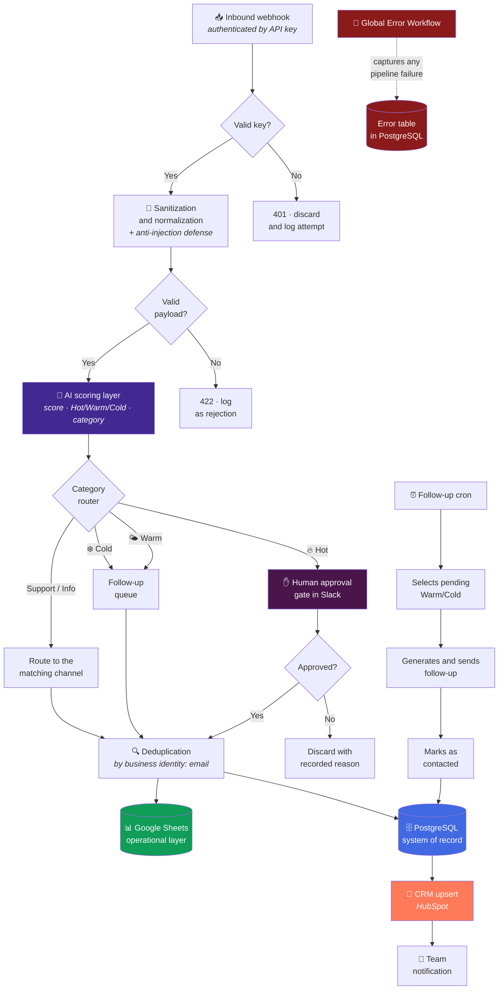

<div align="center">

# Lead Qualification Engine

**AI lead scoring, category-based routing, human approval and dual persistence.**

[](#)
[](#)
[](#)
[](#)
[](#)
[](#)

[](#)
[](#)
[](#)

</div>


---

## The problem

A company receives leads through forms, campaigns and referrals. The sales team works
**first-come, first-served**, not by value. Measurable consequences:

- The lead with budget and urgency waits the same as the one asking out of curiosity.
- Nobody knows how many leads really came in: the source of truth is the inbox.
- The same contact enters three times and becomes three CRM records.
- When something fails, it is discovered because a client complains.

---

## The solution in one sentence

An authenticated pipeline that **sanitizes**, **scores with AI**, **routes by
category**, **asks for human approval on hot leads** and **writes to two systems of
record** — with scheduled follow-up for warm leads and an error workflow that persists
every failure.

---

## Conceptual architecture



---

## Stage-by-stage walkthrough

### 1. Authenticated edge

The entry point is a webhook **protected by an API key**. A request without a valid key
consumes no pipeline resources: it is cut at the edge and the attempt is logged.

**Why it matters:** an unauthenticated public webhook is an endpoint anyone can flood.
And in this case, flooding means **burning LLM calls**.

### 2. Sanitization and anti-injection defense

The content is written by a stranger and ends up reaching a language model. Before that,
the input is **normalized, scoped and neutralized** so the lead's text is treated as
*data to evaluate*, not *instructions to obey*.

> **Design principle, not recipe.** The concrete neutralization logic is part of the
> commercial method and is not published. What matters here is the decision:
> *sanitization happens before the model, not after.*

**What it prevents:** a lead writing in the "message" field something designed to make
the model classify it as maximum priority, escalate to a human, or leak the system
context.

### 3. AI scoring

The AI layer returns **structured output**, not prose:

| Field | Type | Used for |
|---|---|---|
| `score` | numeric | Prioritizes within the same temperature |
| `temperature` | `Hot` · `Warm` · `Cold` | Decides between human gate and follow-up queue |
| `category` | business enum | Decides the routing destination |
| `rationale` | short text | Context for the person approving |

**Key decision:** the model **proposes**, it does not execute. Its output is a typed
field that feeds a deterministic router. If the model returns something out of schema,
the record goes to the error path instead of corrupting the CRM.

### 4. Category routing

A deterministic router — not the model — decides the destination. Each category has its
path: sales, support, informational. The business categories and their concrete
destinations are not published.

### 5. Human-in-the-loop for hot leads

**Hot** leads do not enter the CRM alone. A card is sent to Slack with the summary and
the model's rationale, and a person **approves or rejects**.

**Why:** a hot false positive makes a salesperson spend their most valuable hour on a
lead that was not. The cost of a 5-second approval is much lower than the cost of that
hour.

The flow **waits** for the decision persistently: if the container restarts while
someone decides, the pending approval stays alive.

### 6. Dual persistence with deduplication

| Destination | Role | Why |
|---|---|---|
| **PostgreSQL** | System of record | Real concurrency, durability, historical queries |
| **Google Sheets** | Operational layer | The sales team works where it already knows how to work |

Deduplication uses **email as business identity**. The same contact re-submitting the
form updates its record; it does not create a new one.

> The time window and the exact dedup strategy are not published.

### 7. HubSpot upsert

**Idempotent** write: if the contact exists it is updated, if not it is created. Running
the same event twice leaves the CRM in the same state.

**Why it matters:** a CRM with duplicate contacts stops being trustworthy, and when the
team stops trusting the CRM it goes back to personal spreadsheets. That is where the
automation dies.

### 8. Scheduled follow-up (Warm / Cold)

A cron selects pending warm and cold leads, generates the follow-up and **marks the
record as contacted** — the mark is what prevents the same lead from receiving the same
message on the next run.

### 9. Global Error Workflow

Every failure — from any stage — is captured by a dedicated error workflow that
**writes to an error table in PostgreSQL** with enough context to reproduce it.

**Why persistent and not a log:** container logs are lost when recreated. A table
survives, can be queried, can be aggregated by failure type and shows whether an error
is one-off or systematic.

---

## Engineering decisions

| Decision | Rejected alternative | Reason |
|---|---|---|
| PostgreSQL as system of record | SQLite | Concurrency and durability. SQLite locks under simultaneous writes and tolerates container restarts poorly. |
| Dual persistence (DB + Sheets) | Database only | The sales team needs an editable surface; engineering needs a source of truth. Both are provided without competing. |
| Dedup by business identity (email) | Dedup by execution ID | The execution ID changes on every retry; the email identifies the real person. |
| Human gate only on Hot | Approve everything · approve nothing | Approving everything creates fatigue and people approve on autopilot. Approving nothing lets expensive false positives through. |
| Deterministic router after AI | Model decides the destination | A router in code is auditable and reproducible; the model is not always the latter. |
| Typed-schema AI output | Parsed free text | A schema fails loudly and goes to the error path. Free-text parsing fails silently and corrupts the CRM. |
| Error workflow with persistence | Slack notification only | A notification is read and forgotten. A table can be queried and aggregated. |
| Dedicated Docker network prod ↔ PostgreSQL | Host IP connection | Eliminates intermittent failures from ephemeral IPs after a restart. |

📄 Additional context in the [ADR registry](../../docs/adr/README.md).

---

## Operational behavior

| Property | Behavior |
|---|---|
| **Idempotency** | Reprocessing the same lead does not duplicate in CRM or database |
| **Restart resilience** | State lives outside the container; pending approvals survive |
| **Traceability** | Every lead has records of score, category, human decision and destination |
| **Failure observability** | Queryable error table, aggregatable by type |
| **Controlled degradation** | Invalid payload or out-of-schema AI output → error path, never a partial write |
| **Attack surface** | One authenticated endpoint; nothing else exposed |

---

## Illustrative fragment

> ⚠️ **Generic and not end-to-end functional.** It shows the *shape* of the contract
> validation between the AI and the rest of the pipeline. It contains no prompt, no
> business categories, no thresholds and no sanitization logic.

```js
// ILLUSTRATIVE — contract validation of the decision layer.
// Principle: if the model does not meet the schema, the record does NOT proceed.

const ALLOWED_TEMPERATURES = ['Hot', 'Warm', 'Cold'];

function isValidDecision(decision) {
  if (!decision || typeof decision !== 'object') return false;
  if (typeof decision.score !== 'number') return false;
  if (!Number.isFinite(decision.score)) return false;
  if (!ALLOWED_TEMPERATURES.includes(decision.temperature)) return false;
  if (typeof decision.category !== 'string' || !decision.category) return false;
  return true;
}

// The router is deterministic: the AI proposes, the code decides the destination.
function route(decision) {
  if (!isValidDecision(decision)) {
    return { destination: 'error_path', reason: 'schema_violation' };
  }
  return decision.temperature === 'Hot'
    ? { destination: 'human_approval' }
    : { destination: 'followup_queue' };
}
```

---

## What you will NOT find in this repository

- The exported n8n workflow or the real node/connection graph.
- The scoring prompt (literal text) or its complete output schema.
- The score thresholds separating Hot / Warm / Cold.
- The deduplication window and strategy.
- The concrete anti-injection sanitization rules.
- Credentials, webhook URLs, sheet or channel IDs, connection strings.

That is the replicable part and the commercial method. See [SECURITY.md](../../SECURITY.md).

---

<div align="center">

**Do you want this engine running against your CRM?**
[bhrayan.automation@gmail.com](mailto:bhrayan.automation@gmail.com)

[⬅️ Back to the portfolio](../../README.md) · [Reusable pattern](../../docs/patterns/webhook-ai-crm-notify.md) · [ADRs](../../docs/adr/README.md)

</div>
