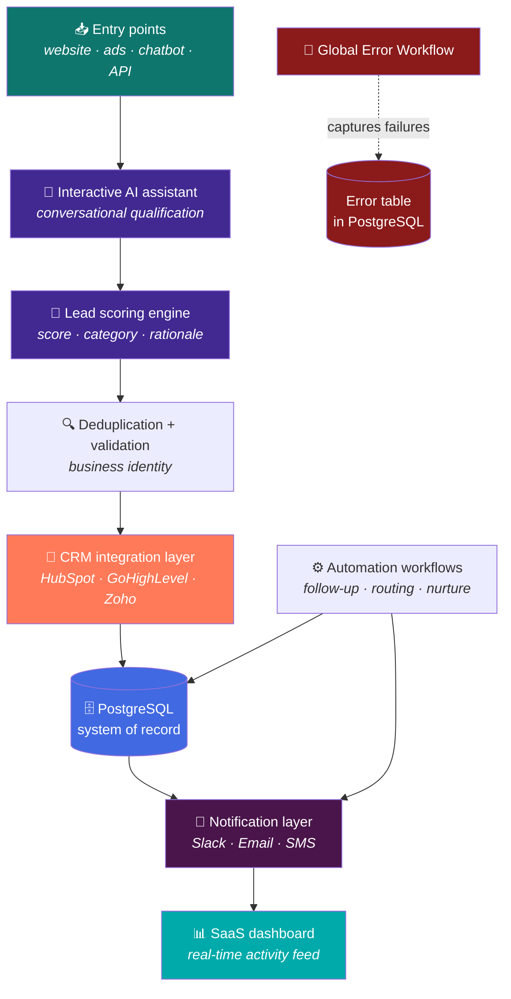

<div align="center">

# AI Lead Qualification Platform | Next.js, OpenAI & CRM Automation

**A full SaaS platform: interactive AI assistant, lead scoring engine, CRM integration layer, multi-channel notifications and a real-time dashboard.**

[](#)
[](#)
[](#)
[](#)
[](#)
[](#)
[](#)
[](#)
[](#)
[](#)

[](#)
[](#)
[](#)

</div>


---

## The problem

A growing business receives leads from the website, ads and a chatbot — and the only
thing worse than losing them is **treating them all the same**. The result:

- The sales team calls the curious and the ready **in arrival order**, not by value.
- Every lead is typed by hand into the CRM — if the CRM is used at all.
- Nobody knows which channel, campaign or ad actually produces revenue.
- The "AI assistant" on the website is a FAQ bot: it cannot qualify a lead, score it
  or hand it to the pipeline.
- When the CRM must change — HubSpot to GoHighLevel, say — the whole integration is
  rebuilt from scratch.

---

## The solution in one sentence

A **SaaS lead qualification platform** where an **interactive AI assistant** qualifies
every lead, a **lead scoring engine** prioritizes it, a **CRM integration layer**
syncs to HubSpot, GoHighLevel or Zoho through one contract, **Slack, email and SMS
notifications** reach the team where they work, and a **real-time dashboard** shows the
activity feed as it happens.

---

## Conceptual architecture



---

## Platform capabilities

### 1. Interactive AI assistant

The assistant does **conversational qualification**: instead of a form, the visitor is
asked the right questions in a natural conversation — budget, timeline, needs — and the
answers are turned into **structured lead data**.

**Key decision:** the assistant proposes, the platform decides. The conversation output
is a typed object that feeds the scoring engine; out-of-schema output goes to the error
path, never into the CRM.

### 2. Lead scoring engine

Every lead receives a score and a category. The scoring model evaluates the signals
collected during the conversation and from the channel:

| Input | What it weighs |
|---|---|
| Service / product requested | Revenue potential of the segment |
| Urgency signals | Time pressure ("need it this week") |
| Budget / authority signals | Buying ability and decision power |
| Channel and campaign | Historical quality of the source |

The model **proposes**; a deterministic router applies the thresholds and decides the
destination. Thresholds are configuration, not prompt text — they can be tuned without
touching the AI layer.

### 3. CRM-ready architecture

All three supported CRMs — **HubSpot, GoHighLevel, Zoho** — plug into the same
integration contract:

| Layer | Responsibility |
|---|---|
| **Adapter** | Translates the canonical lead into the CRM's field model |
| **Idempotent upsert** | Same contact never duplicates, across retries |
| **Source mapping** | Channel, campaign and score travel with the record |
| **Webhook listener** | CRM events (deal created, status changed) feed the activity feed |

Switching CRMs means **adding an adapter, not rebuilding the platform**. The integration
layer is the same contract documented in the [platform API](../../docs/platform.md).

### 4. Notification architecture

The notification layer is channel-agnostic and event-driven:

| Channel | Typical event |
|---|---|
| **Slack** | Hot lead, approval request, CRM errors |
| **Email** | Follow-up sequences, weekly digests |
| **SMS** (Twilio) | Urgent leads outside business hours |

Notifications are **sent after persistence, not before**: the team is never alerted about
something that failed to be written.

### 5. SaaS dashboard with real-time activity feed

The dashboard is a **Next.js application** that shows, as it happens:

- The activity feed: every lead captured, scored, synced or rejected — in real time.
- The pipeline: leads by category, source and status.
- The integration health: last sync per CRM, failed events, retry counts.
- The automation runs: what the workflows did and when.

**Why it matters:** a system nobody can watch is a system nobody trusts. The feed turns
the automation from a black box into something the team can verify and show to the boss.

### 6. Automation workflow design

The workflows that operate on the leads are **designed as data, not as code**: follow-up
sequences, routing rules, nurture campaigns and escalation logic can be configured and
changed without redeploying the platform. The workflow runner is the same engine
documented in the [reusable pattern](../../docs/patterns/webhook-ai-crm-notify.md).

---

## Engineering decisions

| Decision | Rejected alternative | Reason |
|---|---|---|
| Conversational qualification | Form-only capture | Conversations surface signals (budget, urgency) forms do not |
| Scoring engine with tunable thresholds | Thresholds in the prompt | Prompt text is not configuration; thresholds must be auditable and tunable |
| Model proposes, router decides | Model decides the destination | Deterministic routing is reproducible; the model proposes |
| One integration contract, adapters per CRM | One integration per CRM | Adding a CRM = adding an adapter, not rebuilding the platform |
| Idempotent CRM upsert | Plain insert | Retries and duplicates must never corrupt the CRM |
| Notifications after persistence | Notify first | Never announce what was not written |
| Real-time activity feed | Periodic reports | A system nobody watches loses trust; the feed is the evidence |
| Workflows as data | Workflows as code | Business rules change weekly; deployments should not |
| Error workflow with persistence | Logs only | Logs vanish on restart; a table can be queried and aggregated |

📄 Additional context in the [ADR registry](../../docs/adr/README.md).

---

## Operational behavior

| Property | Behavior |
|---|---|
| **Scoring consistency** | Same signals produce the same category — thresholds are config, not luck |
| **CRM portability** | HubSpot ↔ GoHighLevel ↔ Zoho without rebuilding the pipeline |
| **No duplicates** | Guaranteed by business identity, across retries and sources |
| **Real-time visibility** | Every event appears in the activity feed as it happens |
| **Multi-channel reach** | Slack, email and SMS follow the event's urgency |
| **Controlled degradation** | Out-of-schema AI output goes to the error path, never to the CRM |
| **Restart resilience** | State lives outside containers; pending work survives |

---

## Illustrative fragment

> ⚠️ **Generic and not end-to-end functional.** It shows the *shape* of the adapter
> contract. It contains no real field mappings, no thresholds, no prompts.

```js
// ILLUSTRATIVE — the CRM adapter contract.
// Principle: the platform speaks one canonical lead; the adapter speaks CRM fields.

class CrmAdapter {
  constructor(api) {
    this.api = api;
  }

  toCrm(lead) {
    // Translates the canonical lead into this CRM's field model.
    // Field mapping is per-adapter configuration, not per-lead logic.
    throw new Error('implement per CRM');
  }

  async upsert(lead) {
    // Idempotent: locate by business identity, then create or update.
    const existing = await this.api.findBy(lead.businessIdentity);
    if (existing) {
      return this.api.update(existing.id, this.toCrm(lead));
    }
    return this.api.create(this.toCrm(lead));
  }
}

// Adding GoHighLevel tomorrow = one new class, zero pipeline changes.
```

---

## What you will NOT find in this repository

- The exported n8n workflows or the real node/connection graphs.
- The assistant's prompt and the conversation design.
- The scoring model and its thresholds.
- The concrete field mappings per CRM.
- The real webhook URLs, credentials, keys or client data.

That is the replicable part and the commercial method. See [SECURITY.md](../../SECURITY.md).

---

## Screenshots

The gallery of the running platform — assistant conversation, scoring, dashboard activity
feed and CRM records — is shown in the **live demo** offered to clients. Public
screenshots that comply with the [asset policy](../../assets/README.md) are published in
[`assets/screenshots/`](../../assets/screenshots/).

---

<div align="center">

**Do you treat every lead the same — or do you know which one pays?**
[bhrayan.automation@gmail.com](mailto:bhrayan.automation@gmail.com)

[⬅️ Back to the portfolio](../../README.md) · [Reusable pattern](../../docs/patterns/webhook-ai-crm-notify.md) · [Platform API](../../docs/platform.md) · [ADRs](../../docs/adr/README.md)

</div>
