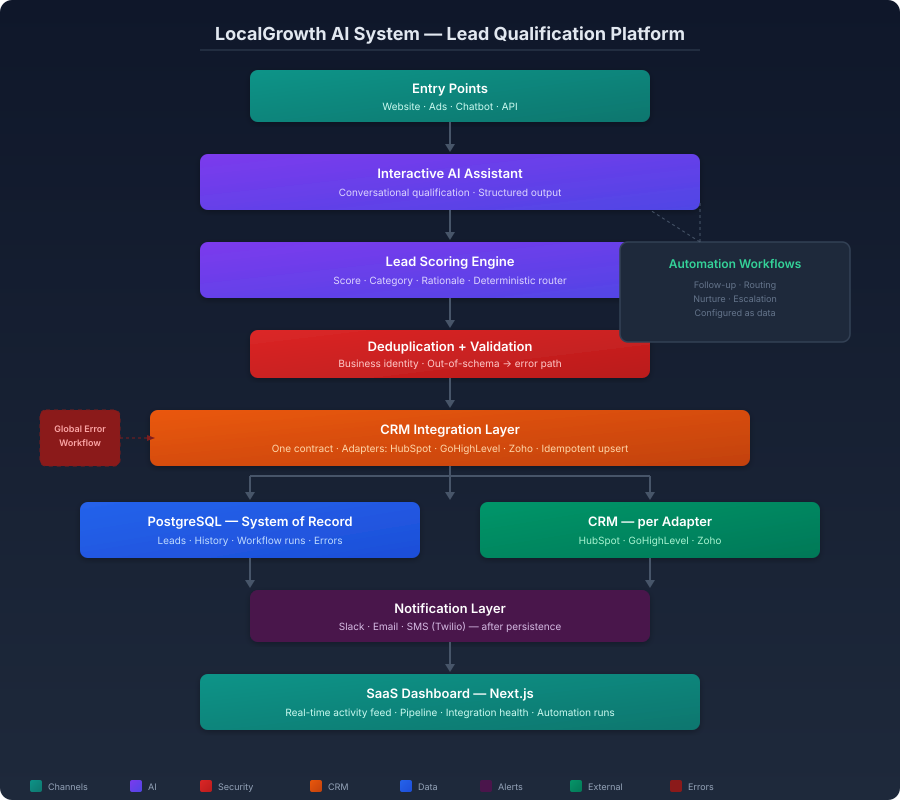

# Case Study — AI Lead Qualification Platform

> Target niche: small and medium businesses and marketing agencies that receive leads
> from multiple channels and need them scored, routed and synced to a CRM.
> Technical details: see the [project README](README.md).
> This case study reformulates what the project already documents.

## The problem

A business or agency receives leads from the website, ads and a chatbot — and treats them all the same. The sales team calls in arrival order, not by value. Leads are typed into the CRM by hand — when they are typed at all. Nobody can say which channel, campaign or ad actually produces revenue, and the website's "AI assistant" is a FAQ bot that cannot qualify a lead or hand it to the pipeline.

## The solution

A SaaS lead qualification platform: an interactive AI assistant qualifies every lead in a natural conversation, a scoring engine prioritizes it (score + category), a CRM integration layer syncs to HubSpot, GoHighLevel or Zoho through one contract, and Slack, email and SMS notifications reach the team where they work. A real-time dashboard shows the activity feed as it happens — every lead captured, scored, synced or rejected.

## The results

- [to complete with real demo data] % of leads qualified automatically with no human work
- [to complete with real demo data] minutes saved per week on manual CRM entry
- [to complete with real demo data] % of revenue attributed to a specific channel or campaign
- [to complete with real demo data] duplicates prevented in the CRM

## Technical stack

Next.js, TypeScript, Tailwind CSS · OpenAI · HubSpot / GoHighLevel / Zoho · Slack · Twilio (SMS) · PostgreSQL · n8n.

## Suggested metrics (to measure in demo)

- Leads qualified automatically per day
- % of leads scored with a category (Hot / Warm / Cold)
- Time between lead capture and score (seconds)
- % of leads followed up within the hour
- Duplicates prevented on CRM entry
- Attribution: revenue by channel, campaign or ad

## Video script (2–3 min, recordable with Loom)

| Time | On screen | Narration |
|---|---|---|
| 0:00–0:20 | Camera + the dashboard activity feed on screen | «Every business receives leads from three or four places — and treats them all the same. I'll show you a platform that qualifies each one, scores it and syncs it to your CRM automatically.» |
| 0:20–0:50 | A visitor starts a conversation with the AI assistant on the website | «A visitor lands on the site and the AI assistant starts a real conversation: it asks about budget, timeline and needs — the same questions your best salesperson would ask.» |
| 0:50–1:25 | The conversation becomes a lead: score appears, category assigned, rationale visible | «The conversation becomes a structured lead, scored and categorized. No one typed anything: the qualification happened during the chat.» |
| 1:25–1:55 | The lead syncs to the CRM; the team receives the notification (Slack or SMS); the activity feed updates in real time | «The lead reaches the CRM with no duplicates, and the team gets the alert where they work. The dashboard feed updates the moment it happens.» |
| 1:55–2:20 | The integrations screen: HubSpot, GoHighLevel and Zoho adapters visible | «The integration layer speaks one language. Switching from HubSpot to GoHighLevel means adding an adapter — not rebuilding the platform.» |
| 2:20–2:45 | Closing: camera + call to action | «If your team is still sorting leads by hand, book a live demo with your own data. My contact info is on screen.» |

---

# Estudio de caso — Plataforma de calificación de leads con IA

> Nicho objetivo: pequeñas y medianas empresas y agencias de marketing que reciben leads
> de varios canales y necesitan calificarlos, enrutarlos y sincronizarlos a un CRM.
> Detalles técnicos: ver el [README del proyecto](README.md).

## El problema

Una empresa o agencia recibe leads del sitio web, de los anuncios y de un chatbot — y los trata a todos por igual. El equipo de ventas llama por orden de llegada, no por valor. Los leads se escriben a mano en el CRM — cuando se escriben. Nadie puede decir qué canal, campaña o anuncio produce ingresos de verdad, y el "asistente de IA" del sitio es un bot de preguntas frecuentes que no puede calificar un lead ni entregarlo al embudo.

## La solución

Una plataforma SaaS de calificación de leads: un asistente de IA interactivo califica a cada lead en una conversación natural, un motor de scoring lo prioriza (puntaje + categoría), una capa de integración de CRM sincroniza con HubSpot, GoHighLevel o Zoho mediante un solo contrato, y las notificaciones por Slack, correo y SMS llegan al equipo donde trabaja. Un panel en tiempo real muestra el feed de actividad mientras ocurre — cada lead capturado, calificado, sincronizado o rechazado.

## El resultado

- [a completar con datos reales de la demo] % de leads calificados automáticamente sin trabajo humano
- [a completar con datos reales de la demo] minutos ahorrados por semana en captura manual al CRM
- [a completar con datos reales de la demo] % de ingresos atribuidos a un canal o campaña específico
- [a completar con datos reales de la demo] duplicados evitados en el CRM

## Stack técnico

Next.js, TypeScript, Tailwind CSS · OpenAI · HubSpot / GoHighLevel / Zoho · Slack · Twilio (SMS) · PostgreSQL · n8n.

## Métricas sugeridas (a medir en demo)

- Leads calificados automáticamente por día
- % de leads con categoría asignada (Caliente / Tibio / Frío)
- Tiempo entre la captura del lead y su puntaje (segundos)
- % de leads con seguimiento en la primera hora
- Duplicados evitados al entrar al CRM
- Atribución: ingresos por canal, campaña o anuncio

## Guion de video (2–3 min, grabable con Loom)

| Tiempo | Qué se ve en pantalla | Qué se dice |
|---|---|---|
| 0:00–0:20 | Cámara + el feed de actividad del panel en pantalla | «Toda empresa recibe leads de tres o cuatro lugares — y los trata a todos por igual. Te muestro una plataforma que califica cada uno, le asigna un puntaje y lo sincroniza a tu CRM automáticamente.» |
| 0:20–0:50 | Un visitante inicia una conversación con el asistente de IA en el sitio | «Un visitante llega al sitio y el asistente de IA inicia una conversación real: pregunta por presupuesto, tiempo y necesidades — las mismas preguntas que haría tu mejor vendedor.» |
| 0:50–1:25 | La conversación se convierte en un lead: aparece el puntaje, la categoría y la justificación | «La conversación se convierte en un lead estructurado, con puntaje y categoría. Nadie escribió nada: la calificación ocurrió durante el chat.» |
| 1:25–1:55 | El lead se sincroniza al CRM; el equipo recibe la notificación (Slack o SMS); el feed del panel se actualiza en tiempo real | «El lead llega al CRM sin duplicados y el equipo recibe la alerta donde trabaja. El feed del panel se actualiza en el momento.» |
| 1:55–2:20 | La pantalla de integraciones: adaptadores de HubSpot, GoHighLevel y Zoho visibles | «La capa de integración habla un solo idioma. Cambiar de HubSpot a GoHighLevel significa agregar un adaptador — no reconstruir la plataforma.» |
| 2:20–2:45 | Cierre: cámara + llamado a la acción | «Si tu equipo todavía ordena leads a mano, agenda una demo en vivo con tus propios datos. Mi contacto está en pantalla.» |

---

[Back to project README](README.md) · [All projects](../README.md)
