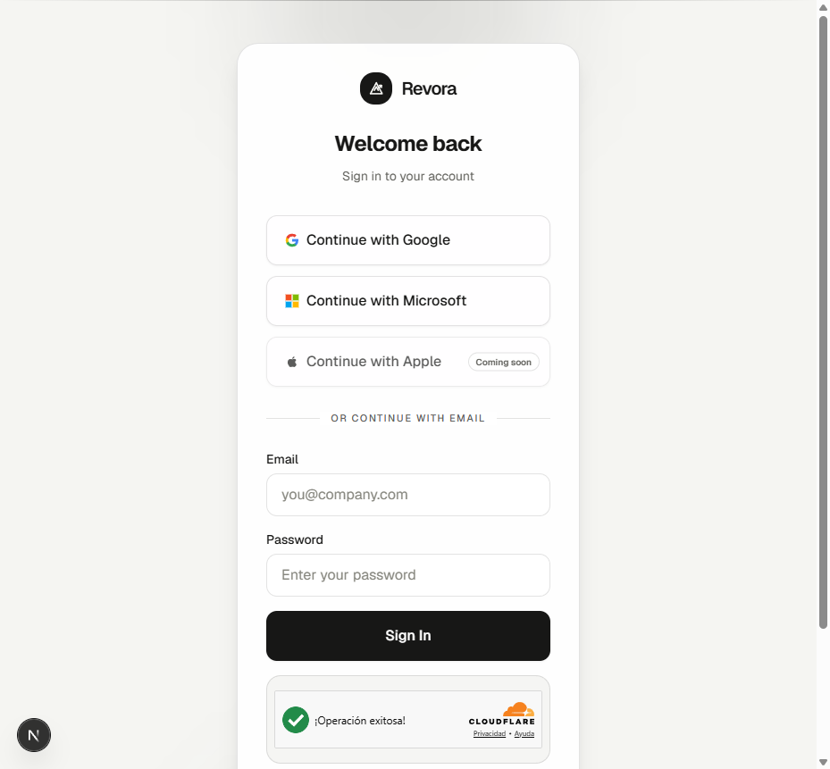
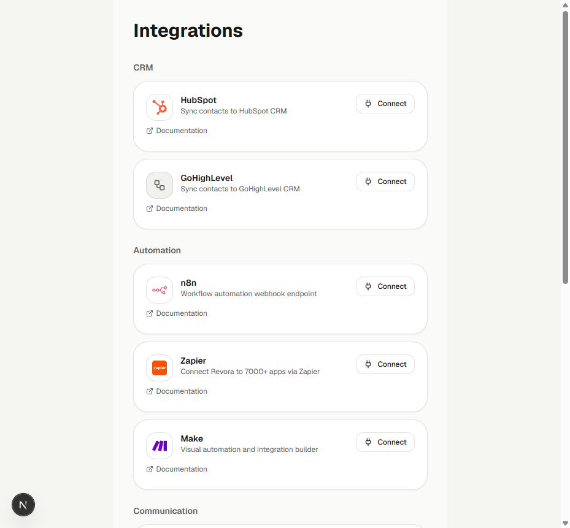

# Revora

**AI revenue automation platform for managing leads, pipelines, workflows, analytics, and third-party integrations in a secure multi-tenant SaaS environment.**

[View on GitHub](https://github.com/BhrayanM/revora)

---

## Overview

Revora is an enterprise-grade SaaS application designed to empower businesses with AI-assisted lead management, qualification, and automated CRM workflows. 

## Problem & Solution

**The Problem**: Managing inbound leads across fragmented tools (CRMs, scheduling software, webhooks, and chat platforms) leads to delayed response times and lost revenue. Without centralized visibility, qualifying leads accurately becomes a bottleneck.

**The Solution**: A strictly isolated multi-tenant architecture that ingests leads, triggers automated webhook-based execution retries, syncs bi-directionally with popular CRMs, and safeguards organizational data using Row-Level Security (RLS) and MFA.

## Product Previews

### Secure Authentication & Onboarding
Enforced TOTP multi-factor authentication, PKCE OAuth, Turnstile bot protection, and robust organizational boundaries.

### Multi-tenant Integrations
Seamless, HMAC-verified integrations with third-party providers (HubSpot, GoHighLevel, n8n, Zapier, Slack, Twilio, and more).

## Core Capabilities

- **Lead Management & Pipeline:** Automated lead ingestion, visualization, and lifecycle tracking.
- **Automation Workflows:** Webhook-based trigger systems and execution retries.
- **CRM Integrations:** Bi-directional syncing with CRMs like HubSpot and GoHighLevel.
- **Calendar & Communications:** Seamless scheduling and communications with Google Workspace, Slack, and Twilio.
- **Multi-tenant Architecture:** Organization and workspace scoping with strict PostgreSQL row-level security.
- **Secure Authentication:** MFA/TOTP, Turnstile bot protection, PKCE OAuth, and authenticated legal consents.

## Architecture & Security

- **Role-Based Access Control (RBAC):** Granular Owner, Admin, and Member constraints.
- **Row-Level Security (RLS):** Database isolation at the tenant level via Supabase PostgreSQL.
- **Secrets Management:** Secure secret handling and strict separation of server/client keys.
- **API Protection:** HMAC webhook verification and distributed rate limiting.

## Tech Stack

- **Framework:** Next.js App Router (React 19)
- **Database / Auth:** Supabase PostgreSQL
- **Styling:** Tailwind CSS v4, Radix Primitives
- **Infrastructure:** Vercel, Supabase, Upstash Redis

## Quality & Testing

- 100% strict TypeScript.
- Comprehensive integration contract tests validation.
- Automated UX validation tests.
- CI/CD quality gates via GitHub Actions.

---
**[View source code and full documentation on GitHub](https://github.com/BhrayanM/revora)**
