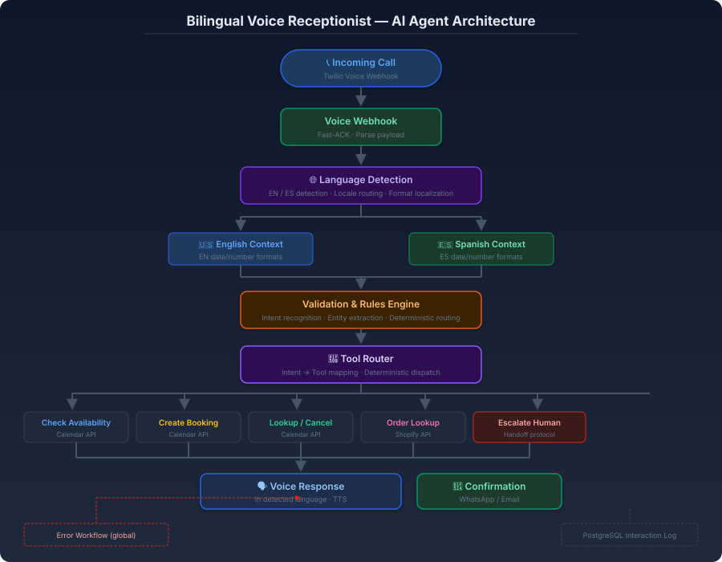

# Bilingual AI Voice Receptionist (EN / ES)

**24/7 conversational voice agent with language detection, calendar management, and commerce integration.**

---

## 1. Overview

The Bilingual Voice Receptionist is an **AI-powered conversational voice agent** that handles inbound calls 24/7 in English and Spanish. It detects the caller's language in real time, validates intent through a deterministic rules engine, routes to the appropriate tool (calendar management, order lookup, or human escalation), and responds with natural speech in the caller's detected language.

### Problem

Businesses with mixed EN/ES customer bases face two simultaneous losses: unanswered calls outside business hours, and language mismatches that alienate half their client base. A traditional IVR solves neither — callers hang up before reaching a human.

### Solution

An AI voice agent that combines **real-time language detection**, **deterministic intent validation**, **bounded tool execution with latency budgets**, and **persistent interaction logging** — all within a containerized, observable architecture.

### Enterprise Value

- **24/7 coverage** — No missed calls, no after-hours gaps
- **Native bilingual experience** — Each caller served in their own language
- **Full calendar lifecycle** — Book, look up, cancel, and reschedule without human intervention
- **Reduced operational overhead** — Routine inquiries handled autonomously

---

## 2. Architecture Diagram

*End-to-end architecture: incoming call → Twilio webhook → language detection → validation rules engine → deterministic tool router → calendar/shopify actions → spoken response with written confirmation.*

---

## 3. Technical Workflow

### Stage 1: Inbound Call & Voice Webhook
An incoming call hits the Twilio voice webhook. The system responds with an immediate ACK to prevent provider timeouts, then parses the call metadata and audio stream.

### Stage 2: Language Detection
The caller's language is detected within the call context — not inferred from phone number or region. English and Spanish contexts are maintained independently, including locale-specific date, time, and number formatting.

**Critical detail:** Date localization is applied to both spoken output and written confirmations. *"El tres de abril"* and *"April third"* are different utterances that produce different calendar entries.

### Stage 3: Validation & Rules Engine
A deterministic rules engine extracts intent and entities from the caller's request before any AI processing occurs. This ensures fast, cheap routing for well-defined queries while reserving LLM inference for ambiguous cases.

### Stage 4: Tool Router
The router dispatches to purpose-built tools based on recognized intent:

| Intent | Tool | API |
|--------|------|-----|
| Availability check | Calendar query | Calendar API |
| Create booking | Calendar write | Calendar API |
| Lookup appointment | Calendar read | Calendar API |
| Cancel appointment | Calendar delete | Calendar API |
| Reschedule | Calendar atomic swap | Calendar API |
| Order inquiry | Order lookup | Shopify API |
| Out of scope | Human escalation | Handoff protocol |

### Stage 5: Voice Response & Confirmation
The agent responds in the caller's detected language using text-to-speech. Written confirmations (WhatsApp or email) are sent in the same language with correctly localized dates and amounts.

---

## 4. Technology Stack

| Technology | Role |
|------------|------|
| **n8n** | Workflow orchestration and tool coordination |
| **Twilio** | Voice telephony and WhatsApp messaging |
| **OpenAI API** | Intent classification and ambiguous query resolution |
| **Calendar API** | Availability, booking, and appointment management |
| **Shopify API** | Commerce order lookup and status inquiries |
| **PostgreSQL** | Interaction logging and error persistence |
| **Docker / Docker Compose** | Containerized deployment |
| **Prometheus / Grafana** | Call metrics and system observability |

---

## 5. Key Engineering Concepts

- **Real-time language detection** — Language identified per-call, not by number or region
- **Deterministic routing** — Intent-to-tool mapping in code, not in the model
- **Latency budgeting** — Each tool has a bounded execution window suited to voice UX
- **Graceful degradation** — Tool timeout produces a spoken fallback, never silence
- **Atomic calendar operations** — Rescheduling is a single atomic operation, not cancel-then-create
- **Persistent state** — Interaction logs and error records survive container restarts
- **Human escalation protocol** — Handoff pauses automation on that thread to prevent dual responses

---

## 6. Security Practices

- No credentials, API keys, or phone numbers stored in workflow exports
- All secrets configured through environment variables
- Input validation before any processing — injection defense at the edge
- Tool access scoped to minimum required operations
- Interaction logs sanitized of personally identifiable information
- Rate limiting on webhook endpoints
- TLS encryption for all API communications

---

## 7. Business Impact

| Benefit | Impact |
|---------|--------|
| **24/7 phone coverage** | Every call answered, every hour of the day |
| **Bilingual service** | Native EN/ES experience without team duplication |
| **Reduced admin burden** | Calendar operations handled without human intervention |
| **Faster resolution** | Order inquiries resolved in seconds, not hours |
| **Higher conversion** | Missed calls recovered; follow-ups automated |
| **Operational insight** | Call metrics and intent trends visible in dashboards |

---

[⬅️ Back to Portfolio](../../README.md) · [Pattern Reference](../../docs/patterns/webhook-ai-crm-notify.md)

