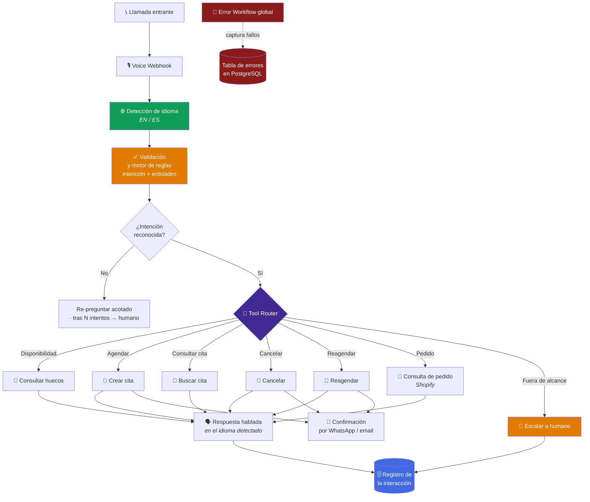
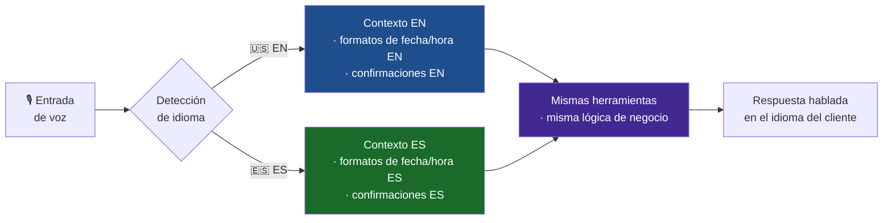

<div align="center">

# Bilingual Voice Receptionist (EN / ES)

**Recepcionista de voz 24/7 que detecta idioma, entiende intención y gestiona el calendario.**

[](#)
[](#)
[](#)
[](#)
[](#)

[](#)
[](#)
[](#)

</div>


---

## El problema

Un negocio con base de clientes mixta EN/ES recibe llamadas fuera de horario. Dos pérdidas
simultáneas:

- **La llamada perdida** — nadie contesta a las 20:00, y la llamada no vuelve.
- **El idioma equivocado** — atender solo en un idioma convierte a media base de clientes
  en clientes de segunda.

Un contestador automático no resuelve ninguna de las dos: el cliente cuelga.

---

## La solución en una frase

Un agente de voz que **detecta el idioma en la propia llamada**, **valida la intención con
reglas deterministas**, **enruta a la herramienta correcta** y **gestiona el calendario de
punta a punta** — con escalado a humano cuando hace falta.

---

## Arquitectura conceptual



---

## Lo que hace difícil un agente de voz

### 1. La latencia no se negocia

En chat, dos segundos de espera son aceptables. En voz, dos segundos de silencio hacen que
la persona diga *"¿hola?"* — y ahí la conversación ya se rompió.

Consecuencias de diseño:

| Restricción | Cómo se aborda |
|---|---|
| Cada herramienta debe caber en el presupuesto de tiempo de la llamada | Herramientas de un solo propósito, sin encadenamientos largos |
| Ninguna herramienta puede colgar la conversación | Límite de tiempo por herramienta con degradación a respuesta genérica |
| El router no puede añadir latencia propia | Enrutamiento determinista por reglas, no una segunda pasada por el modelo |
| No hay tiempo para reintentos silenciosos | El fallo se convierte en una frase útil, no en un silencio |

**Decisión clave:** el motor de reglas resuelve lo determinista *antes* de involucrar al
modelo para lo ambiguo. Lo barato y rápido primero.

### 2. Bilingüe de verdad, no traducido

El idioma se detecta **dentro de la llamada** y toda la conversación —incluidas las
confirmaciones posteriores— ocurre en ese idioma.



**Detalle que casi siempre se rompe:** las fechas. *"El tres de abril"* y *"April third"* no
se dicen igual, y una cita confirmada con el formato equivocado es una cita a la que el
cliente no va a llegar. La localización se aplica a la **salida hablada** y a la
**confirmación escrita**, no solo al idioma del texto.

### 3. Validación antes que generación

Una cita mal agendada es peor que una cita no agendada: ocupa un hueco real y genera una
ausencia.

Por eso el motor de reglas valida **antes** de escribir en el calendario: que la fecha
exista, que caiga en horario de atención, que el hueco siga libre, que la intención esté
confirmada. Solo entonces se ejecuta la escritura.

---

## Motor de calendario

Cubre el ciclo completo, no solo el caso feliz de "agendar":

| Operación | Qué resuelve |
|---|---|
| **Disponibilidad** | *"¿Tienen algo el jueves por la tarde?"* |
| **Crear** | Agenda con validación previa de que el hueco sigue libre |
| **Buscar** | *"¿A qué hora era mi cita?"* — sin pasar por una persona |
| **Cancelar** | Libera el hueco de inmediato en vez de generar una ausencia |
| **Reagendar** | Cancela y crea de forma atómica, sin dejar la cita en limbo |
| **Escalar** | Cuando el caso no cabe en ninguna de las anteriores |

**Por qué el ciclo completo importa comercialmente:** un agente que solo agenda deja el
trabajo aburrido —cancelaciones y cambios— a una persona. Y ese trabajo aburrido es
justamente el que consume más tiempo del equipo.

La cancelación y el reagendado son, además, los que más valor devuelven: **un hueco liberado
a tiempo se puede volver a vender.**

---

## Integración con comercio

Además del calendario, el router puede resolver **consultas de pedido** contra la tienda.
El cliente que llama para preguntar por su pedido no necesita hablar con nadie.

La confirmación de cita se envía por **WhatsApp o email**, en el idioma detectado — el
cliente cuelga y ya tiene el comprobante escrito.

---

## Decisiones de ingeniería

| Decisión | Alternativa descartada | Razón |
|---|---|---|
| Motor de reglas antes del modelo | Todo resuelto por el modelo | Lo determinista es más rápido, más barato y auditable. El modelo se reserva para lo ambiguo. |
| Router determinista | Router basado en modelo | Añadir una pasada de modelo para enrutar cuesta latencia que la voz no tiene |
| Validar antes de escribir en calendario | Escribir y corregir después | Una cita errónea ocupa un hueco real y genera una ausencia |
| Herramientas de propósito único | Herramientas compuestas | Cada llamada cabe en el presupuesto de tiempo; el fallo se aísla |
| Detección de idioma en la llamada | Idioma fijo por número o por región | La misma línea atiende a ambos públicos sin fragmentar la operación |
| Localización en salida y confirmación | Traducir solo el texto | Fechas y horas mal localizadas producen ausencias |
| Reagendar como operación atómica | Cancelar y crear por separado | Evita el estado intermedio donde el cliente se queda sin cita |
| Escalado tras N intentos fallidos | Insistir indefinidamente | Un bucle de re-preguntas es la peor experiencia posible en voz |

📄 Contexto adicional en el [registro de ADRs](../../docs/adr/README.md).

---

## Comportamiento operativo

| Propiedad | Comportamiento |
|---|---|
| **Disponibilidad** | 24/7, incluidos fines de semana y festivos |
| **Cobertura de idioma** | EN y ES en la misma línea, detectado por llamada |
| **Ciclo de calendario completo** | Consultar · crear · buscar · cancelar · reagendar |
| **Degradación controlada** | Herramienta lenta o caída → respuesta útil + escalado, nunca silencio |
| **Trazabilidad** | Cada llamada deja registro de idioma, intención y acción ejecutada |
| **Sin citas fantasma** | La validación previa impide escribir citas inválidas |

---

## Fragmento ilustrativo

> ⚠️ **Genérico y no funcional de extremo a extremo.** Muestra la *forma* del presupuesto de
> latencia por herramienta. No contiene los tiempos reales, el catálogo de intenciones, las
> reglas de validación ni el prompt del agente de voz.

```js
// ILUSTRATIVO — en voz, una herramienta lenta es peor que una herramienta ausente.

async function callToolWithBudget(tool, args, budgetMs, locale) {
  const timeout = new Promise((_, reject) =>
    setTimeout(() => reject(new Error('tool_budget_exceeded')), budgetMs)
  );

  try {
    return { ok: true, data: await Promise.race([tool.run(args), timeout]) };
  } catch (err) {
    // Nunca devolver silencio: siempre una frase hablable en el idioma detectado.
    return {
      ok: false,
      spoken: fallbackPhrase(locale),   // catálogo de frases no publicado
      shouldEscalate: err.message === 'tool_budget_exceeded',
    };
  }
}
```

---

## Qué NO encontrarás en este repositorio

- El workflow n8n exportado ni el grafo real de nodos y conexiones.
- El prompt del agente de voz ni el catálogo de frases habladas.
- El catálogo de intenciones ni las reglas del motor de validación.
- Los presupuestos de latencia reales por herramienta.
- Credenciales, IDs de calendario, números de teléfono, URLs de webhook, claves de tienda.

Ver [SECURITY.md](../../SECURITY.md).

---

<div align="center">

**¿Cuántas llamadas pierdes fuera de horario — y en cuántos idiomas?**
[bhrayan.automation@gmail.com](mailto:bhrayan.automation@gmail.com)

[⬅️ Volver al portafolio](../../README.md) · [Patrón reutilizable](../../docs/patterns/webhook-ai-crm-notify.md) · [ADRs](../../docs/adr/README.md)

</div>
