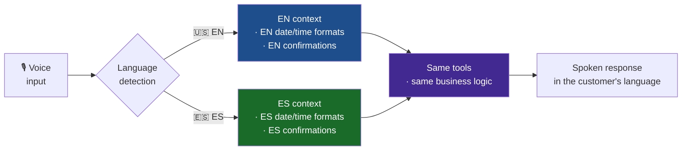

<div align="center">

# Bilingual Voice Receptionist (EN / ES)

**A 24/7 voice receptionist that detects language, understands intent and manages the calendar.**

[](#)
[](#)
[](#)
[](#)
[](#)

[](#)
[](#)
[](#)

</div>


---

## The problem

A business with a mixed EN/ES customer base receives calls outside business hours. Two
simultaneous losses:

- **The lost call** — nobody answers at 8 PM, and the call does not come back.
- **The wrong language** — serving in only one language turns half the customer base
  into second-class customers.

An answering machine solves neither: the customer hangs up.

---

## The solution in one sentence

A voice agent that **detects the language within the call itself**, **validates intent
with deterministic rules**, **routes to the right tool** and **manages the calendar end
to end** — with human escalation when needed.

---

## Conceptual architecture

```mermaid
flowchart TD
    A["📞 Incoming call"] --> B["🎙️ Voice Webhook"]
    B --> C["🌐 Language detection<br/><i>EN / ES</i>"]
    C --> D["✅ Validation<br/>and rule engine<br/><i>intent + entities</i>"]
    D --> E{"Intent<br/>recognized?"}
    E -- No --> E1["Scoped re-ask<br/>· after N attempts → human"]
    E -- Yes --> F{"🔀 Tool Router"}

    F -- "Availability" --> G["📆 Check slots"]
    F -- "Book" --> H["📆 Create appointment"]
    F -- "Check appointment" --> I["📆 Look up appointment"]
    F -- "Cancel" --> J["📆 Cancel"]
    F -- "Reschedule" --> K["📆 Reschedule"]
    F -- "Order" --> L["🛒 Order lookup<br/><i>Shopify</i>"]
    F -- "Out of scope" --> M["🙋 Escalate to human"]

    G --> N["🗣️ Spoken response<br/><i>in the detected language</i>"]
    H --> N
    I --> N
    J --> N
    K --> N
    L --> N

    H --> O["🔔 Confirmation<br/>via WhatsApp / email"]
    K --> O
    J --> O

    N --> P[("🗄️ Interaction<br/>record")]
    M --> P

    Q["🚨 Global Error Workflow"] -.captures failures.-> R[("Error table<br/>in PostgreSQL")]

    style C fill:#0F9D58,color:#fff
    style D fill:#e07b00,color:#fff
    style F fill:#412991,color:#fff
    style M fill:#e07b00,color:#fff
    style P fill:#4169E1,color:#fff
    style Q fill:#8b1a1a,color:#fff
    style R fill:#8b1a1a,color:#fff
```



---

## What makes a voice agent hard

### 1. Latency is non-negotiable

In chat, two seconds of wait are acceptable. In voice, two seconds of silence make the
person say *"hello?"* — and the conversation is already broken.

Design consequences:

| Constraint | How it is addressed |
|---|---|
| Every tool must fit in the call's time budget | Single-purpose tools, no long chains |
| No tool can hang the conversation | Per-tool time limit with degradation to a generic response |
| The router cannot add its own latency | Deterministic rule-based routing, not a second model pass |
| No time for silent retries | A failure becomes a useful phrase, not silence |

**Key decision:** the rule engine resolves the deterministic part *before* involving the
model for the ambiguous part. Cheap and fast first.

### 2. Truly bilingual, not translated

The language is detected **within the call**, and the whole conversation —including
subsequent confirmations— happens in that language.



**Detail that almost always breaks:** dates. *"April third"* and *"el tres de abril"* are
not said the same way, and an appointment confirmed with the wrong format is an
appointment the customer will not show up to. Localization applies to the **spoken
output** and the **written confirmation**, not just to the text language.

### 3. Validation before generation

A badly booked appointment is worse than a non-booked one: it occupies a real slot and
generates a no-show.

That is why the rule engine validates **before** writing to the calendar: the date
exists, it falls within business hours, the slot is still free, the intent is confirmed.
Only then is the write executed.

---

## Calendar engine

It covers the complete cycle, not just the happy-path "book":

| Operation | What it solves |
|---|---|
| **Availability** | *"Do you have anything Thursday afternoon?"* |
| **Create** | Books with prior validation that the slot is still free |
| **Look up** | *"What time was my appointment?"* — without going through a person |
| **Cancel** | Frees the slot immediately instead of creating a no-show |
| **Reschedule** | Cancels and creates atomically, without leaving the appointment in limbo |
| **Escalate** | When the case does not fit any of the above |

**Why the full cycle matters commercially:** an agent that only books leaves the boring
work —cancellations and changes— to a person. And that boring work is exactly what
consumes the most team time.

Cancellation and rescheduling are also the ones that return the most value: **a slot
freed in time can be sold again.**

---

## Commerce integration

In addition to the calendar, the router can resolve **order lookups** against the store.
The customer who calls to ask about their order does not need to talk to anyone.

The appointment confirmation is sent via **WhatsApp or email**, in the detected
language — the customer hangs up and already has the written confirmation.

---

## Engineering decisions

| Decision | Rejected alternative | Reason |
|---|---|---|
| Rule engine before the model | Everything resolved by the model | Deterministic parts are faster, cheaper and auditable. The model is reserved for ambiguity. |
| Deterministic router | Model-based router | Adding a model pass for routing costs latency that voice does not have |
| Validate before writing to calendar | Write and correct later | A wrong appointment occupies a real slot and creates a no-show |
| Single-purpose tools | Composite tools | Each call fits in the time budget; failures are isolated |
| In-call language detection | Fixed language by number or region | The same line serves both audiences without fragmenting operations |
| Localization in output and confirmation | Translating text only | Poorly localized dates and times produce no-shows |
| Reschedule as an atomic operation | Cancel and create separately | Avoids the intermediate state where the customer is left without an appointment |
| Escalation after N failed attempts | Insist indefinitely | A re-ask loop is the worst possible voice experience |

📄 Additional context in the [ADR registry](../../docs/adr/README.md).

---

## Operational behavior

| Property | Behavior |
|---|---|
| **Availability** | 24/7, including weekends and holidays |
| **Language coverage** | EN and ES on the same line, detected per call |
| **Full calendar cycle** | Look up · create · book · cancel · reschedule |
| **Controlled degradation** | Slow or down tool → useful response + escalation, never silence |
| **Traceability** | Every call leaves a record of language, intent and executed action |
| **No ghost appointments** | Pre-validation prevents writing invalid appointments |

---

## Illustrative fragment

> ⚠️ **Generic and not end-to-end functional.** It shows the *shape* of the per-tool
> latency budget. It contains no real timings, no intent catalog, no validation rules and
> no voice agent prompt.

```js
// ILLUSTRATIVE — in voice, a slow tool is worse than a missing tool.

async function callToolWithBudget(tool, args, budgetMs, locale) {
  const timeout = new Promise((_, reject) =>
    setTimeout(() => reject(new Error('tool_budget_exceeded')), budgetMs)
  );

  try {
    return { ok: true, data: await Promise.race([tool.run(args), timeout]) };
  } catch (err) {
    // Never return silence: always a speakable phrase in the detected language.
    return {
      ok: false,
      spoken: fallbackPhrase(locale),   // phrase catalog not published
      shouldEscalate: err.message === 'tool_budget_exceeded',
    };
  }
}
```

---

## What you will NOT find in this repository

- The exported n8n workflow or the real node/connection graph.
- The voice agent prompt or the spoken phrase catalog.
- The intent catalog or the validation engine rules.
- The real per-tool latency budgets.
- Credentials, calendar IDs, phone numbers, webhook URLs, store keys.

See [SECURITY.md](../../SECURITY.md).

---

<div align="center">

**How many calls do you lose outside business hours — and in how many languages?**
[bhrayan.automation@gmail.com](mailto:bhrayan.automation@gmail.com)

[⬅️ Back to the portfolio](../../README.md) · [Reusable pattern](../../docs/patterns/webhook-ai-crm-notify.md) · [ADRs](../../docs/adr/README.md)

</div>
