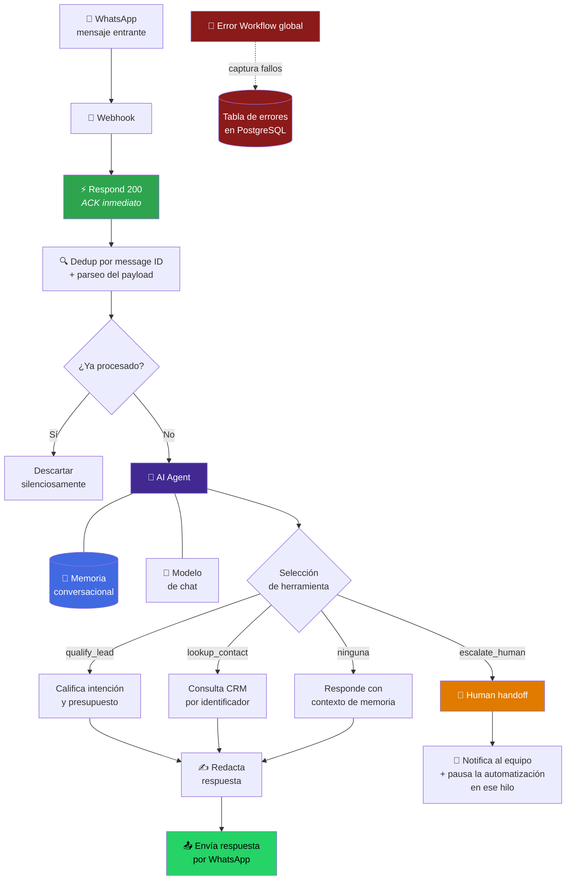
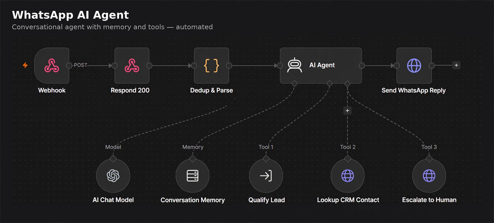
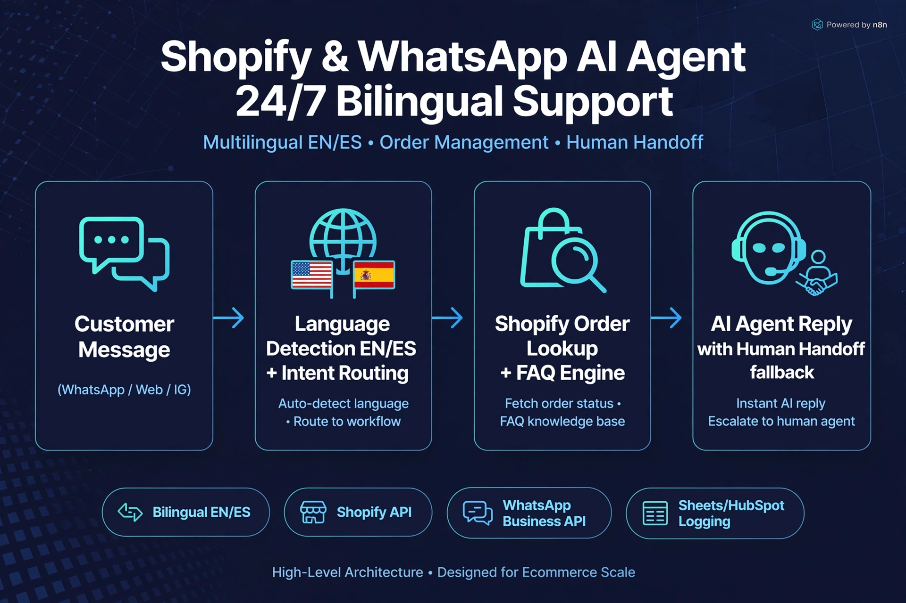

<div align="center">

# WhatsApp Conversational Agent

**Agente conversacional con memoria, herramientas acotadas y escalado a humano.**

[](#)
[](#)
[](#)
[](#)
[](#)

[](#)
[](#)
[](#)
[](#)

</div>


---

## El problema

El cliente escribe por WhatsApp a las 21:40 de un viernes. Espera respuesta.

Sin automatización, ese mensaje se contesta el lunes — y para el lunes ya compró en otro
sitio. Con una automatización mal hecha, pasa algo peor: recibe **la misma respuesta tres
veces** porque el proveedor de mensajería reintentó el webhook mientras el flujo todavía
estaba pensando.

---

## La solución en una frase

Webhook entrante con **confirmación inmediata**, **deduplicación por identificador de
mensaje** y un **agente IA con memoria conversacional** que dispone de un conjunto acotado
de herramientas — incluida la de **rendirse y llamar a un humano**.

---

## Arquitectura conceptual



<details>
<summary><b>Ver el flujo desde la perspectiva del grafo de orquestación</b></summary>

<br>



*Vista conceptual: el agente recibe modelo, memoria y herramientas como dependencias
declaradas, no como pasos secuenciales. El agente decide **si** usa una herramienta.*

</details>

---

## Las tres decisiones que sostienen todo

### 1. Fast-ACK: responder antes de pensar

Los proveedores de mensajería tienen un presupuesto de tiempo para el webhook. Si lo
excedes, **reintentan**. Y si tu flujo tarda porque está llamando a un LLM, vas a exceder
ese presupuesto casi siempre.

```mermaid
sequenceDiagram
    participant P as Proveedor de mensajería
    participant W as Webhook
    participant A as Agente IA

    rect rgb(60, 20, 20)
    Note over P,A: ❌ Sin fast-ACK
    P->>W: mensaje
    W->>A: procesar (lento)
    P->>W: reintento (timeout)
    W->>A: procesar de nuevo
    A-->>P: respuesta
    A-->>P: respuesta duplicada 😖
    end

    rect rgb(20, 50, 25)
    Note over P,A: ✅ Con fast-ACK + dedup
    P->>W: mensaje
    W-->>P: 200 OK (inmediato)
    W->>A: procesar en segundo plano
    P->>W: reintento
    W-->>P: 200 OK
    W->>A: dedup → descartado ✔
    A-->>P: una sola respuesta
    end
```



**Resultado:** el usuario recibe exactamente una respuesta por mensaje, sin importar cuántas
veces el proveedor reintente.

### 2. Deduplicación por identificador de mensaje

El ACK rápido evita los timeouts, pero no es suficiente: un reintento que llega **antes**
del ACK ya está en vuelo. La deduplicación por **message ID** es la red de seguridad real.

**Por qué message ID y no el contenido:** dos mensajes con el mismo texto pueden ser
legítimos ("hola" dos veces). El identificador del proveedor es único por evento real.

> La estrategia de almacenamiento y la ventana de retención del registro de dedup no se
> publican.

### 3. Memoria + herramientas acotadas

El agente tiene **memoria conversacional** (recuerda el hilo, no arranca de cero en cada
mensaje) y un **conjunto cerrado y pequeño** de herramientas.

| Herramienta | Qué hace | Por qué existe |
|---|---|---|
| `qualify_lead` | Evalúa intención y capacidad de compra | Alimenta la priorización comercial sin preguntar de forma robótica |
| `lookup_contact` | Busca el contacto en el CRM | La conversación arranca sabiendo quién es, no preguntando lo que ya sabemos |
| `escalate_human` | Entrega la conversación a una persona | La IA debe saber cuándo **no** es la indicada |

**Decisión clave:** el agente llama herramientas **solo cuando hacen falta**. Un agente que
consulta el CRM en cada mensaje es lento y caro. El coste real de un agente conversacional
no está en el modelo: está en las llamadas que hace sin necesitarlas.

---

## Human handoff: la herramienta más importante

Cuando el agente escala, pasan **tres** cosas — y las tres son necesarias:

1. Se notifica al equipo con el contexto de la conversación.
2. Se **pausa la automatización en ese hilo**.
3. Se marca el estado para que quede registro de que hubo intervención.

**El punto 2 es el que casi siempre se olvida.** Sin él, la persona y el bot responden a la
vez al mismo cliente. Eso destruye la confianza más rápido que no haber automatizado nada.

Casos que disparan escalado: petición explícita de hablar con una persona, frustración
detectada, tema fuera del alcance definido, o cualquier situación donde la respuesta
incorrecta tenga coste real.

---

## Variante para comercio electrónico

El mismo esqueleto, con herramientas de tienda y detección de idioma EN/ES:



Se añaden consulta de estado de pedido y base de conocimiento de preguntas frecuentes. El
patrón de fiabilidad — ACK, dedup, memoria, handoff — no cambia. **Eso es lo que hace que
el patrón valga: cambian las herramientas, no los cimientos.**

---

## Decisiones de ingeniería

| Decisión | Alternativa descartada | Razón |
|---|---|---|
| Fast-ACK antes de procesar | Procesar y luego responder | Evita reintentos del proveedor por timeout, que es la causa raíz de las respuestas duplicadas |
| Dedup por message ID | Dedup por contenido o por remitente | El contenido se repite de forma legítima; el ID identifica el evento |
| Conjunto cerrado de herramientas | Agente con acceso amplio | Superficie de acción acotada = comportamiento predecible y auditable |
| Memoria conversacional persistente | Contexto en cada petición | Coherencia entre mensajes sin arrastrar todo el historial en cada llamada |
| Handoff que **pausa** el bot | Handoff solo notificando | Sin pausa, persona y bot responden a la vez al mismo cliente |
| Estado fuera del contenedor | Estado en memoria del proceso | Un reinicio no puede borrar el hilo ni el registro de dedup |
| Error Workflow con persistencia | Logs del contenedor | Los logs se pierden al recrear; una tabla se consulta y se agrega |

📄 Contexto adicional en el [registro de ADRs](../../docs/adr/README.md).

---

## Comportamiento operativo

| Propiedad | Comportamiento |
|---|---|
| **Exactamente una respuesta** | Por mensaje real, sin importar los reintentos del proveedor |
| **Continuidad conversacional** | El agente no vuelve a preguntar lo que ya sabe |
| **Disponibilidad** | 24/7; el escalado a humano respeta el horario del equipo |
| **Coste controlado** | Herramientas invocadas bajo demanda, no por defecto |
| **Resiliencia a reinicios** | Hilos y dedup sobreviven al reinicio del contenedor |
| **Trazabilidad** | Cada conversación deja registro de herramientas usadas y de si hubo escalado |

---

## Fragmento ilustrativo

> ⚠️ **Genérico y no funcional de extremo a extremo.** Muestra la *forma* del guardián de
> deduplicación. No contiene la ventana temporal real, el backend de almacenamiento, el
> formato del payload del proveedor ni el prompt del agente.

```js
// ILUSTRATIVO — guardián de deduplicación en la entrada.
// Principio: el trabajo caro (LLM, CRM) solo ocurre tras pasar este punto.

async function shouldProcess(messageId, store) {
  if (!messageId) {
    return { process: false, reason: 'missing_message_id' };
  }

  // Reserva atómica: si otra ejecución ya lo tomó, ésta se retira.
  const reserved = await store.reserveOnce(messageId);
  if (!reserved) {
    return { process: false, reason: 'duplicate_delivery' };
  }

  return { process: true };
}

// Orden de operaciones que importa:
//   1) responder 200 al proveedor
//   2) deduplicar
//   3) recién entonces invocar al agente
```

---

## Qué NO encontrarás en este repositorio

- El workflow n8n exportado ni el grafo real de nodos y conexiones.
- El prompt del agente ni las descripciones literales de las herramientas.
- La ventana de deduplicación ni el backend donde se almacena.
- Los criterios exactos que disparan el escalado a humano.
- Credenciales, tokens, instance IDs, números de teléfono, URLs de webhook.

Ver [SECURITY.md](../../SECURITY.md).

---

<div align="center">

**¿Tu WhatsApp de negocio necesita responder a las 21:40 de un viernes?**
[CONTACT.md](../../CONTACT.md)

[⬅️ Volver al portafolio](../../README.md) · [Patrón reutilizable](../../docs/patterns/webhook-ai-crm-notify.md) · [ADRs](../../docs/adr/README.md)

</div>
