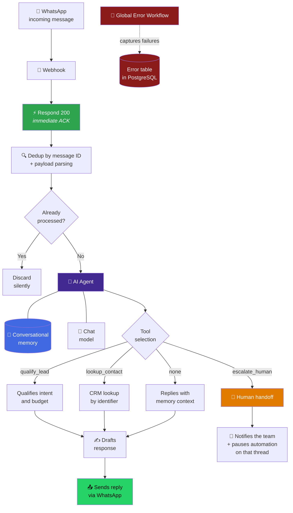

<div align="center">

# WhatsApp Conversational Agent

**Conversational agent with memory and tools, with human escalation built in.**

[](#)
[](#)
[](#)
[](#)
[](#)

[](#)
[](#)
[](#)

</div>


---

## The problem

The customer writes on WhatsApp at 9:40 PM on a Friday. They expect an answer.

Without automation, that message is answered on Monday — and by Monday they already
bought somewhere else. With a badly built automation, something worse happens: they get
**the same answer three times** because the messaging provider retried the webhook while
the flow was still thinking.

---

## The solution in one sentence

An inbound webhook with **immediate acknowledgment**, **deduplication by message
identifier** and an **AI agent with conversational memory** that has a scoped toolset —
including the tool to **give up and call a human**.

---

## Conceptual architecture



<details>
<summary><b>View the flow from the orchestration graph perspective</b></summary>

<br>


*Conceptual view: the agent receives model, memory and tools as declared dependencies,
not as sequential steps. The agent decides **whether** to use a tool.*

</details>

---

## The three decisions that hold everything together

### 1. Fast-ACK: respond before thinking

Messaging providers have a time budget for the webhook. If you exceed it, they
**retry**. And if your flow is slow because it is calling an LLM, you will exceed that
budget almost always.

```mermaid
sequenceDiagram
    participant P as Messaging provider
    participant W as Webhook
    participant A as AI agent

    rect rgb(60, 20, 20)
    Note over P,A: ❌ Without fast-ACK
    P->>W: message
    W->>A: process (slow)
    P->>W: retry (timeout)
    W->>A: process again
    A-->>P: reply
    A-->>P: duplicate reply 😖
    end

    rect rgb(20, 50, 25)
    Note over P,A: ✅ With fast-ACK + dedup
    P->>W: message
    W-->>P: 200 OK (immediate)
    W->>A: process in background
    P->>W: retry
    W-->>P: 200 OK
    W->>A: dedup → discarded ✔
    A-->>P: exactly one reply
    end
```



**Result:** the user receives exactly one reply per message, no matter how many times
the provider retries.

### 2. Deduplication by message identifier

Fast ACK prevents timeouts, but it is not enough: a retry that arrives **before** the
ACK is already in flight. Deduplication by **message ID** is the real safety net.

**Why message ID and not content:** two messages with the same text can be legitimate
("hello" twice). The provider identifier is unique per real event.

> The storage strategy and retention window of the dedup registry are not published.

### 3. Memory + scoped tools

The agent has **conversational memory** (it remembers the thread, it does not start
from zero on every message) and a **small, closed set** of tools.

| Tool | What it does | Why it exists |
|---|---|---|
| `qualify_lead` | Evaluates intent and buying ability | Feeds sales prioritization without asking in a robotic way |
| `lookup_contact` | Looks up the contact in the CRM | The conversation starts knowing who the person is, instead of asking what we already know |
| `escalate_human` | Hands the conversation to a person | The AI must know when it is **not** the right one |

**Key decision:** the agent calls tools **only when needed**. An agent that queries the
CRM on every message is slow and expensive. The real cost of a conversational agent is
not the model: it is the calls it makes without needing them.

---

## Human handoff: the most important tool

When the agent escalates, **three** things happen — and all three are necessary:

1. The team is notified with the conversation context.
2. The **automation is paused on that thread**.
3. The state is marked so there is a record of the intervention.

**Point 2 is the one almost always forgotten.** Without it, the person and the bot
reply at the same time to the same customer. That destroys trust faster than not
automating anything.

Escalation triggers: explicit request to talk to a person, detected frustration,
out-of-scope topics, or any situation where a wrong answer has real cost.

---

## E-commerce variant

The same skeleton, with store tools and EN/ES language detection:


Order status lookup and a FAQ knowledge base are added. The reliability pattern —
ACK, dedup, memory, handoff — does not change. **That is what makes the pattern worth
it: the tools change, the foundations do not.**

---

## Engineering decisions

| Decision | Rejected alternative | Reason |
|---|---|---|
| Fast-ACK before processing | Process and then respond | Prevents provider retries on timeout, the root cause of duplicate replies |
| Dedup by message ID | Dedup by content or sender | Content repeats legitimately; the ID identifies the event |
| Closed toolset | Agent with broad access | Bounded action surface = predictable, auditable behavior |
| Persistent conversational memory | Context on every request | Coherence between messages without dragging the full history on every call |
| Handoff that **pauses** the bot | Handoff by notification only | Without the pause, person and bot reply at the same time |
| State outside the container | In-process memory state | A restart cannot erase the thread or the dedup registry |
| Error workflow with persistence | Container logs | Logs are lost on recreate; a table can be queried and aggregated |

📄 Additional context in the [ADR registry](../../docs/adr/README.md).

---

## Operational behavior

| Property | Behavior |
|---|---|
| **Exactly one reply** | Per real message, regardless of provider retries |
| **Conversational continuity** | The agent does not re-ask what it already knows |
| **Availability** | 24/7; human escalation respects the team's schedule |
| **Controlled cost** | Tools invoked on demand, not by default |
| **Restart resilience** | Threads and dedup survive container restarts |
| **Traceability** | Every conversation leaves a record of tools used and whether escalation happened |

---

## Illustrative fragment

> ⚠️ **Generic and not end-to-end functional.** It shows the *shape* of the
> deduplication guard. It contains no real time window, no storage backend, no provider
> payload format and no agent prompt.

```js
// ILLUSTRATIVE — deduplication guard at the entry.
// Principle: expensive work (LLM, CRM) only happens after passing this point.

async function shouldProcess(messageId, store) {
  if (!messageId) {
    return { process: false, reason: 'missing_message_id' };
  }

  // Atomic reservation: if another execution already took it, this one backs off.
  const reserved = await store.reserveOnce(messageId);
  if (!reserved) {
    return { process: false, reason: 'duplicate_delivery' };
  }

  return { process: true };
}

// Order of operations that matters:
//   1) reply 200 to the provider
//   2) deduplicate
//   3) only then invoke the agent
```

---

## What you will NOT find in this repository

- The exported n8n workflow or the real node/connection graph.
- The agent prompt or the literal tool descriptions.
- The deduplication window or the backend where it is stored.
- The exact criteria that trigger human escalation.
- Credentials, tokens, instance IDs, phone numbers, webhook URLs.

See [SECURITY.md](../../SECURITY.md).

---

<div align="center">

**Does your business WhatsApp need to answer at 9:40 PM on a Friday?**
[bhrayan.automation@gmail.com](mailto:bhrayan.automation@gmail.com)

[⬅️ Back to the portfolio](../../README.md) · [Reusable pattern](../../docs/patterns/webhook-ai-crm-notify.md) · [ADRs](../../docs/adr/README.md)

</div>
