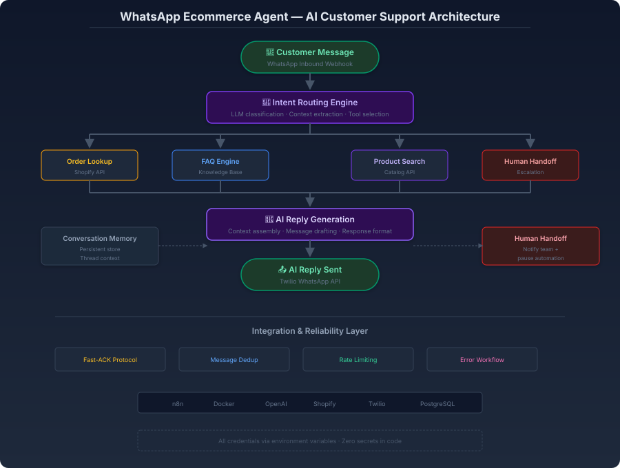

# WhatsApp Ecommerce AI Agent

**Conversational AI customer support automation with real-time order lookup, FAQ engine, and intelligent human handoff.**

---

## 1. Overview

The WhatsApp Ecommerce Agent is an **AI-powered conversational automation platform** that handles customer inquiries via WhatsApp — from order status and product questions to FAQ responses and intelligent human escalation. It combines a fast-ACK webhook protocol, message deduplication, persistent conversation memory, and a bounded tool-calling loop.

### Problem

Customers message businesses on WhatsApp expecting immediate answers. Without automation, messages go unanswered for hours or days — and the customer buys elsewhere. With naive automation, webhook retries from the messaging provider produce duplicate responses, damaging trust.

### Solution

An AI agent architecture built on three reliability pillars: **fast-ACK** to prevent provider retries, **message ID deduplication** as a safety net, and **bounded tool selection** with persistent conversation memory — all running on a self-hosted, containerized automation engine.

### Enterprise Value

- **Instant response** — Every message answered within seconds, 24/7
- **Zero duplicates** — Exactly one response per message, regardless of provider retries
- **Context-aware conversations** — The agent remembers the thread across messages
- **Controlled escalation** — Human intervention only when the AI identifies its own limits

---

## 2. Architecture Diagrams

### Ecommerce Agent Architecture

*AI customer support flow: customer message → intent routing engine → order lookup / FAQ / product search / human handoff → AI reply generation → WhatsApp response.*

### Technical Infrastructure

*Infrastructure architecture: WhatsApp → n8n on Docker → webhook reception → fast ACK → deduplication → payload parsing → AI agent tool-calling loop → Twilio reply with PostgreSQL error logging.*

---

## 3. Technical Workflow

### Stage 1: Webhook Reception & Fast-ACK
An inbound WhatsApp message arrives via Twilio webhook. The system immediately responds with HTTP 200 — before any processing begins. This prevents the messaging provider from retrying, which is the root cause of duplicate responses.

### Stage 2: Message Deduplication
Each message carries a unique provider-assigned ID. The system atomically reserves this ID in persistent storage. If the same ID arrives again (from a retry that was already in flight), it is silently discarded. This is the safety net that guarantees exactly-one processing.

**Critical design principle:** Deduplication happens **before** any AI or API call. Expensive operations only execute after the message is confirmed unique.

### Stage 3: Payload Parsing & Validation
The message payload is parsed, validated against the expected schema, and normalized. Malformed payloads are logged to the error workflow without further processing.

### Stage 4: AI Agent Tool-Calling Loop
The agent receives the validated message, loads conversation memory for thread context, and selects from a bounded set of tools:

| Tool | Function |
|------|----------|
| `qualify_lead` | Evaluate purchase intent and budget |
| `lookup_contact` | Query CRM for customer context |
| `lookup_order` | Fetch real-time order status from Shopify |
| `faq_engine` | Search knowledge base for common questions |
| `escalate_human` | Transfer conversation to a human agent |

The agent calls tools only when necessary — minimizing API cost and response latency. Tools are single-purpose and bounded, ensuring predictable behavior.

### Stage 5: Response & Human Handoff
The AI generates a context-aware reply and sends it via Twilio WhatsApp API. If the agent determines the query is outside its scope, it escalates to a human with the full conversation context and **pauses automation on that thread** — preventing dual responses from bot and human.

---

## 4. Technology Stack

| Technology | Role |
|------------|------|
| **n8n** | Visual workflow orchestration and agent coordination |
| **Twilio** | WhatsApp Business API integration |
| **OpenAI API** | Intent classification, reply generation, and tool selection |
| **Shopify API** | Real-time order lookup and product queries |
| **PostgreSQL** | Conversation memory, deduplication records, and error logging |
| **Docker / Docker Compose** | Self-hosted containerized deployment |
| **Prometheus / Grafana** | Message throughput, latency, and error rate monitoring |

---

## 5. Key Engineering Concepts

- **Fast-ACK protocol** — HTTP 200 before processing prevents provider retries
- **Message ID deduplication** — Atomic reservation guarantees exactly-one processing
- **Persistent conversation memory** — Thread context survives container restarts
- **Bounded tool selection** — Closed set of single-purpose tools for predictable behavior
- **Human handoff with thread pause** — Escalation disables automation on that thread
- **Error workflow persistence** — All failures logged to PostgreSQL, not ephemeral container logs
- **Cost-aware agent design** — Tools called on demand, not on every message

---

## 6. Security Practices

- Zero credentials or tokens stored in workflow exports — all secrets via environment variables
- Webhook payloads validated and sanitized before processing
- Message rate limiting to prevent abuse
- Least-privilege API access — each tool scoped to minimum required operations
- Conversation memory excludes sensitive customer data
- TLS encryption for all API communications
- Pre-commit hooks and CI/CD security scanning

---

## 7. Business Impact

| Benefit | Impact |
|---------|--------|
| **24/7 customer support** | Every message answered instantly, any time |
| **Zero duplicate responses** | Provider retries never reach the customer |
| **Reduced support tickets** | Routine inquiries resolved autonomously |
| **Contextual conversations** | No repeated questions across messages |
| **Controlled escalation** | Human agents handle only complex cases |
| **Higher customer satisfaction** | Instant, accurate responses build trust |

---

[⬅️ Back to Portfolio](../../README.md) · [Pattern Reference](../../docs/patterns/webhook-ai-crm-notify.md) · [Examples](../../examples/crm-sync-demo.json)

