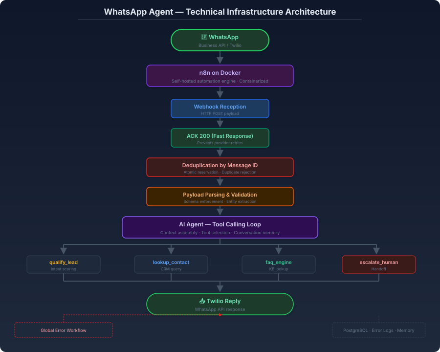

# Case Study — Your documents, answering for you, 24/7

> Target niche: companies with catalogs, products, prices, internal policies, manuals and FAQs.
> This case is an application of the existing [WhatsApp agent](README.md) (FAQ engine,
> knowledge base and human handoff) to company documentation. It only reformulates what
> that project already does; no real client implementation is claimed.

## The problem

Customers and employees ask the same questions over and over: product details, prices, policies, manuals, FAQs. Someone in the company ends up answering the same things by hand for hours every week — or the answer arrives late and the customer loses patience.

## The solution

A chatbot that answers questions strictly based on the documents the company uploads: catalogs, products, prices, internal policies, manuals and FAQs. It responds immediately in the channel where the question arrives, and it never answers beyond those documents: no general knowledge, no assumptions. If the answer is not in the documentation, the conversation escalates to a person automatically, with the full context, instead of guessing.

## The results

- [to complete with real demo data] questions answered automatically per day
- [to complete with real demo data] % of questions resolved without a person
- [to complete with real demo data] seconds to first answer
- [to complete with real demo data] escalations to a person with complete context

## Technical stack

n8n · AI (LLM) · WhatsApp Business API · Knowledge base · Human handoff · PostgreSQL.

## Suggested metrics (to measure in demo)

- Questions answered per day
- % of questions resolved without a person
- Time to first answer (seconds)
- % of escalations that carry the full conversation context
- Hours of manual Q&A saved per week

## Video script (2–3 min, recordable with Loom)

| Time | On screen | Narration |
|---|---|---|
| 0:00–0:20 | Camera + browser open on the system's document area | «Your customers ask the same questions every day: prices, policies, hours. This demo shows a chatbot that answers with your own documents — nothing more, nothing invented.» |
| 0:20–0:50 | A product catalog and an FAQ file are uploaded; both appear in the knowledge base | «I load the company documents: catalog, prices and FAQs. The assistant works only with this material — it never answers from general knowledge.» |
| 0:50–1:25 | A customer sends a question on WhatsApp; the bot answers with the exact information from the document | «A customer asks about a product and its price. The chatbot answers immediately, in the same chat, using only what the documents say.» |
| 1:25–1:55 | A question not covered by the documents: the conversation escalates to a person | «This question is not in the documents. The chatbot doesn't guess: it escalates to a person with the full conversation, so nothing is lost.» |
| 1:55–2:20 | The escalation reaches the right person; the customer is followed up without repeating themselves | «The right person takes over with all the context. The customer never has to repeat themselves.» |
| 2:20–2:45 | Closing: camera + contact details on screen | «If your team repeats the same answers every day, let's run a live demo with your own documents. My contact info is on screen.» |

---

# Estudio de caso — Tus documentos, respondiendo por ti, 24/7

> Nicho objetivo: empresas con catálogos, productos, precios, políticas internas, manuales y preguntas frecuentes.
> Este caso es una aplicación del [agente de WhatsApp](README.md) existente (motor de preguntas frecuentes,
> base de conocimiento y traspaso a una persona) a la documentación de la empresa. Solo reformula
> lo que ese proyecto ya hace; no se afirma ninguna implementación para un cliente real.

## El problema

Clientes y empleados repiten las mismas preguntas una y otra vez: detalles de productos, precios, políticas, manuales, preguntas frecuentes. Alguien en la empresa termina respondiendo lo mismo a mano durante horas cada semana — o la respuesta llega tarde y el cliente pierde la paciencia.

## La solución

Un chatbot que responde preguntas estrictamente según los documentos que la empresa carga: catálogos, productos, precios, políticas internas, manuales y preguntas frecuentes. Responde de inmediato en el canal donde llega la pregunta y nunca responde más allá de esos documentos: sin conocimiento general, sin suposiciones. Si la respuesta no está en la documentación, la conversación escala a una persona automáticamente, con todo el contexto, en lugar de adivinar.

## El resultado

- [a completar con datos reales de la demo] preguntas respondidas automáticamente al día
- [a completar con datos reales de la demo] % de preguntas resueltas sin una persona
- [a completar con datos reales de la demo] segundos hasta la primera respuesta
- [a completar con datos reales de la demo] escalamientos a una persona con el contexto completo

## Stack técnico

n8n · IA (LLM) · WhatsApp Business API · Base de conocimiento · Traspaso a una persona · PostgreSQL.

## Métricas sugeridas (a medir en demo)

- Preguntas respondidas al día
- % de preguntas resueltas sin una persona
- Tiempo hasta la primera respuesta (segundos)
- % de escalamientos que llevan el contexto completo de la conversación
- Horas de atención manual ahorradas por semana

## Guion de video (2–3 min, grabable con Loom)

| Tiempo | Qué se ve en pantalla | Qué se dice |
|---|---|---|
| 0:00–0:20 | Cámara + navegador abierto en el área de documentos del sistema | «Tus clientes hacen las mismas preguntas todos los días: precios, políticas, horarios. Esta demo muestra un chatbot que responde con tus propios documentos — nada más, nada inventado.» |
| 0:20–0:50 | Se carga un catálogo de productos y un archivo de preguntas frecuentes; ambos aparecen en la base de conocimiento | «Cargo los documentos de la empresa: catálogo, precios y preguntas frecuentes. El asistente trabaja solo con este material — nunca responde desde conocimiento general.» |
| 0:50–1:25 | Un cliente envía una pregunta por WhatsApp; el bot responde con la información exacta del documento | «Un cliente pregunta por un producto y su precio. El chatbot responde al instante, en el mismo chat, usando solo lo que dicen los documentos.» |
| 1:25–1:55 | Una pregunta que no está en los documentos: la conversación escala a una persona | «Esta pregunta no está en los documentos. El chatbot no adivina: escala a una persona con toda la conversación, para que nada se pierda.» |
| 1:55–2:20 | El escalamiento llega a la persona correcta; el cliente es atendido sin repetirse | «La persona correcta toma el caso con todo el contexto. El cliente nunca tiene que repetirse.» |
| 2:20–2:45 | Cierre: cámara + llamado a la acción | «Si tu equipo repite las mismas respuestas todos los días, hagamos una demo en vivo con tus propios documentos. Mi contacto está en pantalla.» |

---

[Back to project README](README.md) · [All projects](../README.md)
